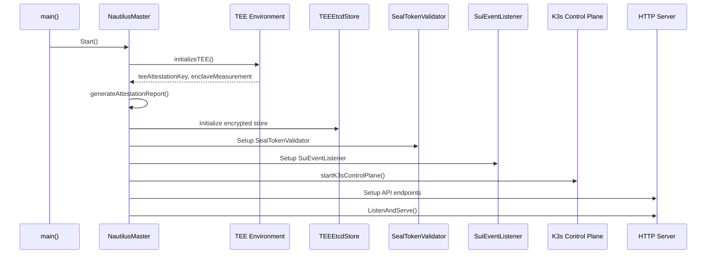
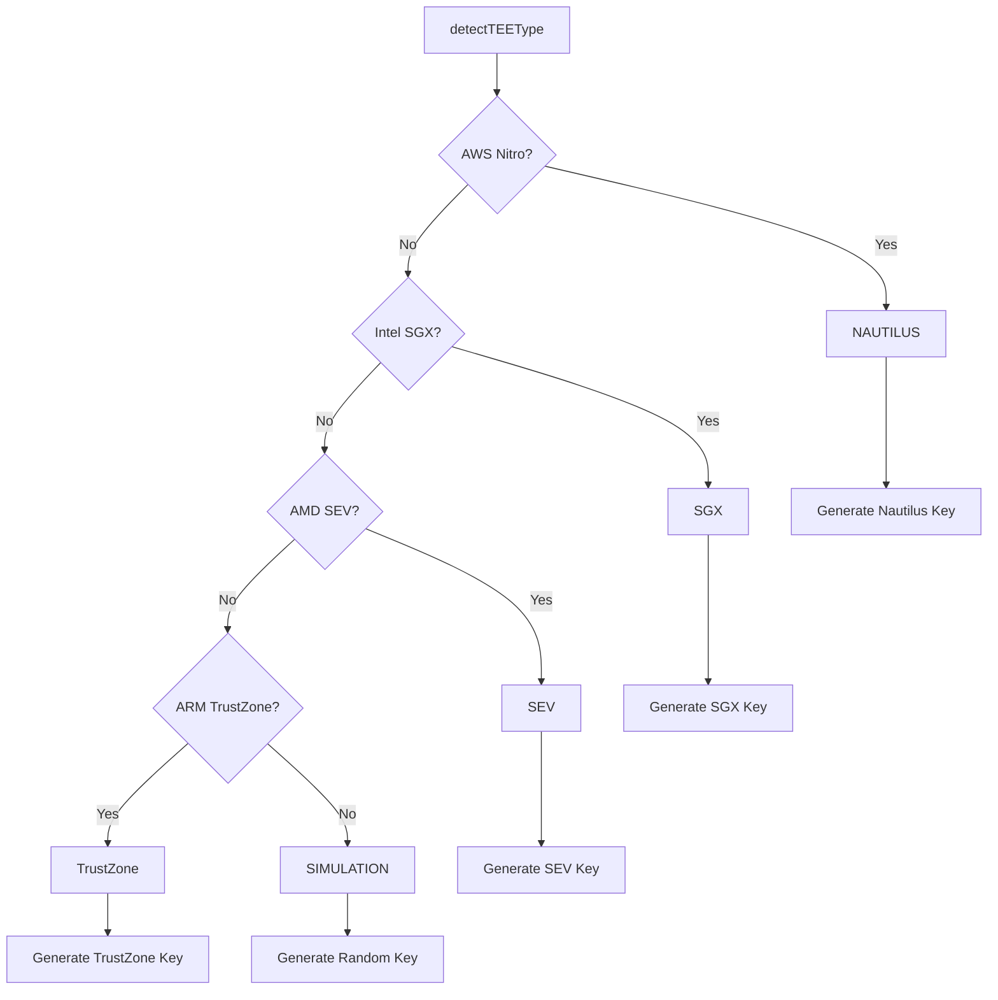
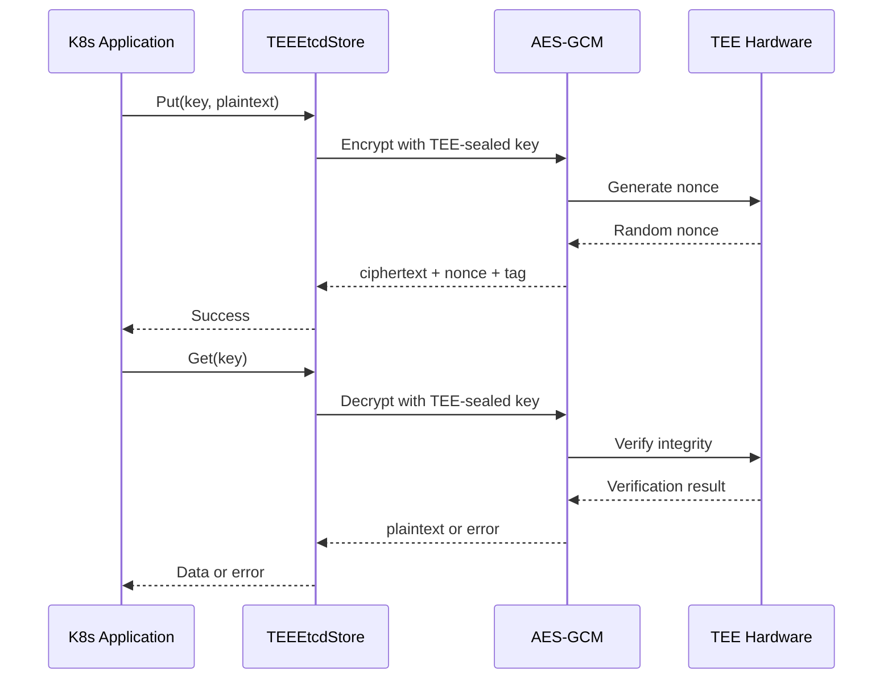
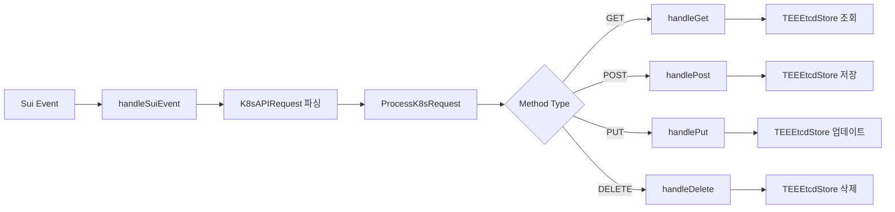
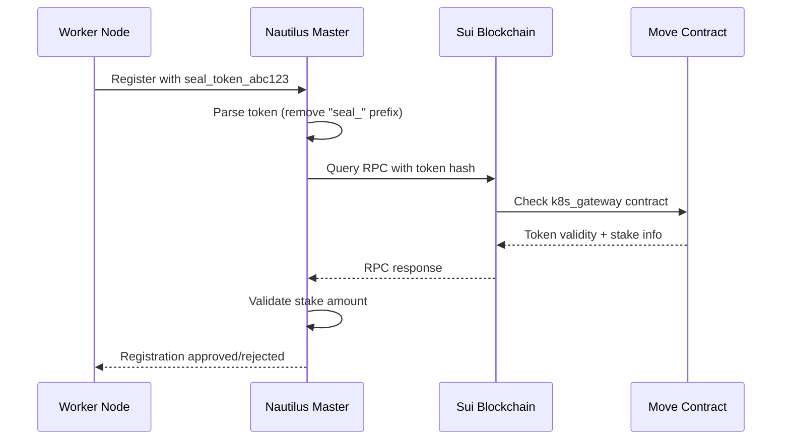

# 📋 Nautilus TEE 메인 코드 플로우 분석

**파일**: `nautilus-release/main.go`
**역할**: K3s-DaaS Nautilus TEE 마스터 노드의 메인 진입점
**복잡도**: ★★★★★ (매우 높음)
**코드 라인**: 1,038줄

---

## 🎯 전체 시스템 아키텍처 플로우

```mermaid
graph TB
    subgraph "Main Entry Point"
        MAIN[main()]
        CONFIG[InitializeConfig]
        LOGGER[Logger Setup]
        VALIDATION[Config Validation]
    end

    subgraph "TEE Master Initialization"
        MASTER[NautilusMaster]
        TEE_INIT[initializeTEE]
        ATTEST[generateAttestationReport]
        ETCD[TEEEtcdStore Setup]
    end

    subgraph "Core Services"
        SEAL[SealTokenValidator]
        SUI[SuiEventListener]
        K3S[K3s Control Plane]
        HTTP[HTTP API Server]
    end

    subgraph "API Endpoints"
        HEALTH[/health]
        ATTEST_EP[/api/v1/attestation]
        REGISTER[/api/v1/register-worker]
        HEARTBEAT[/api/v1/nodes/heartbeat]
        K8S_PROXY[/api/* /apis/*]
        KUBECTL[/kubectl/*]
    end

    MAIN --> CONFIG
    CONFIG --> LOGGER
    LOGGER --> VALIDATION
    VALIDATION --> MASTER
    MASTER --> TEE_INIT
    TEE_INIT --> ATTEST
    ATTEST --> ETCD
    ETCD --> SEAL
    SEAL --> SUI
    SUI --> K3S
    K3S --> HTTP

    HTTP --> HEALTH
    HTTP --> ATTEST_EP
    HTTP --> REGISTER
    HTTP --> HEARTBEAT
    HTTP --> K8S_PROXY
    HTTP --> KUBECTL
```

---

## 🚀 1. 프로그램 시작점 (main 함수)

### 📍 위치: `main.go:988-1038`

```go
func main() {
    // 1. 설정 초기화
    if err := InitializeConfig(); err != nil {
        friendlyErr := NewConfigLoadError(err)
        fmt.Printf("%s\n", friendlyErr.FullError())
        log.Fatalf("설정 초기화 실패")
    }

    // 2. Logger 초기화 (설정 기반)
    logger := logrus.New()
    if level, err := logrus.ParseLevel(GlobalConfig.Logging.Level); err == nil {
        logger.SetLevel(level)
    }
    if GlobalConfig.Logging.Format == "json" {
        logger.SetFormatter(&logrus.JSONFormatter{})
    }

    // 3. 설정 요약 출력
    GlobalConfig.PrintSummary()

    // 4. 설정 유효성 검사
    if err := GlobalConfig.Validate(); err != nil {
        friendlyErr := NewConfigValidationError(err)
        LogUserFriendlyError(logger, friendlyErr)
        logger.Fatalf("설정 검증 실패")
    }

    // 5. TEE 환경 확인
    if GlobalConfig.TEE.Mode != "real" {
        logger.Warn("⚠️ 시뮬레이션 모드로 실행 중 (실제 TEE 아님)")
    }

    // 6. 마스터 노드 생성 및 시작
    master := &NautilusMaster{
        logger: logger,
    }

    if err := master.Start(); err != nil {
        // 사용자 친화적 에러 처리
        if friendlyErr, ok := err.(*UserFriendlyError); ok {
            LogUserFriendlyError(logger, friendlyErr)
        } else {
            friendlyErr := WrapError(err, "STARTUP_FAILED")
            LogUserFriendlyError(logger, friendlyErr)
        }
        logger.Fatalf("Nautilus 마스터 시작 실패")
    }
}
```

### 🔄 실행 시퀀스

1. **설정 초기화** → `config.go:InitializeConfig()`
2. **로거 설정** → JSON/Text 포맷, 로그 레벨 설정
3. **설정 검증** → 필수값, 네트워크, 보안 검증
4. **TEE 모드 확인** → production/simulation 모드
5. **마스터 생성** → `NautilusMaster` 구조체 인스턴스화
6. **마스터 시작** → `master.Start()` 호출

---

## 🏗️ 2. NautilusMaster 구조체 정의

### 📍 위치: `main.go:36-45`

```go
type NautilusMaster struct {
    etcdStore              *TEEEtcdStore            // TEE 내부 암호화된 etcd
    suiEventListener       *SuiEventListener        // Sui 블록체인 이벤트 수신
    sealTokenValidator     *SealTokenValidator      // Seal 토큰 검증
    enhancedSealValidator  *EnhancedSealTokenValidator // 향상된 Seal 토큰 검증
    teeAttestationKey      []byte                   // TEE 인증 키
    enclaveMeasurement     string                   // Enclave 측정값
    logger                 *logrus.Logger           // 구조화된 로거
}
```

### 🔑 핵심 컴포넌트

- **etcdStore**: TEE 내부에서 암호화된 K8s 데이터 저장
- **suiEventListener**: Sui 블록체인의 K8s 이벤트 수신
- **sealTokenValidator**: 블록체인 기반 노드 인증
- **teeAttestationKey**: 하드웨어 TEE 인증 키
- **enclaveMeasurement**: 코드 무결성 측정값

---

## 🚀 3. NautilusMaster.Start() 메인 플로우

### 📍 위치: `main.go:301-405`



### 🔄 단계별 상세 분석

#### 3.1 TEE 환경 초기화
```go
func (n *NautilusMaster) Start() error {
    n.logger.Info("TEE: Starting Nautilus K3s Master...")

    // Initialize TEE environment and attestation
    if err := n.initializeTEE(); err != nil {
        return fmt.Errorf("failed to initialize TEE: %v", err)
    }
```

**역할**: 하드웨어 TEE 환경 감지 및 초기화
- AWS Nitro Enclaves 감지
- Intel SGX/AMD SEV/ARM TrustZone 감지
- 플랫폼별 인증 키 생성
- Enclave 측정값 계산

#### 3.2 인증 보고서 생성
```go
    // Generate attestation report
    attestationReport, err := n.generateAttestationReport()
    if err != nil {
        n.logger.Warn("Failed to generate attestation report")
    } else {
        n.logger.Info("TEE attestation report generated", logrus.Fields{
            "enclave_id": attestationReport.EnclaveID,
            "tee_type":   attestationReport.TEEType,
        })
    }
```

**역할**: TEE 인증 보고서 생성
- Enclave ID 및 측정값 포함
- 디지털 서명 생성
- 타임스탬프 및 보안 레벨 기록

#### 3.3 암호화된 etcd 초기화
```go
    // TEE 내부 etcd 초기화 with encryption
    encryptionKey, err := n.generateSealedKey()
    if err != nil {
        return fmt.Errorf("failed to generate sealed key: %v", err)
    }

    n.etcdStore = &TEEEtcdStore{
        data:          make(map[string][]byte),
        encryptionKey: encryptionKey,
        sealingKey:    n.teeAttestationKey,
    }
```

**역할**: TEE 내부 암호화된 K8s 데이터 저장소 초기화
- AES-GCM 암호화 사용
- TEE-sealed 키로 데이터 보호
- K8s 리소스의 기밀성 보장

#### 3.4 Seal Token 검증기 초기화
```go
    // Enhanced Seal 토큰 검증기 초기화
    n.enhancedSealValidator = NewEnhancedSealTokenValidator(n.logger)

    // 기존 호환성을 위한 래퍼 초기화
    n.sealTokenValidator = &SealTokenValidator{
        suiRPCEndpoint:    "https://fullnode.testnet.sui.io:443",
        contractAddress:   os.Getenv("CONTRACT_ADDRESS"),
        logger:            n.logger,
        enhancedValidator: n.enhancedSealValidator,
    }
```

**역할**: 블록체인 기반 노드 인증 시스템 초기화
- Sui RPC 엔드포인트 설정
- 스마트 계약 주소 설정
- 향상된 검증 로직 연결

#### 3.5 Sui 이벤트 리스너 시작
```go
    // Sui 이벤트 리스너 시작
    n.suiEventListener = &SuiEventListener{nautilusMaster: n}
    if err := n.suiEventListener.SubscribeToK8sEvents(); err != nil {
        return fmt.Errorf("failed to subscribe to Sui events: %v", err)
    }
```

**역할**: Sui 블록체인의 K8s 관련 이벤트 수신
- WebSocket 또는 HTTP Long Polling
- K8s API 요청을 블록체인에서 수신
- 탈중앙화된 클러스터 관리

#### 3.6 K3s Control Plane 시작
```go
    // 🚀 실제 K3s Control Plane 시작 (TEE 내에서)
    n.logger.Info("TEE: Starting K3s Control Plane components...")
    if err := n.startK3sControlPlane(); err != nil {
        return fmt.Errorf("failed to start K3s Control Plane: %v", err)
    }
```

**역할**: TEE 내부에서 K3s Control Plane 시작
- API Server, Controller Manager, Scheduler 시작
- Seal Token 인증 시스템 통합
- 기존 kubectl 100% 호환성 제공

#### 3.7 HTTP API 서버 설정
```go
    // TEE 상태 확인 엔드포인트
    http.HandleFunc("/health", func(w http.ResponseWriter, r *http.Request) {
        json.NewEncoder(w).Encode(map[string]interface{}{
            "status":         "healthy",
            "enclave":        true,
            "components":     []string{"apiserver", "controller-manager", "scheduler", "etcd"},
            "sui_events":     "connected",
            "tee_type":       n.detectTEEType(),
            "security_level": n.getSecurityLevel(),
            "measurement":    n.enclaveMeasurement[:16] + "...",
            "timestamp":      time.Now().Unix(),
        })
    })
```

**역할**: 다양한 API 엔드포인트 설정
- `/health`: 시스템 상태 확인
- `/api/v1/attestation`: TEE 인증 보고서
- `/api/v1/register-worker`: 워커 노드 등록
- `/api/v1/nodes/heartbeat`: 노드 하트비트
- `/api/*`, `/apis/*`: K8s API 프록시
- `/kubectl/*`: kubectl 호환성

---

## 🔒 4. TEE 환경 초기화 상세 분석

### 📍 위치: `main.go:689-715`

```go
func (n *NautilusMaster) initializeTEE() error {
    n.logger.Info("Initializing TEE environment...")

    // Check TEE availability
    teeType := n.detectTEEType()
    if teeType == "SIMULATION" {
        n.logger.Warn("Running in TEE simulation mode")
    } else {
        n.logger.Info("TEE detected", logrus.Fields{"type": teeType})
    }

    // Generate platform-specific attestation key
    var err error
    n.teeAttestationKey, err = n.generateAttestationKey(teeType)
    if err != nil {
        return fmt.Errorf("failed to generate attestation key: %v", err)
    }

    // Measure enclave state
    n.enclaveMeasurement = n.measureEnclave()
    n.logger.Info("Enclave measurement computed", logrus.Fields{
        "measurement": n.enclaveMeasurement[:16] + "...",
    })

    return nil
}
```

### 🔍 TEE 타입 감지 로직



### 🌊 Sui Nautilus (AWS Nitro) 특별 처리

```go
func (n *NautilusMaster) isAWSNitroAvailable() bool {
    // Check for Nitro Enclaves device files
    if _, err := os.Stat("/dev/nitro_enclaves"); err == nil {
        n.logger.Info("🌊 AWS Nitro Enclaves device detected")
        return true
    }

    // Check for Nautilus environment variables (Sui Hackathon specific)
    if os.Getenv("NAUTILUS_ENCLAVE_ID") != "" {
        n.logger.Info("🌊 Sui Nautilus environment detected via NAUTILUS_ENCLAVE_ID")
        return true
    }

    // Check for AWS Nitro hypervisor
    if _, err := os.Stat("/sys/devices/virtual/misc/nitro_enclaves"); err == nil {
        n.logger.Info("🌊 AWS Nitro hypervisor detected")
        return true
    }
}
```

**특징**:
- 🌊 Sui Nautilus 우선 감지
- AWS Nitro Enclaves 디바이스 파일 확인
- 환경변수 기반 설정 지원
- IMDS를 통한 AWS EC2 인스턴스 확인

---

## 🔐 5. TEEEtcdStore 암호화 저장소

### 📍 위치: `main.go:82-165`

```go
type TEEEtcdStore struct {
    data          map[string][]byte  // 암호화된 데이터 맵
    encryptionKey []byte             // TEE-sealed 암호화 키
    sealingKey    []byte             // 플랫폼별 실링 키
}
```

### 🔒 암호화/복호화 플로우



### 🛡️ 암호화 메소드

```go
func (t *TEEEtcdStore) encryptData(plaintext []byte) ([]byte, error) {
    block, err := aes.NewCipher(t.encryptionKey)
    if err != nil {
        return nil, err
    }

    // Create GCM mode for authenticated encryption
    gcm, err := cipher.NewGCM(block)
    if err != nil {
        return nil, err
    }

    // Generate random nonce
    nonce := make([]byte, gcm.NonceSize())
    if _, err := io.ReadFull(rand.Reader, nonce); err != nil {
        return nil, err
    }

    // Encrypt and authenticate
    ciphertext := gcm.Seal(nonce, nonce, plaintext, nil)
    return ciphertext, nil
}
```

**보안 특징**:
- **AES-256-GCM**: 인증된 암호화
- **TEE-sealed 키**: 하드웨어에서만 복호화 가능
- **Nonce**: 매번 새로운 랜덤 값 사용
- **무결성 보장**: 데이터 변조 감지

---

## 🌊 6. Sui 블록체인 통합

### 📍 위치: `main.go:167-200`

```go
type SuiEventListener struct {
    nautilusMaster *NautilusMaster
}

func (s *SuiEventListener) SubscribeToK8sEvents() error {
    // Sui 이벤트 구독 - 실제로는 Sui SDK 사용
    log.Println("TEE: Subscribing to Sui K8s Gateway events...")

    // WebSocket이나 HTTP long polling으로 이벤트 수신
    http.HandleFunc("/api/v1/sui-events", s.handleSuiEvent)

    return nil
}
```

### 🔄 K8s API 요청 처리 플로우



### 📝 K8s API 요청 구조체

```go
type K8sAPIRequest struct {
    Method       string `json:"method"`        // HTTP 메소드
    Path         string `json:"path"`          // API 경로
    Namespace    string `json:"namespace"`     // K8s 네임스페이스
    ResourceType string `json:"resource_type"` // 리소스 타입 (Pod, Service 등)
    Payload      []byte `json:"payload"`       // 요청 페이로드
    Sender       string `json:"sender"`        // Sui 주소
    Timestamp    uint64 `json:"timestamp"`     // 타임스탬프
}
```

---

## 🔑 7. Seal Token 인증 시스템

### 📍 위치: `main.go:582-687`

```go
func (s *SealTokenValidator) ValidateSealToken(sealToken string) bool {
    // Enhanced Seal Token 검증 사용
    if s.enhancedValidator != nil {
        return s.enhancedValidator.ValidateSealToken(sealToken)
    }

    // 기존 호환성 검증 (fallback)
    // Seal token format validation
    if len(sealToken) < 10 || !strings.HasPrefix(sealToken, "seal_") {
        s.logger.Warn("Invalid Seal token format")
        return false
    }

    // Extract transaction hash from seal token
    tokenHash := sealToken[5:] // Remove "seal_" prefix

    // Validate with Sui blockchain
    isValid, err := s.validateWithSuiBlockchain(tokenHash)
    if err != nil {
        s.logger.Error("Error validating with Sui blockchain")
        return false
    }

    return isValid
}
```

### 🌊 Sui 블록체인 검증 플로우



### 🎯 토큰 검증 단계

1. **형식 검증**: `seal_` 접두사 및 길이 확인
2. **해시 추출**: 토큰에서 트랜잭션 해시 추출
3. **블록체인 쿼리**: Sui RPC로 스마트 계약 조회
4. **스테이킹 확인**: 최소 스테이킹 양 검증
5. **캐시 확인**: 로컬 캐시에서 유효성 확인

---

## 🔗 8. 워커 노드 등록 및 하트비트

### 📍 위치: `main.go:407-579`

### 📋 워커 등록 플로우

```go
func (n *NautilusMaster) handleWorkerRegistration(w http.ResponseWriter, r *http.Request) {
    var req WorkerRegistrationRequest
    if err := json.NewDecoder(r.Body).Decode(&req); err != nil {
        http.Error(w, "Invalid request", http.StatusBadRequest)
        return
    }

    // Seal 토큰 검증
    if !n.sealTokenValidator.ValidateSealToken(req.SealToken) {
        n.logger.Error("Invalid Seal token for worker registration")
        http.Error(w, "Invalid Seal token", http.StatusUnauthorized)
        return
    }

    // 워커 노드 등록
    workerInfo := map[string]interface{}{
        "node_id":     req.NodeID,
        "registered":  time.Now().Unix(),
        "status":      "ready",
        "seal_token":  req.SealToken,
    }

    key := fmt.Sprintf("/workers/%s", req.NodeID)
    data, _ := json.Marshal(workerInfo)
    n.etcdStore.Put(key, data)
}
```

### ❤️ 하트비트 처리

```go
func (n *NautilusMaster) handleWorkerHeartbeat(w http.ResponseWriter, r *http.Request) {
    // Seal 토큰 검증
    sealToken := r.Header.Get("X-Seal-Token")
    if !n.sealTokenValidator.ValidateSealToken(sealToken) {
        http.Error(w, "Invalid Seal token", http.StatusUnauthorized)
        return
    }

    // 하트비트 페이로드 파싱
    var heartbeatPayload map[string]interface{}
    json.NewDecoder(r.Body).Decode(&heartbeatPayload)

    // 워커 노드 정보 업데이트
    workerInfo := map[string]interface{}{
        "node_id":         nodeID,
        "last_heartbeat":  heartbeatPayload["timestamp"],
        "stake_status":    heartbeatPayload["stake_status"],
        "stake_amount":    heartbeatPayload["stake_amount"],
        "running_pods":    heartbeatPayload["running_pods"],
        "resource_usage":  heartbeatPayload["resource_usage"],
        "status":          "active",
        "seal_token":      sealToken,
    }

    // TEE etcd에 저장
    key := fmt.Sprintf("/workers/%s", nodeID)
    data, _ := json.Marshal(workerInfo)
    n.etcdStore.Put(key, data)
}
```

---

## 🚀 9. HTTP API 엔드포인트

### 📋 제공되는 엔드포인트

| 경로 | 메소드 | 역할 | 인증 |
|------|---------|------|------|
| `/health` | GET | 시스템 상태 확인 | 없음 |
| `/api/v1/attestation` | GET | TEE 인증 보고서 | 없음 |
| `/api/v1/security-context` | GET | TEE 보안 컨텍스트 | 없음 |
| `/api/v1/register-worker` | POST | 워커 노드 등록 | Seal Token |
| `/api/v1/nodes/heartbeat` | POST | 하트비트 처리 | Seal Token |
| `/api/v1/sui-events` | POST | Sui 이벤트 수신 | 내부 |
| `/api/*` | ALL | K8s API 프록시 | Seal Token |
| `/apis/*` | ALL | K8s API 프록시 | Seal Token |
| `/kubectl/*` | ALL | kubectl 지원 | Seal Token |

### 🌐 kubectl 호환성

```go
// 🚀 kubectl 호환을 위한 K8s API 프록시 엔드포인트
http.HandleFunc("/api/", n.handleKubernetesAPIProxy)
http.HandleFunc("/apis/", n.handleKubernetesAPIProxy)

// kubectl 설정 및 헬스체크 엔드포인트
http.HandleFunc("/kubectl/config", n.handleKubectlConfig)
http.HandleFunc("/kubectl/health", n.handleKubectlHealthCheck)
```

**kubectl 사용법**:
```bash
kubectl --server=http://MASTER_IP:8080 get pods
kubectl --server=http://MASTER_IP:8080 apply -f deployment.yaml
```

---

## 🎯 10. 핵심 설계 원칙

### 🔒 보안 중심 설계
- **TEE 격리**: 모든 중요 연산이 TEE 내부에서 실행
- **암호화 저장**: etcd 데이터가 TEE-sealed 키로 암호화
- **블록체인 인증**: Seal Token으로 노드 신원 검증
- **무결성 보장**: Enclave 측정값으로 코드 무결성 확인

### 🌊 블록체인 네이티브
- **탈중앙화**: Sui 블록체인을 통한 클러스터 관리
- **스테이킹 기반**: 노드 참여 권한을 스테이킹으로 결정
- **Move 계약**: 스마트 계약으로 클러스터 상태 검증
- **이벤트 기반**: 블록체인 이벤트로 K8s API 요청 처리

### ⚡ 성능 최적화
- **메모리 내 저장**: 빠른 액세스를 위한 인메모리 etcd
- **비동기 처리**: 논블로킹 이벤트 처리
- **캐시 활용**: 토큰 검증 결과 캐싱
- **효율적 암호화**: AES-GCM 하드웨어 가속 활용

### 🔄 호환성 보장
- **kubectl 100% 호환**: 기존 DevOps 도구 그대로 사용
- **K8s API 표준**: 표준 Kubernetes API 인터페이스 제공
- **기존 워크로드**: 수정 없이 기존 애플리케이션 실행
- **에코시스템 통합**: Helm, ArgoCD 등 도구 지원

---

## 🚨 중요한 보안 고려사항

### 🔐 TEE 보안
- **키 격리**: 암호화 키가 TEE 외부로 노출되지 않음
- **코드 무결성**: 변조된 코드 실행 방지
- **메모리 보호**: 물리적 메모리 접근 차단
- **원격 인증**: 클러스터 외부에서 TEE 상태 검증 가능

### 🌊 블록체인 보안
- **위변조 방지**: 블록체인의 불변성으로 데이터 보호
- **투명성**: 모든 클러스터 변경 사항이 온체인에 기록
- **탈중앙화**: 단일 실패 지점 제거
- **스테이킹 인센티브**: 악의적 행위에 대한 경제적 처벌

### 🛡️ 운영 보안
- **최소 권한**: 각 컴포넌트가 필요한 최소 권한만 보유
- **감사 로그**: 모든 중요 작업이 로그에 기록
- **실시간 모니터링**: 비정상 행위 실시간 감지
- **자동 복구**: 장애 상황에서 자동 복구 메커니즘

---

**다음 분석**: `02_WORKER_NODE_FLOW.md` - 워커 노드 코드 플로우 분석