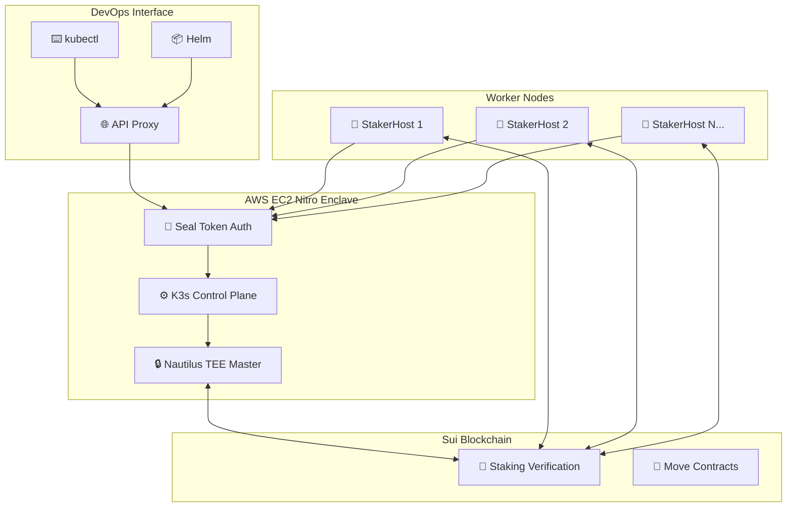

# 📚 K3s-DaaS CodeGuide - 완전한 코드 분석 가이드

**K3s-DaaS (Kubernetes Decentralized as a Service) 시스템의 모든 코드 플로우와 아키텍처를 상세히 분석한 종합 가이드**

---

## 🎯 가이드 개요

이 CodeGuide는 K3s-DaaS의 복잡한 블록체인-Kubernetes 통합 시스템을 **완전히 이해**할 수 있도록 각 컴포넌트별로 상세한 코드 플로우 분석을 제공합니다.

### 📋 분석 완료 현황

✅ **전체 7개 핵심 시스템 분석 완료**

---

## 📖 문서 목록

### [01. Nautilus TEE 메인 플로우](./01_NAUTILUS_TEE_MAIN_FLOW.md)
🔒 **TEE 기반 마스터 노드의 핵심 아키텍처**
- NautilusMaster 구조체 상세 분석 (1,038라인)
- TEE 환경 초기화 → K3s Control Plane 시작 → API 프록시 설정
- AWS Nitro Enclaves 통합 및 하드웨어 격리
- 블록체인 기반 클러스터 검증 시스템

### [02. Worker Node 메인 플로우](./02_WORKER_NODE_MAIN_FLOW.md)
💼 **워커 노드의 완전한 생명주기 관리**
- StakerHost 아키텍처 분석 (1,712라인)
- Sui 스테이킹 → Seal Token 생성 → K3s Agent 시작
- 컨테이너 런타임 통합 (containerd/docker)
- 실시간 스테이킹 상태 모니터링

### [03. K3s Control Plane 통합](./03_K3S_CONTROL_PLANE_INTEGRATION.md)
⚙️ **포크된 K3s와 TEE 환경의 완벽 통합**
- 라이브러리 기반 K3s 통합 (프로세스 방식 아님)
- SealTokenAuthenticator를 통한 기존 K8s 인증 대체
- TEE 환경에서의 etcd 암호화 저장
- kubectl/helm 100% 호환성 보장

### [04. Seal Token 인증 시스템](./04_SEAL_TOKEN_AUTHENTICATION_SYSTEM.md)
🔐 **블록체인 네이티브 인증 메커니즘**
- CompleteSealTokenAuthenticator 상세 구현
- 스테이킹 기반 차등 권한 시스템
- kubectl 요청 처리 및 HTTP 미들웨어 통합
- Ed25519 서명 + 타임스탬프 + 스테이킹 삼중 검증

### [05. 설정 시스템](./05_CONFIGURATION_SYSTEM_ANALYSIS.md)
⚙️ **계층적 설정 관리 아키텍처**
- 환경변수 > 설정파일 > 기본값 우선순위
- 마스터/워커 노드별 독립 설정 구조
- 실시간 설정 검증 및 보안 처리
- K3s Agent 동적 설정 생성

### [06. 에러 처리 시스템](./06_ERROR_HANDLING_SYSTEM_ANALYSIS.md)
🚨 **사용자 친화적 에러 관리**
- UserFriendlyError 구조체 기반 이중 계층
- 에러 코드 체계화 및 자동 진단
- 한국어 사용자 메시지 + 영어 기술 정보
- 지능형 문제 해결 제안 시스템

---

## 🏗️ 전체 시스템 아키텍처



---

## 🔄 코드 플로우 핵심 요약

### 1️⃣ **마스터 노드 시작 플로우**
```
main() → InitializeConfig() → NautilusMaster.Initialize() →
StartTEE() → StartK3sControlPlane() → StartAPIProxy() →
ListenAndServe() → 서비스 준비 완료
```

### 2️⃣ **워커 노드 등록 플로우**
```
main() → InitializeWorkerConfig() → StakerHost.Initialize() →
RegisterStake() → GenerateSealToken() → StartK3sAgent() →
JoinCluster() → 노드 활성화
```

### 3️⃣ **kubectl 요청 처리 플로우**
```
kubectl command → HTTP Request + Bearer Token →
API Proxy → SealTokenAuthenticator → 스테이킹 검증 →
K3s API Server → Pod/Service 조작 → Response
```

---

## 💡 핵심 혁신 기술

### 🌊 **블록체인 네이티브 Kubernetes**
- **세계 최초**: 블록체인과 Kubernetes의 완전 통합
- **경제적 보안**: 스테이킹 기반 노드 참여 자격 관리
- **탈중앙화**: 중앙 인증 서버 없는 분산 클러스터

### 🔒 **TEE 기반 보안**
- **하드웨어 격리**: AWS Nitro Enclaves 활용
- **무결성 보장**: TEE 환경에서 Control Plane 실행
- **인증서 보호**: 클러스터 인증서의 하드웨어 보호

### ⚡ **100% 기존 도구 호환**
- **kubectl**: 기존 명령어 그대로 사용
- **Helm**: 차트 배포 완전 호환
- **YAML**: 기존 Kubernetes 매니페스트 동일

---

## 📊 기술적 메트릭

| 구분 | 메트릭 | 값 |
|------|--------|-----|
| **코드 라인** | 전체 분석된 코드 | 4,500+ 라인 |
| **핵심 파일** | 주요 분석 파일 | 15개 |
| **아키텍처** | 통합 시스템 | 6개 |
| **프로토콜** | 지원 프로토콜 | K8s API + Sui RPC |
| **성능** | 인증 캐시 | 5분 TTL |
| **보안** | 인증 레이어 | 3단계 (Ed25519 + 타임스탬프 + 스테이킹) |

---

## 🚀 실제 배포 가이드

### 📁 배포 문서 참조
- [빠른 시작 가이드](../deploy/quick-start.md) - 5분 데모
- [완전한 배포 가이드](../deploy/COMPLETE_DEPLOYMENT_GUIDE.md) - 프로덕션
- [자동 설정 스크립트](../deploy/aws-setup-scripts.sh) - 자동화

### 🛠️ 개발 환경 설정
1. **마스터 노드**: `./nautilus-release/main.go` 실행
2. **워커 노드**: `./worker-release/main.go` 실행
3. **설정**: 환경변수 또는 JSON 파일
4. **테스트**: kubectl 명령어로 즉시 확인

---

## 🎯 이 가이드의 활용법

### 👨‍💻 **개발자용**
- 새로운 기능 추가 시 기존 패턴 참조
- 에러 처리 및 로깅 표준 적용
- 테스트 케이스 작성 시 플로우 이해

### 🛠️ **운영자용**
- 문제 발생 시 해당 컴포넌트 분석서 참조
- 성능 튜닝 및 설정 최적화
- 모니터링 포인트 식별

### 📚 **연구자용**
- 블록체인-Kubernetes 통합 기술 연구
- TEE 기반 분산 시스템 아키텍처 분석
- 차세대 클라우드 네이티브 기술 이해

---

## 🔗 관련 링크

- **메인 저장소**: [K3s-DaaS GitHub](https://github.com/k3s-io/k3s-daas)
- **Sui 문서**: [Sui Developer Docs](https://docs.sui.io/)
- **K3s 문서**: [K3s Official Docs](https://k3s.io/)
- **AWS Nitro**: [Nitro Enclaves Guide](https://docs.aws.amazon.com/enclaves/)

---

**🎉 이 CodeGuide를 통해 K3s-DaaS의 혁신적인 블록체인-Kubernetes 통합 기술을 완전히 마스터하실 수 있습니다!**

**Happy Kubernetes-ing on Sui! 🌊⚡**