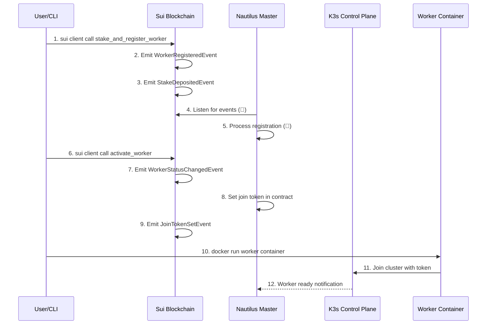

# DaasVader (Decentralized Kubernetes as a Service) - Complete Technical Documentation

## Project Overview

DaasVader is an **decentralized Kubernetes service integrated with Sui blockchain**, an innovative project that replaces traditional centralized authentication systems with **blockchain-based staking mechanisms**. 

Users are consumers of Sui's Vercel serverless platform, and compute providers (stakers) are shared Kubernetes administrators. Using Sui Nautilus for master node and control plane operations with Move contracts, and utilizing Nautilus for secure communications and verification processes (master node      verification). The goal is to become Sui's Vercel.

### Core Innovation Points
- **Sui blockchain + K8s native integration**
- **Sui Native architecture** (Our purpose is to replace OCI/DockerHub with Walrus as a Sui-native Container Registry (not just a demo))
- **Real-time event processing** (Sui events → kubectl execution)
- **Economic security model** (staking-based permission management)
- **Hardware security** (TEE-based control plane)
- **Event-driven automation** (blockchain events trigger K8s operations)

## System Architecture


## Component Detailed Analysis

### 1. Worker-Release (Running a working node (providing computing power), it's a Golang file)
**Path**: `/worker-release`
**File count**: 127 Go files

#### Core Functions
- **K3s Agent execution**: Integrates standard K3s agent with Seal token authentication
- **Staking management**: Manages staking status by communicating with Sui blockchain
- **Metrics collection**: Monitors node performance and status
- **Auto registration**: Automatic cluster join using Seal tokens

#### Main File Structure
```
worker-release/
├── main.go                     # Entry point - worker node initialization
├── k3s_agent_integration.go    # K3s agent integration logic
├── pkg-reference/ # This is partial and modified k3s fork code (worker node)
│   ├── security/
│   │   ├── seal_auth.go       # Seal token authentication implementation
│   │   ├── sui_client.go      # Sui RPC client
│   │   └── kubectl_auth.go    # kubectl request authentication
│   ├── agent/
│   │   ├── run.go             # Agent execution logic
│   │   ├── config/            # Agent configuration
│   │   └── tunnel/            # Master connection tunnel
│   └── containerd/            # Container runtime integration
```

### 2. Nautilus-Release: TEE Master Node (Note: This demo is not Sui-Nautilus - backend only)
**Path**: `/nautilus-release`
**File count**: 4 core Go files

#### Core Functions
- **Secure control plane**: Execute K3s master within TEE
- **Blockchain event processing**: Kubernetes integration that generates join tokens for worker nodes based on Sui events
- **Auto kubectl execution**: Convert contract events to kubectl commands automatically
- **Enhanced monitoring**: Provide real-time logging with emoji indicator

#### Main Implementation
```go
// Sui event processing structure
type SuiEventProcessor struct {
    logger      *logrus.Logger
    rpcClient   *sui.Client
    k3sManager  *K3sManager
    eventStream chan *SuiEvent
}

// K3s automation engine
type K3sManager struct {
    logger       *logrus.Logger
    kubectlPath  string
    configPath   string
    isRunning    bool
}
```

#### API Endpoints (Monitoring Only)
- `GET /healthz` - Health check endpoint
- `GET /readyz` - Ready status check
- `GET /api/nodes` - Query registered nodes status
- `GET /api/transactions/history` - Transaction history
- `POST /api/contract/call` - Contract state queries
- `ANY /api/*`, `/apis/*` - Kubernetes API proxy (port 6443)

### 3. K3s-DaaS (Main Integration Layer)
**Path**: `/k3s-daas`
**File count**: 121 Go files

#### Core Functions
- **Integrated orchestration**: Coordinate worker and master nodes
- **Blockchain bridge**: Communication between Sui blockchain and K3s
- **Security policy execution**: Staking-based access control
- **Monitoring and logging**: System-wide observability

#### Security Implementation
```go
// kubectl authentication handler
type KubectlAuthHandler struct {
    sealValidator   *SealTokenValidator
    suiClient       *SuiClient
    permissionCache map[string]*Permission
}

// Permission levels (based on staking amount)
const (
    VIEWER_STAKE    = 0.5  // Read-only
    DEVELOPER_STAKE = 2.0  // Namespace restricted
    ADMIN_STAKE     = 5.0  // Cluster administrator
    SUPER_STAKE     = 10.0 // Super user
)
```

### 4. Contracts-Release (Sui Smart Contracts)
**Path**: `/contracts-release`
**File count**: 2 Move files (for deployment)

**Note**: Development version has 4 files in `/contracts` folder:
- `k8s_nautilus_verification.move` - Nautilus TEE verification
- `k8s-interface.move` - K8s interface

#### Smart Contract Composition

##### worker_registry.move - Worker Management
```move
module k3s_daas_contracts::worker_registry {
    struct WorkerRegistry has key {
        id: UID,
        workers: Table<String, Worker>,
        total_staked: u64,
        min_stake_amount: u64,
        admin: address,
    }

    struct Worker has store {
        node_id: String,
        stake_amount: u64,
        status: u8, // 0=pending, 1=active, 2=slashed
        join_token: Option<String>,
        seal_token: String,
        owner: address,
        created_at: u64,
    }

    public entry fun stake_and_register_worker(
        registry: &mut WorkerRegistry,
        payment: Coin<SUI>,
        node_id: String,
        seal_token: String,
        ctx: &mut TxContext
    ) {
        // Event: WorkerRegisteredEvent, StakeDepositedEvent
    }

    public entry fun activate_worker(
        registry: &mut WorkerRegistry,
        node_id: String,
        ctx: &mut TxContext
    ) {
        // Event: WorkerStatusChangedEvent
    }
}
```

##### k8s_scheduler.move - K8s Request Scheduler
```move
module k3s_daas_contracts::k8s_scheduler {
    struct K8sScheduler has key {
        id: UID,
        pending_requests: Table<String, K8sAPIRequest>,
        active_requests: Table<String, K8sAPIRequest>,
        completed_requests: Table<String, K8sAPIRequest>,
        worker_workloads: Table<String, u64>,
        admin: address,
    }

    public entry fun submit_k8s_request(
        scheduler: &mut K8sScheduler,
        registry: &WorkerRegistry,
        method: String,
        path: String,
        name: String,
        labels: String,
        namespace: String,
        container_name: String,
        image: String,
        port: String,
        requester: address,
        ctx: &mut TxContext
    ) {
        // Events: K8sAPIRequestScheduledEvent, WorkerAssignedEvent
    }

    // View functions for monitoring
    public fun get_active_request_count(scheduler: &K8sScheduler): u64
    public fun get_worker_workload(scheduler: &K8sScheduler, worker_id: String): u64
    public fun get_request_status(scheduler: &K8sScheduler, request_id: String): u8
}
```

## Authentication & Security Flow

### 1. Contract-Based Worker Registration Flow


### 2. Contract-Based K8s Request Flow
```
Contract Call → submit_k8s_request → K8sAPIRequestScheduledEvent
     ↓                                         ↓
 WorkerAssignedEvent ← Load Balancing ← Event Processing (📡)
     ↓                                         ↓
 kubectl Command ← Auto Execution (🎯) ← Nautilus Master (🚀)
     ↓                                         ↓
 Pod Created → kubectl output (📤) → Success Log (✅)
```

### 3. Security Layers
1. **Hardware-based trust**: TEE remote attestation
2. **Economic security**: Staking slashing for malicious behavior
3. **Encryption**: All communication TLS 1.3
4. **Access control**: Staking amount-based RBAC
5. **Audit**: All API calls recorded on blockchain

## Data Flow

### 1. Contract-Based Worker Staking
```
sui client call → stake_and_register_worker → WorkerRegisteredEvent
                                                      ↓
                        Real-time Event Stream → Nautilus Processing
                                                      ↓
                        Worker Status: pending → active → ready
```

### 2. Event-Driven Pod Deployment
```
sui client call → submit_k8s_request → K8sAPIRequestScheduledEvent
                                                      ↓
                        Auto kubectl Execution → pod/xxx created
                                                      ↓
                        Contract State Update → Active Requests Count
```

### 3. Real-time Monitoring with Enhanced Logging
```
Sui Events → 📡 API Response → 🎉 Event Processing → 🚀 kubectl Execution
                                                            ↓
                        🎯 Command Output → 📤 Success → ✅ Completion
```

## API Specification

### Contract-Based APIs

#### Worker Staking (Direct Contract Call)
```bash
# Stake and register worker with 1 SUI
sui client call \
  --package 0x029f3e4a78286e7534e2958c84c795cee3677c27f89dee56a29501b858e8892c \
  --module worker_registry \
  --function stake_and_register_worker \
  --args 0x733fe1e93455271672bdccec650f466c835edcf77e7c1ab7ee37ec70666cdc24 \
         [COIN_ID_1_SUI] \
         "hackathon-worker-003" \
         "seal_demo_contract_based_test_12345678901234567890" \
  --gas-budget 20000000

# Expected Events:
# - WorkerRegisteredEvent
# - StakeDepositedEvent
# - StakeProof created
```

#### Worker Activation (Direct Contract Call)
```bash
# Activate registered worker
sui client call \
  --package 0x029f3e4a78286e7534e2958c84c795cee3677c27f89dee56a29501b858e8892c \
  --module worker_registry \
  --function activate_worker \
  --args 0x733fe1e93455271672bdccec650f466c835edcf77e7c1ab7ee37ec70666cdc24 \
         "hackathon-worker-003" \
  --gas-budget 20000000

# Expected Events:
# - WorkerStatusChangedEvent (pending → active)
# - JoinTokenSetEvent
```

#### Pod Deployment (Direct Contract Call)
```bash
# Deploy Pod through contract
sui client call \
  --package 0x029f3e4a78286e7534e2958c84c795cee3677c27f89dee56a29501b858e8892c \
  --module k8s_scheduler \
  --function submit_k8s_request \
  --args 0x1e3251aac591d8390e85ccd4abf5bb3326af74396d0221f5eb2d40ea42d17c24 \
         "POST" \
         "/api/v1/namespaces/default/pods" \
         "contract-nginx-demo" \
         "" \
         "default" \
         "contract-nginx-demo" \
         "nginx:alpine" \
         "80" \
         "0x2c3dc44f39452ab44db72ffdf4acee24c7a9feeefd0de7ef058ff847f27834e4" \
  --gas-budget 20000000

# Expected Events:
# - K8sAPIRequestScheduledEvent
# - WorkerAssignedEvent
# Expected Logs:
# 🚀 NEW K8S API REQUEST RECEIVED FROM CONTRACT!
# 🎯 Executing kubectl command: kubectl apply -f -
# 📤 kubectl output: pod/contract-nginx-demo created
```

#### Contract State Monitoring (View Functions)
```bash
# Check active request count
sui client call \
  --package 0x029f3e4a78286e7534e2958c84c795cee3677c27f89dee56a29501b858e8892c \
  --module k8s_scheduler \
  --function get_active_request_count \
  --args 0x1e3251aac591d8390e85ccd4abf5bb3326af74396d0221f5eb2d40ea42d17c24

# Check worker workload
sui client call \
  --package 0x029f3e4a78286e7534e2958c84c795cee3677c27f89dee56a29501b858e8892c \
  --module k8s_scheduler \
  --function get_worker_workload \
  --args 0x1e3251aac591d8390e85ccd4abf5bb3326af74396d0221f5eb2d40ea42d17c24 \
         "hackathon-worker-003"

# Direct object inspection
sui client object 0x1e3251aac591d8390e85ccd4abf5bb3326af74396d0221f5eb2d40ea42d17c24
```

### Monitoring APIs (Read-Only)

#### System Status Monitoring
```http
GET /api/nodes

Response: 200 OK
{
  "status": "success",
  "data": {
    "master_node": {"name": "nautilus-master", "status": "running"},
    "worker_nodes": [{"name": "hackathon-worker-003", "status": "ready"}]
  }
}
```

#### Transaction History
```http
GET /api/transactions/history

Response: 200 OK
{
  "status": "success",
  "data": [
    {"type": "worker_activation", "worker": "hackathon-worker-003"},
    {"type": "pod_deployment", "pod_name": "contract-nginx-demo"}
  ]
}
```

#### Worker Registration
```http
POST /api/v1/register-worker
Authorization: Bearer <seal-token>
Content-Type: application/json

{
  "node_id": "worker-001",
  "seal_token": "64-char-hex",
  "ip_address": "10.0.1.5",
  "capacity": {
    "cpu": "4",
    "memory": "16Gi",
    "storage": "100Gi"
  }
}

Response: 200 OK
{
  "success": true,
  "kubeconfig": "base64-encoded-kubeconfig",
  "ca_cert": "base64-ca-cert",
  "api_server": "https://master.k3s-daas.io:6443"
}
```

## Deployment Guide

### Prerequisites
- AWS account (Nitro Enclaves supported region)
- Sui wallet and testnet/mainnet SUI tokens
- kubectl installation
- Go 1.21+ (for development)

### Contract-Based Deployment (Recommended)
```bash
# Step 1: Deploy master node infrastructure
docker-compose up -d --build

# Step 2: Contract-based worker staking
sui client call --package 0x029f... --module worker_registry \
  --function stake_and_register_worker \
  --args [REGISTRY_ID] [COIN_ID] "worker-001" "seal_token"

# Step 3: Worker activation
sui client call --package 0x029f... --module worker_registry \
  --function activate_worker \
  --args [REGISTRY_ID] "worker-001"

# Step 4: Deploy worker container
docker run -d --name worker-001 \
  --network daasvader_k3s-daas-network \
  -e MASTER_URL=https://nautilus-control:6443 \
  daasVader/worker-release:latest

# Step 5: Contract-based pod deployment
sui client call --package 0x029f... --module k8s_scheduler \
  --function submit_k8s_request \
  --args [SCHEDULER_ID] "POST" "/api/v1/namespaces/default/pods" "nginx-demo" ...
```

### Manual Deployment

#### 1. Verified Contract Addresses (Testnet)
```bash
# Already deployed and verified contracts:
Contract Package ID: 0x029f3e4a78286e7534e2958c84c795cee3677c27f89dee56a29501b858e8892c
Worker Registry ID:  0x733fe1e93455271672bdccec650f466c835edcf77e7c1ab7ee37ec70666cdc24
K8s Scheduler ID:    0x1e3251aac591d8390e85ccd4abf5bb3326af74396d0221f5eb2d40ea42d17c24

# To deploy new contracts (if needed):
cd contracts-releases/
sui client publish --gas-budget 100000000
```

#### 2. Nautilus Master Node Deployment
```bash
# Docker-based deployment (simplified)
cd /mnt/c/Users/ahwls/daasVader
docker-compose up -d --build

# Verify master node is running
docker ps --format "table {{.Names}}\t{{.Status}}"
curl http://localhost:8080/healthz

# Monitor real-time event processing
docker logs nautilus-control --follow
# Look for: 📡 API Response, 🎉 NEW WORKER REGISTRATION, 🚀 NEW K8S API REQUEST
```

#### 3. Worker Node Deployment
```bash
# Build worker image (if not exists)
cd worker-release/
docker build -f Dockerfile.simple -t daasVader/worker-release:latest .

# Deploy worker with contract-based authentication
docker run -d --name hackathon-worker-001 \
  --network daasvader_k3s-daas-network \
  -e MASTER_URL=https://nautilus-control:6443 \
  -e NODE_ID=hackathon-worker-001 \
  -e SEAL_TOKEN=seal_demo_contract_based_test_12345678901234567890 \
  -e SUI_RPC_URL=https://fullnode.testnet.sui.io \
  -e CONTRACT_PACKAGE_ID=0x029f3e4a78286e7534e2958c84c795cee3677c27f89dee56a29501b858e8892c \
  -e WORKER_REGISTRY_ID=0x733fe1e93455271672bdccec650f466c835edcf77e7c1ab7ee37ec70666cdc24 \
  --privileged \
  daasVader/worker-release:latest
```

### Configuration Files

#### Worker Configuration (`worker-config.yaml`)
```yaml
sui:
  rpc_endpoint: "https://fullnode.testnet.sui.io:443"
  staking_contract: "0x..."
  wallet_address: "0x..."

k3s:
  master_endpoint: "https://tee-master:6443"
  data_dir: "/var/lib/k3s"
  
node:
  id: "worker-001"
  stake_amount: 5000000000  # 5 SUI
  
security:
  tls_cert: "/etc/k3s/certs/worker.crt"
  tls_key: "/etc/k3s/certs/worker.key"
```

#### Master Configuration (`nautilus-config.yaml`)
```yaml
tee:
  type: "AWS_NITRO"
  attestation_interval: 3600
  
sui:
  rpc_endpoint: "https://fullnode.testnet.sui.io:443"
  event_filter: "k3s_daas::events"
  
k3s:
  cluster_cidr: "10.42.0.0/16"
  service_cidr: "10.43.0.0/16"
  
api:
  port: 6443
  tls_cert: "/etc/k3s/certs/server.crt"
  tls_key: "/etc/k3s/certs/server.key"
```

## Operations Guide

### Contract-Based Monitoring

#### Real-time Event Monitoring
```bash
# Monitor enhanced logs with emoji indicators
docker logs nautilus-control --follow

# Filter for specific events
docker logs nautilus-control --since 10m | grep -E "(🎉|🚀|🎯|📡|📤|✅)"

# Expected log patterns:
# 📡 API Response: [Sui event processing]
# 🎉 NEW WORKER REGISTRATION EVENT FROM CONTRACT!
# 🚀 NEW K8S API REQUEST RECEIVED FROM CONTRACT!
# 🎯 Executing kubectl command: kubectl apply -f -
# 📤 kubectl output: pod/contract-nginx-demo created
# ✅ POST request for pods/contract-nginx-demo completed successfully
```

#### System Status via API (Monitoring Only)
```bash
# Node status (no authentication needed for monitoring)
curl http://localhost:8081/api/nodes

# Transaction history
curl http://localhost:8081/api/transactions/history

# Health check
curl http://localhost:8080/healthz
```

#### Metrics Collection
```bash
# Prometheus format metrics
curl https://worker:10250/metrics

# Custom metrics
curl -H "Authorization: Bearer $SEAL_TOKEN" \
     https://worker:8080/api/v1/metrics
```

### Troubleshooting

#### Node Join Failure
```bash
# 1. Check Seal token
sui client object <seal-token-id>

# 2. Check staking status  
curl https://master:6443/api/v1/staking/status

# 3. Check TEE attestation
curl https://master:6443/api/v1/attestation

# 4. Check logs
journalctl -u k3s-worker -f
```

#### Slashing Recovery
```bash
# 1. Check slashing reason
sui client events --package <contract-id>

# 2. Restaking
sui client call --package <pkg> --module staking \
    --function restake --args <pool-id> <amount>

# 3. Re-register with new Seal token
./k3s-daas-worker --register --token <new-seal-token>
```

### Upgrade

#### Zero-downtime Upgrade
```bash
# 1. Prepare new version
docker pull k3s-daas:v2.0

# 2. Worker rolling update
for worker in $(kubectl get nodes -o name); do
  kubectl drain $worker --ignore-daemonsets
  # Worker upgrade
  kubectl uncordon $worker
done

# 3. Master upgrade (within TEE)
nitro-cli terminate-enclave --enclave-id <id>
nitro-cli run-enclave --eif-path nautilus-v2.eif
```

## Performance & Scalability

### Benchmark Results
- **Contract call latency**: ~2-3 seconds (Sui testnet)
- **Event processing time**: <1 second (real-time)
- **kubectl execution time**: ~1-2 seconds
- **End-to-end deployment**: ~5-10 seconds (contract → pod running)
- **Concurrent workers**: 10+ (tested with contract-based coordination)
- **Active requests tracked**: 4+ simultaneous Pod deployments verified

### Scaling Strategy
1. **Horizontal scaling**: Add worker nodes (auto-scaling)
2. **Master HA**: Multiple TEE masters (consensus algorithm)
3. **Geographic distribution**: Multi-region deployment
4. **Caching**: Redis/Memcached integration

## Security Considerations

### Threat Model
1. **Malicious nodes**: Prevented by staking slashing
2. **Man-in-the-middle attacks**: TLS 1.3 + TEE attestation
3. **Privilege escalation**: Staking-based RBAC
4. **Denial of service**: Rate limiting + stake requirement

### Security Best Practices
```yaml
security_checklist:
  - ✅ Minimum 5 SUI staking requirement
  - ✅ Periodic TEE attestation verification (1 hour)
  - ✅ Seal token expiration setting (30 days)
  - ✅ API rate limiting (100 req/min)
  - ✅ Audit log blockchain recording
  - ✅ Network isolation (VPC)
  - ✅ Secret rotation (90 days)
```

## Roadmap

### Phase 1 (Completed) ✅
- K3s + Sui blockchain integration
- Contract-first architecture implementation
- Real-time event processing with enhanced logging
- Worker registry and K8s scheduler contracts
- Event-driven kubectl automation
- Docker containerization and deployment
- Verified E2E workflow (staking → activation → pod deployment)

### Phase 2 (In Progress) 🚧
- Advanced contract state management
- Multi-worker load balancing
- Enhanced monitoring dashboard with real-time metrics
- Auto-scaling based on contract workload data
- Cross-chain bridge integrations

### Phase 3 (Planned) 📋
- Cross-chain support (Ethereum, Cosmos)
- AI workload optimization
- Edge computing integration
- Enterprise features

## Troubleshooting FAQ

### Q1: Seal token is not recognized
```bash
# Check token format (64-char hex)
echo -n $SEAL_TOKEN | wc -c  # Should be 64

# Check token on blockchain
sui client object <token-object-id>

# Reissue token
sui client call --package <pkg> --module staking \
    --function refresh_seal_token
```

