# DaasVader (Decentralized Kubernetes as a Service) - Complete Technical Documentation

## Project Overview

DaasVader is an **decentralized Kubernetes service integrated with Sui blockchain**, an innovative project that replaces traditional centralized authentication systems with **blockchain-based staking mechanisms**. 

Users are consumers of Sui's Vercel serverless platform, and compute providers (stakers) are shared Kubernetes administrators. Using Sui Nautilus for master node and control plane operations with Move contracts, and utilizing Nautilus for secure communications and verification processes (master node      verification). The goal is to become Sui's Vercel.

### Core Innovation Points
- **Sui blockchain + K8s native integration**
- **Sui Native architecture** (Our purpose is to replace OCI/DockerHub with Walrus as a Sui-native Container Registry (not just a demo))
- **Real-time event processing** (Sui events → masternode execution)
- **Economic security model** (staking-based permission management)
- **Hardware security** (TEE-based control plane (not just a demo))
- **Event-driven automation** (blockchain events trigger K8s operations)

## System Architecture


## Component Detailed Analysis

### 1. Worker-Release (Running a working node (providing computing power), it's a Golang file)
**Path**: `/worker-release`
**File count**: 127 Go files

#### Core Functions
- **K3s Agent execution**: Integrates standard K3s agent with Stake token authentication
- **Staking management**: Manages staking status by communicating with Sui blockchain
- **Metrics collection**: Monitors node performance and status
- **Auto registration**: Automatic cluster join using Stake tokens

#### Main File Structure
```
worker-release/
├── main.go                     # Entry point - worker node initialization
├── k3s_agent_integration.go    # K3s agent integration logic
├── pkg-reference/ # This is partial and modified k3s fork code (worker node)
│   ├── security/
│   │   ├── seal_auth.go       # Seal token authentication implementation
│   │   ├── sui_client.go      # Sui RPC client
│   │   └── kubectl_auth.go    # kubectl request authentication
│   ├── agent/
│   │   ├── run.go             # Agent execution logic
│   │   ├── config/            # Agent configuration
│   │   └── tunnel/            # Master connection tunnel
│   └── containerd/            # Container runtime integration
```

### 2. Nautilus-Release: TEE Master Node (Note: This demo is not Sui-Nautilus - backend only)
**Path**: `/nautilus-release`
**File count**: 4 core Go files

#### Core Functions
- **Secure control plane**: Execute K3s master within TEE
- **Blockchain event processing**: Kubernetes integration that generates join tokens for worker nodes based on Sui events
- **Auto kubectl execution**: Convert contract events to kubectl commands automatically
- **Enhanced monitoring**: Provide real-time logging with emoji indicator

#### Main Implementation
```go
// Sui event processing structure
type SuiEventProcessor struct {
    logger      *logrus.Logger
    rpcClient   *sui.Client
    k3sManager  *K3sManager
    eventStream chan *SuiEvent
}

// K3s automation engine
type K3sManager struct {
    logger       *logrus.Logger
    kubectlPath  string
    configPath   string
    isRunning    bool
}
```

#### API Endpoints (Monitoring Only)
- `GET /healthz` - Health check endpoint
- `GET /readyz` - Ready status check
- `GET /api/nodes` - Query registered nodes status
- `GET /api/transactions/history` - Transaction history
- `POST /api/contract/call` - Contract state queries
- `ANY /api/*`, `/apis/*` - Kubernetes API proxy (port 6443)

### 3. Contracts-Release (Sui Smart Contracts)
*Path**: `/contracts-release`
**Deployed on**: Sui Testnet (Verified & Production Ready)

#### Contract Overview
| Contract | Address | Function | Status |
|----------|---------|----------|--------|
| **Package** | `0x029f3e4a78286e7534e2958c84c795cee3677c27f89dee56a29501b858e8892c` | Main package | Deployed |
| **Worker Registry** | `0x733fe1e93455271672bdccec650f466c835edcf77e7c1ab7ee37ec70666cdc24` | Worker management | Active |
| **K8s Scheduler** | `0x1e3251aac591d8390e85ccd4abf5bb3326af74396d0221f5eb2d40ea42d17c24` | Pod scheduling | Active |

#### Core Functions

| Function | Purpose | Events Emitted | Status |
|----------|---------|----------------|--------|
| `stake_and_register_worker` | Stake SUI & register worker | `WorkerRegisteredEvent`, `StakeDepositedEvent` | Tested |
| `activate_worker` | Activate staked worker | `WorkerStatusChangedEvent`, `JoinTokenSetEvent` | Tested |
| `submit_k8s_request` | Deploy Pods via contract | `K8sAPIRequestScheduledEvent`, `WorkerAssignedEvent` | Tested |

#### Contract Structures

##### Worker Registry Contract
```move
struct WorkerRegistry has key {
    id: UID,
    workers: Table<String, Worker>,     // node_id → Worker
    total_staked: u64,                  // Total SUI staked
    min_stake_amount: u64,              // Minimum stake (1 SUI)
    admin: address,
}

struct Worker has store {
    node_id: String,                    // "hackathon-worker-001"
    stake_amount: u64,                  // 1000000000 (1 SUI)
    status: u8,                         // 0=pending, 1=active, 2=slashed
    join_token: Option<String>,         // K3s join token
    seal_token: String,                 // Authentication token
    owner: address,                     // Staker address
    created_at: u64,
}
```

##### K8s Scheduler Contract
```move
struct K8sScheduler has key {
    id: UID,
    pending_requests: Table<String, K8sAPIRequest>,   // Queued requests
    active_requests: Table<String, K8sAPIRequest>,    // Processing requests
    completed_requests: Table<String, K8sAPIRequest>, // Finished requests
    worker_workloads: Table<String, u64>,             // Load balancing
    admin: address,
}
```

#### Quick Usage Examples

##### Stake Worker (1 SUI)
```bash
sui client call --package 0x029f3e... --module worker_registry \
  --function stake_and_register_worker \
  --args [REGISTRY] [COIN_1_SUI] "worker-001" "seal_token"
```

##### Deploy Pod
```bash
sui client call --package 0x029f3e... --module k8s_scheduler \
  --function submit_k8s_request \
  --args [SCHEDULER] "POST" "/api/v1/namespaces/default/pods" "nginx-demo" ...
```

##### Monitor Status
```bash
sui client call --package 0x029f3e... --module k8s_scheduler \
  --function get_active_request_count --args [SCHEDULER]
```
## Authentication & Security Flow

### 1. Contract-Based Worker Registration Flow

```mermaid
sequenceDiagram
    participant U as User/CLI
    participant B as Sui Blockchain
    participant N as Nautilus Master
    participant K as K3s Control Plane
    participant W as Worker Container

    U->>B: 1. sui client call stake_and_register_worker
    B->>B: 2. Emit WorkerRegisteredEvent
    B->>B: 3. Emit StakeDepositedEvent
    N->>B: 4. Listen for events (📡)
    N->>N: 5. Process registration (🎉)
    U->>B: 6. sui client call activate_worker
    B->>B: 7. Emit WorkerStatusChangedEvent
    N->>N: 8. Set join token in contract
    B->>B: 9. Emit JoinTokenSetEvent
    U->>W: 10. docker run worker container
    W->>K: 11. Join cluster with token
    K-->>N: 12. Worker ready notification
```


### 2. Contract-Based K8s Request Flow


### 3. Security Layers
1. **Hardware-based trust**: TEE remote attestation
2. **Economic security**: Staking slashing for malicious behavior
3. **Encryption**: All communication TLS 1.3
4. **Access control**: Staking amount-based RBAC
5. **Audit**: All API calls recorded on blockchain

## Data Flow

### 1. Contract-Based Worker Staking


### 2. Event-Driven Pod Deployment


### 3. Real-time Monitoring Pipeline


### 4. System Architecture Overview


