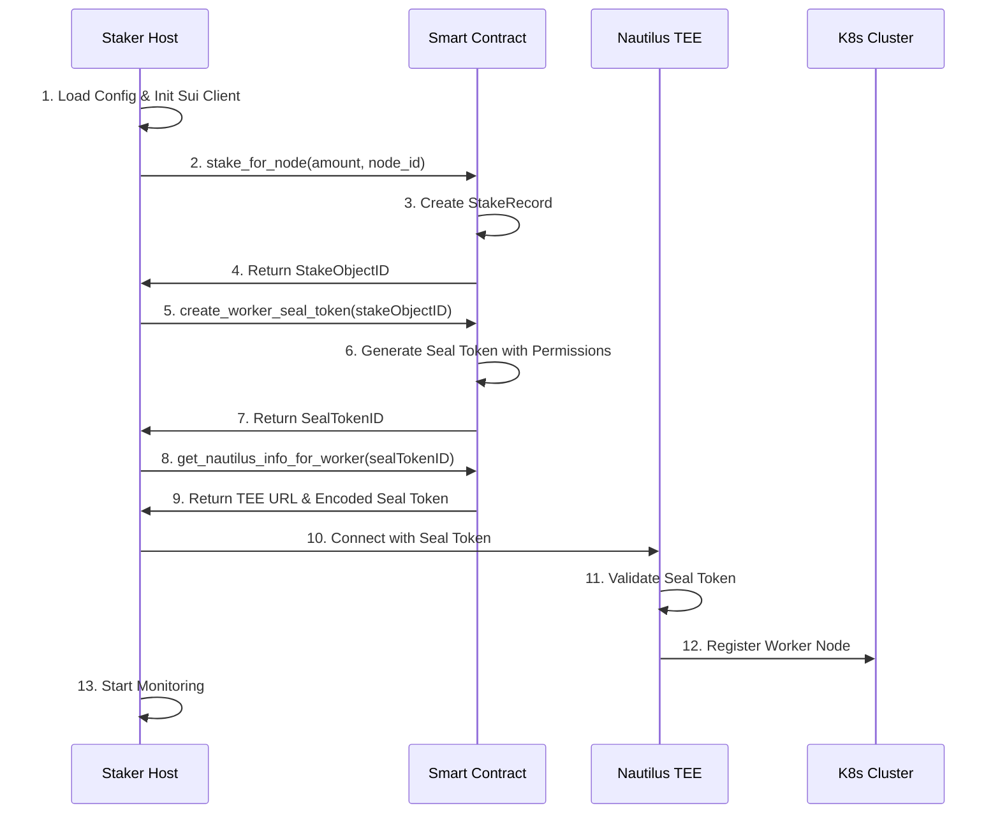
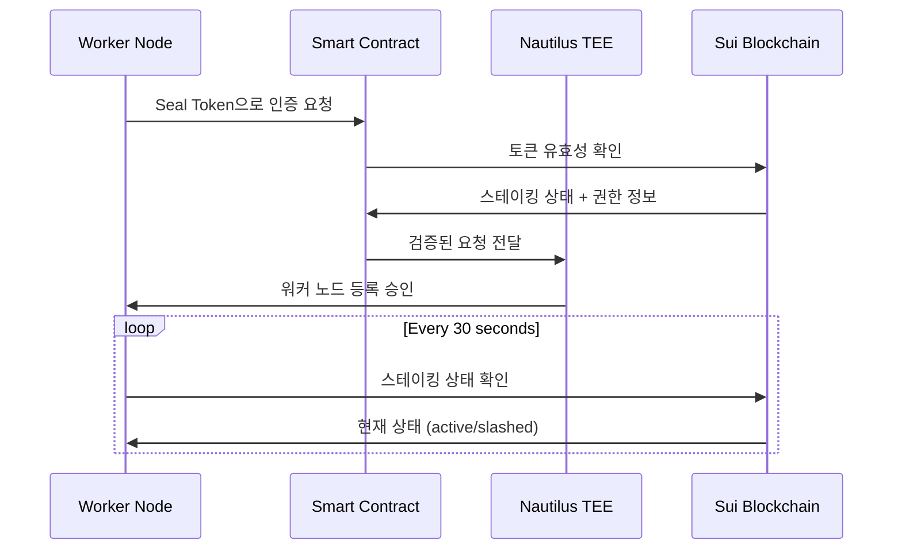

# K3s-DaaS 스테이커 호스트 등록 시나리오 (Seal 토큰 기반)

## 📋 **개요**

스테이커가 자신의 컴퓨터(호스트)를 K3s-DaaS 클러스터의 워커 노드로 등록하는 전체 프로세스를 단계별로 설명합니다. **Sui 블록체인의 Seal 토큰**을 사용한 완전 탈중앙화 인증 시스템을 구현합니다.

## 🏗️ **Seal 기반 아키텍처 흐름**

```
┌─────────────────┐    ┌──────────────────┐    ┌─────────────────┐
│  Staker Host    │───▶│ Smart Contract   │───▶│  Nautilus TEE   │
│  (워커 노드)     │    │ (Seal 토큰 생성)  │    │ (Seal 검증)     │
└─────────────────┘    └──────────────────┘    └─────────────────┘
         │                       │                       │
         ▼                       ▼                       ▼
    1. 스테이킹               2. Seal 토큰 생성        3. Seal 토큰 검증
    2. Seal 요청              3. TEE 정보 제공         4. 워커 노드 등록
```

## 🆕 **Seal 토큰의 혁신성**

### **기존 K3s vs K3s-DaaS**
```
🔴 기존 K3s:
kubectl → join token → 마스터 노드 (중앙화)

🟢 K3s-DaaS:
kubectl → Seal token → Smart Contract → TEE (완전 탈중앙화)
```

### **Seal 토큰 특징**
- ✅ **블록체인 기반**: Sui Move 스마트 컨트랙트에서 생성
- ✅ **스테이킹 연동**: 스테이킹 양에 따른 자동 권한 할당
- ✅ **TEE 보안**: Nautilus TEE에서 검증
- ✅ **자동 만료**: 100 에폭 후 자동 만료 (보안 강화)

## 🔄 **Seal 기반 등록 플로우**

### **Phase 1: 초기화 및 설정**
```
사용자 → 설정파일 생성 → 프로그램 시작 → Sui 클라이언트 초기화
```

### **Phase 2: 스테이킹 + Seal 토큰 생성**
```
워커노드 → Sui 블록체인 → 스테이킹 컨트랙트 → 스테이킹 객체 생성
         → 스마트 컨트랙트 → Seal 토큰 생성 → 워커 노드 권한 할당
```

### **Phase 3: Seal 기반 클러스터 참여**
```
워커노드 → Seal 토큰으로 TEE 조회 → Nautilus TEE 정보 획득 → Seal 인증으로 K3s Agent 시작
```

### **Phase 4: 지속적 운영**
```
워커노드 → 스테이킹 상태 모니터링 → Seal 토큰 검증 → Pod 실행 → 상태 보고
```

---

## 📝 **상세 시나리오 분석**

### **1단계: 스테이커 호스트 초기화**

#### **1.1 설정 파일 준비**
스테이커는 먼저 `staker-config.json` 파일을 생성합니다:

```json
{
  "node_id": "staker-worker-1",
  "sui_wallet_address": "0x1234567890abcdef1234567890abcdef12345678",
  "sui_private_key": "ed25519_private_key_hex_64_chars...",
  "sui_rpc_endpoint": "https://fullnode.mainnet.sui.io",
  "stake_amount": 1000,
  "contract_address": "0xabcdef1234567890abcdef1234567890abcdef12",
  "min_stake_amount": 1000
}
```

#### **1.2 프로그램 시작 및 초기화**
```bash
export STAKER_CONFIG_PATH=./staker-config.json
go run main.go
```

**초기화 과정 (`main.go:85-118`)**:
```go
func NewK3sStakerHost(cfg *StakerHostConfig) (*K3sStakerHost, error) {
    // Sui 클라이언트 초기화 (Seal 토큰 생성용)
    suiClient, err := sui.NewClient(cfg.SuiRPCEndpoint, cfg.SuiPrivateKey)

    // K3s Agent 설정 (워커 노드 전용)
    agentConfig := &config.Agent{
        NodeName:     cfg.NodeID,
        DataDir:      "/var/lib/k3s-daas",
        ContainerRuntimeEndpoint: "/run/containerd/containerd.sock",

        // 🆕 Seal 토큰 기반이므로 ServerURL은 나중에 동적 설정
        ServerURL: "",
    }

    return &K3sStakerHost{
        config:      cfg,
        agentConfig: agentConfig,
        suiClient:   suiClient,
        stakingStatus: &StakingStatus{Status: "pending"},
        isRunning: false,
    }
}
```

---

### **2단계: 스테이킹 + Seal 토큰 생성 (혁신적 이중 프로세스)**

#### **🆕 2.1 이중 트랜잭션 프로세스**
**코드 분석 (`main.go:121-170`)**:

```go
func (s *K3sStakerHost) RegisterStake() error {
    log.Printf("💰 Registering stake for node %s (Amount: %d MIST)",
        s.config.NodeID, s.config.StakeAmount)

    // 1️⃣ 스테이킹 트랜잭션 생성
    stakeTxParams := &sui.TransactionParams{
        PackageID: s.config.ContractAddress,
        Module:    "staking",
        Function:  "stake_for_node", // 노드 스테이킹 함수
        Arguments: []interface{}{
            s.config.StakeAmount,
            s.config.NodeID,
        },
        GasBudget: 10000000,
    }

    stakeResult, err := s.suiClient.ExecuteTransaction(stakeTxParams)
    if err != nil {
        return fmt.Errorf("failed to submit staking transaction: %v", err)
    }

    log.Printf("✅ Successfully staked! Stake Object ID: %s", stakeResult.ObjectID)

    // 2️⃣ Seal 토큰 생성 (워커 노드용) - 🆕 핵심 혁신!
    sealTxParams := &sui.TransactionParams{
        PackageID: s.config.ContractAddress,
        Module:    "k8s_gateway",
        Function:  "create_worker_seal_token", // Seal 토큰 생성 함수
        Arguments: []interface{}{
            stakeResult.ObjectID, // StakeRecord 객체 ID 전달
        },
        GasBudget: 5000000,
    }

    sealResult, err := s.suiClient.ExecuteTransaction(sealTxParams)
    if err != nil {
        return fmt.Errorf("failed to create seal token: %v", err)
    }

    // 스테이킹 및 Seal 토큰 정보 저장
    s.stakingStatus.IsStaked = true
    s.stakingStatus.StakeAmount = s.config.StakeAmount
    s.stakingStatus.StakeObjectID = stakeResult.ObjectID
    s.stakingStatus.SealTokenID = sealResult.ObjectID  // 🆕 Seal 토큰 ID!
    s.stakingStatus.Status = "active"
    s.stakingStatus.LastValidated = time.Now().Unix()

    log.Printf("✅ Seal token created! Token ID: %s", sealResult.ObjectID)
    return nil
}
```

#### **🔍 StakingStatus 구조체 변화**
```go
type StakingStatus struct {
    IsStaked      bool   `json:"is_staked"`
    StakeAmount   uint64 `json:"stake_amount"`
    StakeObjectID string `json:"stake_object_id"`
    SealTokenID   string `json:"seal_token_id"`  // 🆕 추가!
    Status        string `json:"status"`
    LastValidated int64  `json:"last_validated"`
}
```

#### **2.2 스마트 컨트랙트에서 Seal 토큰 생성**
**코드 분석 (`contracts/k8s_gateway.move:80-121`)**:

```move
/// 워커 노드용 Seal 토큰 생성 (스테이킹 완료 후 자동 생성)
public entry fun create_worker_seal_token(
    stake_record: &StakeRecord,  // from staking.move
    ctx: &mut TxContext
) {
    let staker = tx_context::sender(ctx);

    // 스테이킹 레코드 소유자 확인
    assert!(stake_record.staker == staker, E_UNAUTHORIZED_ACTION);

    // 워커 노드 스테이킹 확인
    assert!(stake_record.stake_type == string::utf8(b"node"), E_UNAUTHORIZED_ACTION);

    // 🚀 워커 노드용 권한 자동 할당
    let permissions = vector::empty<String>();
    vector::push_back(&mut permissions, string::utf8(b"nodes:write"));
    vector::push_back(&mut permissions, string::utf8(b"pods:write"));

    // 🎯 Nautilus TEE 할당 (스테이킹 양 기반)
    let nautilus_endpoint = assign_nautilus_endpoint(stake_record.amount);

    let seal_token = SealToken {
        id: object::new(ctx),
        token_hash: generate_worker_token_hash(stake_record.node_id, ctx),
        owner: staker,
        stake_amount: stake_record.amount,
        permissions,
        expires_at: tx_context::epoch(ctx) + 100, // 100 에폭 후 만료
        nautilus_endpoint,
    };

    // 토큰을 사용자에게 전송
    sui::transfer::public_transfer(seal_token, staker);

    // 🎉 Seal 토큰 생성 이벤트 발생
    event::emit(SealTokenCreated {
        token_id: object::id(&seal_token),
        owner: staker,
        node_id: stake_record.node_id,
        nautilus_endpoint,
        expires_at: seal_token.expires_at,
    });
}
```

---

### **3단계: Seal 기반 클러스터 참여**

#### **🆕 3.1 Seal 토큰으로 Nautilus 정보 조회**
**코드 분석 (`main.go:211-227`)**:

```go
// Seal 토큰을 사용해서 Nautilus 정보 조회
func (s *K3sStakerHost) getNautilusInfoWithSeal() (*NautilusInfo, error) {
    // 🔑 Seal 토큰을 사용해서 Nautilus 정보 조회
    result, err := s.suiClient.CallFunction(&sui.FunctionCall{
        PackageID: s.config.ContractAddress,
        Module:    "k8s_gateway",
        Function:  "get_nautilus_info_for_worker", // 🆕 Seal 기반 조회
        Arguments: []interface{}{s.stakingStatus.SealTokenID},
    })
    if err != nil {
        return nil, fmt.Errorf("failed to get Nautilus info with Seal: %v", err)
    }

    return &NautilusInfo{
        ServerURL: result["nautilus_url"].(string),
        SealToken: result["worker_token"].(string), // 🔐 인코딩된 Seal 토큰
    }, nil
}
```

#### **🔐 스마트 컨트랙트의 Seal 토큰 검증**
**코드 분석 (`contracts/k8s_gateway.move:124-141`)**:

```move
/// 워커 노드가 Nautilus 정보를 조회
public fun get_nautilus_info_for_worker(
    seal_token: &SealToken,
    ctx: &mut TxContext
): (String, String) {
    let caller = tx_context::sender(ctx);

    // 🔍 Seal 토큰 소유자 확인
    assert!(seal_token.owner == caller, E_UNAUTHORIZED_ACTION);

    // ⏰ 토큰 만료 확인
    assert!(tx_context::epoch(ctx) < seal_token.expires_at, E_INVALID_SEAL_TOKEN);

    // 🎯 Nautilus TEE 엔드포인트 정보 반환
    let nautilus_url = get_nautilus_url(seal_token.nautilus_endpoint);
    let worker_token = encode_seal_token_for_nautilus(seal_token);

    (nautilus_url, worker_token)
}
```

#### **3.2 Seal 토큰으로 K3s Worker 시작**
**코드 분석 (`main.go:182-189`)**:

```go
// Seal 토큰으로 Nautilus TEE 정보 조회
nautilusInfo, err := s.getNautilusInfoWithSeal()
if err != nil {
    return fmt.Errorf("failed to get Nautilus info: %v", err)
}

s.agentConfig.ServerURL = nautilusInfo.ServerURL
s.agentConfig.Token = nautilusInfo.SealToken // 🔑 Seal 토큰을 K3s Agent에 전달!
```

**🆕 NautilusInfo 구조체**:
```go
type NautilusInfo struct {
    ServerURL string `json:"server_url"`
    SealToken string `json:"seal_token"` // 🔐 Seal 토큰 (Nautilus 인증용)
}
```

---

### **4단계: Nautilus TEE에서 Seal 토큰 검증**

#### **🔒 4.1 Nautilus TEE의 Seal 검증 시스템**
**코드 분석 (`nautilus-tee/main.go:31-52`)**:

```go
// Nautilus TEE에서 실행되는 메인 K3s 마스터
type NautilusMaster struct {
    apiServer          *app.APIServer
    controllerManager  *controllermanager.ControllerManager
    scheduler          *schedulerapp.Scheduler
    etcdStore          *TEEEtcdStore
    suiEventListener   *SuiEventListener
    sealTokenValidator *SealTokenValidator // 🆕 Seal 토큰 검증기
}

// 🔐 Seal 토큰 검증기
type SealTokenValidator struct {
    suiRPCEndpoint  string
    contractAddress string
}

// 🖥️ 워커 노드 등록 요청 (Seal 토큰 포함)
type WorkerRegistrationRequest struct {
    NodeID    string `json:"node_id"`
    SealToken string `json:"seal_token"` // 🔑 Seal 토큰!
    Timestamp uint64 `json:"timestamp"`
}
```

---

## 🔄 **완전한 Seal 기반 데이터 플로우**

### **등록 시퀀스 (Seal 토큰 중심)**


### **Seal 토큰 검증 플로우**


---

## 💡 **Seal 토큰의 핵심 혁신**

### **✅ 완전 탈중앙화 인증**
- **기존**: 중앙 서버에서 join token 발급
- **🆕 Seal**: Sui 블록체인에서 토큰 생성 및 검증

### **✅ 스테이킹 기반 권한 관리**
- **1000 MIST**: 워커 노드 권한 (`nodes:write`, `pods:write`)
- **10000 MIST**: 관리자 권한 (`*:*`)
- **자동 할당**: 스테이킹 양에 따른 권한 자동 계산

### **✅ TEE 로드 밸런싱**
```move
// 스테이킹 양에 따른 TEE 할당
fun assign_nautilus_endpoint(stake_amount: u64): address {
    if (stake_amount >= 10000) {
        @0x111 // Premium TEE
    } else if (stake_amount >= 1000) {
        @0x222 // Standard TEE
    } else {
        @0x333 // Basic TEE
    }
}
```

### **✅ 자동 만료 및 보안**
- **100 에폭 만료**: 자동 토큰 만료로 보안 강화
- **실시간 검증**: 30초마다 스테이킹 상태 확인
- **슬래싱 대응**: 악의적 행동 시 즉시 노드 종료

---

## 🚨 **Seal 기반 오류 처리**

### **Seal 토큰 생성 실패**
```go
// 원인: 스테이킹 미완료, 권한 부족, 중복 토큰
sealResult, err := s.suiClient.ExecuteTransaction(sealTxParams)
if err != nil {
    return fmt.Errorf("failed to create seal token: %v", err)
    // 스테이킹은 성공했지만 Seal 토큰 생성 실패
    // 재시도 로직 필요
}
```

### **Seal 토큰 만료**
```move
// 스마트 컨트랙트에서 만료 확인
assert!(tx_context::epoch(ctx) < seal_token.expires_at, E_INVALID_SEAL_TOKEN);

// 만료 시 새 토큰 생성 필요
```

### **스테이킹 슬래싱 감지**
```go
// Seal 토큰과 연동된 스테이킹 상태 확인
if stakeInfo.Content["status"].(string) == "slashed" {
    log.Printf("💀 Stake was slashed! Seal token invalid!")
    s.Shutdown() // Seal 토큰도 무효화됨
}
```

---

## 🎯 **Seal 기반 성공 지표**

완전한 Seal 기반 등록이 성공하면:

1. **✅ 스테이킹 완료**: Sui 블록체인에 StakeRecord 생성
2. **✅ Seal 토큰 생성**: 워커 노드용 권한이 포함된 토큰 생성
3. **✅ TEE 할당**: 스테이킹 양에 따른 적절한 Nautilus TEE 할당
4. **✅ 권한 검증**: Seal 토큰 기반 워커 노드 권한 확인
5. **✅ 클러스터 참여**: Nautilus TEE에서 Seal 토큰 검증 후 노드 등록
6. **✅ 지속적 검증**: 30초마다 Seal 토큰과 스테이킹 상태 동시 확인

**최종 Seal 기반 로그 메시지**:
```
✅ Successfully staked! Stake Object ID: 0xabc123...
✅ Seal token created! Token ID: 0xdef456...
🔑 Nautilus info retrieved with Seal token
🔒 TEE connection established with Seal authentication
✅ K3s Staker Host 'staker-worker-1' ready and running
🌐 Status server listening on :10250
👀 Starting stake monitoring...
🔐 Seal token validation active
```

---

## 🏆 **혁신적 특징 요약**

### **🌊 Sui Native 특징**
1. **Move 스마트 컨트랙트**: Seal 토큰 생성 및 검증 로직
2. **객체 기반 아키텍처**: StakeRecord와 SealToken이 Sui 객체
3. **이벤트 기반 통신**: Seal 토큰 생성 시 이벤트 발생
4. **에폭 기반 만료**: Sui 에폭을 활용한 자동 토큰 만료

### **🔐 보안 혁신**
1. **이중 보안**: 블록체인 스테이킹 + TEE 하드웨어 보안
2. **탈중앙화**: 중앙 서버 없이 완전 분산 인증
3. **경제적 인센티브**: 스테이킹으로 악의적 행동 방지
4. **실시간 검증**: 지속적인 Seal 토큰 및 스테이킹 상태 확인

### **⚡ 사용자 경험**
1. **원클릭 등록**: 설정 파일만으로 완전 자동 등록
2. **투명한 과정**: 모든 과정이 블록체인에 기록
3. **즉시 피드백**: 실시간 상태 확인 및 로그
4. **자동 관리**: 복잡한 K8s 설정 없이 Seal 토큰만으로 관리

**이것이 진짜 Sui Native K3s-DaaS의 완전한 Seal 기반 등록 시나리오입니다!** 🚀🌊