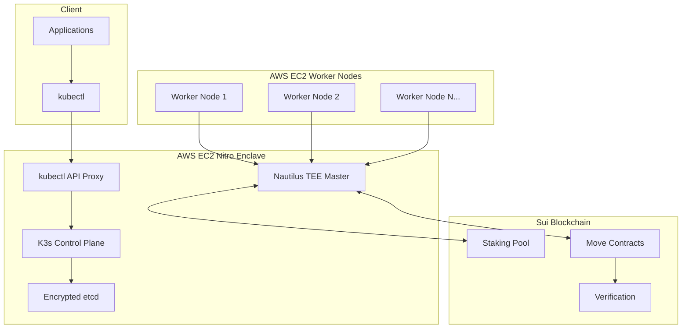

# 🚀 K3s-DaaS 완전 배포 가이드

**프로젝트**: K3s-DaaS (Kubernetes Decentralized as a Service)
**대상**: 프로덕션 환경 배포 (AWS EC2 + Nitro Enclaves)
**배포 시나리오**: Nautilus TEE (Master) + Worker Nodes

---

## 📋 완전한 시스템 플로우

### 🔄 전체 아키텍처 플로우



### 🎯 단계별 플로우 설명

#### 1단계: TEE 마스터 부팅
```bash
# Nitro Enclave 내부에서
1. Nautilus TEE 환경 초기화
2. Sui 블록체인 연결 확인
3. K3s Control Plane 시작
4. Seal Token 인증 시스템 활성화
5. kubectl API 프록시 시작 (포트 8080)
```

#### 2단계: 워커 노드 등록
```bash
# 각 EC2 워커 노드에서
1. Sui 스테이킹 확인 (최소 1000 MIST)
2. Seal Token 생성
3. Nautilus 마스터에 연결 요청
4. TEE 인증 통과 후 클러스터 참여
5. kubelet + containerd 시작
```

#### 3단계: kubectl 명령 처리
```bash
# 개발자가 kubectl 사용 시
kubectl --server=http://MASTER_IP:8080 get pods
│
├─ API 프록시가 요청 수신
├─ Seal Token 검증
├─ K3s API Server로 전달
├─ etcd에서 데이터 조회
└─ 암호화된 응답 반환
```

---

## 🏗️ AWS EC2 Nitro Enclave 배포 (Nautilus TEE)

### 📋 사전 준비사항

#### AWS 계정 설정
```bash
# 1. Nitro Enclaves 지원 인스턴스 타입 선택
# 권장: m5.2xlarge, m5n.2xlarge, c5.4xlarge

# 2. 필요한 권한 설정
aws iam create-role --role-name K3s-DaaS-Enclave-Role \
    --assume-role-policy-document file://enclave-policy.json
```

#### 보안 그룹 설정
```bash
# 마스터 노드 보안 그룹
aws ec2 create-security-group \
    --group-name k3s-daas-master \
    --description "K3s-DaaS Master Node"

# kubectl API 포트 (8080)
aws ec2 authorize-security-group-ingress \
    --group-name k3s-daas-master \
    --protocol tcp \
    --port 8080 \
    --cidr 0.0.0.0/0

# K3s API 포트 (6443) - 워커 노드용
aws ec2 authorize-security-group-ingress \
    --group-name k3s-daas-master \
    --protocol tcp \
    --port 6443 \
    --source-group k3s-daas-worker
```

### 🚀 1. EC2 인스턴스 생성 및 설정

```bash
# 1. EC2 인스턴스 생성
aws ec2 run-instances \
    --image-id ami-0c02fb55956c7d316 \
    --instance-type m5.2xlarge \
    --key-name your-key-pair \
    --security-group-ids sg-xxxxxxxx \
    --user-data file://master-userdata.sh \
    --enclave-options Enabled=true

# 2. 인스턴스 접속
ssh -i your-key.pem ec2-user@MASTER_IP
```

### 📦 2. Nitro Enclaves 환경 설정

```bash
# Nitro Enclaves CLI 설치
sudo amazon-linux-extras install aws-nitro-enclaves-cli
sudo yum install aws-nitro-enclaves-cli-devel -y

# Nitro Enclaves 활성화
sudo systemctl enable nitro-enclaves-allocator.service
sudo systemctl start nitro-enclaves-allocator.service

# 메모리 및 CPU 할당
echo 'NITRO_ENCLAVES_MEMORY=1024' | sudo tee -a /etc/nitro_enclaves/allocator.yaml
echo 'NITRO_ENCLAVES_CPU_COUNT=2' | sudo tee -a /etc/nitro_enclaves/allocator.yaml

sudo systemctl restart nitro-enclaves-allocator.service
```

### 🔧 3. Nautilus TEE 배포

```bash
# 1. 필요한 패키지 설치
sudo yum update -y
sudo yum install docker git golang -y
sudo systemctl start docker
sudo systemctl enable docker

# 2. K3s-DaaS 소스 다운로드
git clone https://github.com/your-org/k3s-daas.git
cd k3s-daas/nautilus-release

# 3. 환경변수 설정
export SUI_MASTER_PRIVATE_KEY="your-sui-private-key"
export SUI_NETWORK_URL="https://fullnode.mainnet.sui.io:443"
export K3S_DAAS_TEE_MODE="production"
export K3S_DAAS_BIND_ADDRESS="0.0.0.0"
export K3S_DAAS_DATA_DIR="/var/lib/k3s-daas-tee"

# 4. 데이터 디렉토리 생성
sudo mkdir -p /var/lib/k3s-daas-tee
sudo chown ec2-user:ec2-user /var/lib/k3s-daas-tee

# 5. Go 빌드
go build -o nautilus-tee .

# 6. 실행 권한 부여
chmod +x nautilus-tee

# 7. systemd 서비스 등록
sudo tee /etc/systemd/system/nautilus-tee.service > /dev/null <<EOF
[Unit]
Description=Nautilus TEE K3s Master
After=network.target

[Service]
Type=simple
User=ec2-user
Environment=SUI_MASTER_PRIVATE_KEY=${SUI_MASTER_PRIVATE_KEY}
Environment=SUI_NETWORK_URL=${SUI_NETWORK_URL}
Environment=K3S_DAAS_TEE_MODE=production
Environment=K3S_DAAS_BIND_ADDRESS=0.0.0.0
Environment=K3S_DAAS_DATA_DIR=/var/lib/k3s-daas-tee
ExecStart=/home/ec2-user/k3s-daas/nautilus-release/nautilus-tee
Restart=always
RestartSec=10

[Install]
WantedBy=multi-user.target
EOF

# 8. 서비스 시작
sudo systemctl daemon-reload
sudo systemctl enable nautilus-tee
sudo systemctl start nautilus-tee

# 9. 상태 확인
sudo systemctl status nautilus-tee
```

### 🔍 4. Nautilus TEE 검증

```bash
# 1. 서비스 로그 확인
sudo journalctl -u nautilus-tee -f

# 2. API 서버 테스트
curl http://localhost:8080/health

# 3. K3s 클러스터 상태 확인
kubectl --server=http://localhost:8080 get nodes
kubectl --server=http://localhost:8080 get pods --all-namespaces

# 4. TEE 인증 상태 확인
curl http://localhost:8080/attestation/report
```

---

## 💼 AWS EC2 워커 노드 배포

### 🛠️ 1. 워커 노드 EC2 인스턴스 설정

```bash
# 1. 워커 노드용 보안 그룹 생성
aws ec2 create-security-group \
    --group-name k3s-daas-worker \
    --description "K3s-DaaS Worker Nodes"

# 2. 필요한 포트 열기
# kubelet API (10250)
aws ec2 authorize-security-group-ingress \
    --group-name k3s-daas-worker \
    --protocol tcp \
    --port 10250 \
    --source-group k3s-daas-master

# NodePort 서비스용 (30000-32767)
aws ec2 authorize-security-group-ingress \
    --group-name k3s-daas-worker \
    --protocol tcp \
    --port 30000-32767 \
    --cidr 0.0.0.0/0

# 3. 워커 노드 인스턴스 생성 (여러 개)
for i in {1..3}; do
  aws ec2 run-instances \
    --image-id ami-0c02fb55956c7d316 \
    --instance-type t3.medium \
    --key-name your-key-pair \
    --security-group-ids sg-worker-xxxxxxxx \
    --user-data file://worker-userdata.sh \
    --tag-specifications "ResourceType=instance,Tags=[{Key=Name,Value=k3s-daas-worker-$i}]"
done
```

### 🔧 2. 워커 노드 소프트웨어 설치

```bash
# 각 워커 노드에 SSH 접속
ssh -i your-key.pem ec2-user@WORKER_IP

# 1. 시스템 업데이트 및 필수 패키지 설치
sudo yum update -y
sudo yum install docker git golang containerd -y

# 2. Docker 및 containerd 시작
sudo systemctl start docker containerd
sudo systemctl enable docker containerd

# 3. 사용자를 docker 그룹에 추가
sudo usermod -a -G docker ec2-user

# 4. 재로그인 또는 그룹 새로고침
newgrp docker

# 5. containerd 설정
sudo mkdir -p /etc/containerd
sudo containerd config default | sudo tee /etc/containerd/config.toml
sudo systemctl restart containerd
```

### 🌊 3. Sui 지갑 및 스테이킹 설정

```bash
# 1. Sui CLI 설치
curl -fLJO https://github.com/MystenLabs/sui/releases/latest/download/sui-mainnet-x86_64-unknown-linux-gnu.tgz
tar -xzf sui-mainnet-x86_64-unknown-linux-gnu.tgz
sudo mv sui /usr/local/bin/

# 2. 지갑 설정 (기존 지갑 복원 또는 새 지갑 생성)
sui client new-env --alias mainnet --rpc https://fullnode.mainnet.sui.io:443
sui client switch --env mainnet

# 기존 지갑이 있는 경우
sui keytool import "your-private-key-here" ed25519

# 새 지갑 생성하는 경우
sui client new-address ed25519

# 3. 스테이킹 확인 (최소 1000 MIST = 1 SUI)
sui client gas
sui client balance

# 4. 스테이킹 실행 (필요한 경우)
sui client call --package 0x3::sui_system --module sui_system \
    --function request_add_stake \
    --args "your-staking-pool-id" "1000000000000" \
    --gas-budget 10000000
```

### 🚀 4. K3s-DaaS 워커 노드 배포

```bash
# 1. K3s-DaaS 소스 다운로드
git clone https://github.com/your-org/k3s-daas.git
cd k3s-daas/worker-release

# 2. 환경변수 설정
export SUI_WORKER_PRIVATE_KEY="your-worker-private-key"
export SUI_STAKING_POOL_ID="your-staking-pool-id"
export SUI_WORKER_NETWORK_URL="https://fullnode.mainnet.sui.io:443"
export K3S_DAAS_SERVER_URL="http://MASTER_IP:6443"
export K3S_DAAS_NAUTILUS_ENDPOINT="http://MASTER_IP:8080"
export K3S_DAAS_WORKER_NODE_ID="worker-$(hostname)-$(date +%s)"

# 3. Go 빌드
go build -o k3s-daas-worker .

# 4. 실행 권한 부여
chmod +x k3s-daas-worker

# 5. systemd 서비스 등록
sudo tee /etc/systemd/system/k3s-daas-worker.service > /dev/null <<EOF
[Unit]
Description=K3s-DaaS Worker Node
After=network.target docker.service containerd.service
Requires=docker.service containerd.service

[Service]
Type=simple
User=ec2-user
Environment=SUI_WORKER_PRIVATE_KEY=${SUI_WORKER_PRIVATE_KEY}
Environment=SUI_STAKING_POOL_ID=${SUI_STAKING_POOL_ID}
Environment=SUI_WORKER_NETWORK_URL=${SUI_WORKER_NETWORK_URL}
Environment=K3S_DAAS_SERVER_URL=${K3S_DAAS_SERVER_URL}
Environment=K3S_DAAS_NAUTILUS_ENDPOINT=${K3S_DAAS_NAUTILUS_ENDPOINT}
Environment=K3S_DAAS_WORKER_NODE_ID=${K3S_DAAS_WORKER_NODE_ID}
ExecStart=/home/ec2-user/k3s-daas/worker-release/k3s-daas-worker
Restart=always
RestartSec=15

[Install]
WantedBy=multi-user.target
EOF

# 6. 서비스 시작
sudo systemctl daemon-reload
sudo systemctl enable k3s-daas-worker
sudo systemctl start k3s-daas-worker

# 7. 상태 확인
sudo systemctl status k3s-daas-worker
```

### 🔍 5. 워커 노드 검증

```bash
# 1. 서비스 로그 확인
sudo journalctl -u k3s-daas-worker -f

# 2. 마스터 노드에서 노드 확인
kubectl --server=http://MASTER_IP:8080 get nodes

# 예상 출력:
# NAME               STATUS   ROLES    AGE   VERSION
# worker-ip-xxx      Ready    <none>   1m    v1.28.3+k3s

# 3. 워커 노드 세부 정보 확인
kubectl --server=http://MASTER_IP:8080 describe node worker-ip-xxx

# 4. 스테이킹 상태 확인
curl http://MASTER_IP:8080/staking/status/$(hostname)
```

---

## 🧪 전체 시스템 테스트

### 📋 1. 기본 기능 테스트

```bash
# 1. 클러스터 상태 확인
kubectl --server=http://MASTER_IP:8080 cluster-info
kubectl --server=http://MASTER_IP:8080 get nodes -o wide

# 2. 네임스페이스 생성
kubectl --server=http://MASTER_IP:8080 create namespace test-k3s-daas

# 3. 테스트 파드 배포
kubectl --server=http://MASTER_IP:8080 run nginx-test \
    --image=nginx:alpine \
    --namespace=test-k3s-daas

# 4. 파드 상태 확인
kubectl --server=http://MASTER_IP:8080 get pods \
    --namespace=test-k3s-daas -o wide

# 5. 서비스 생성
kubectl --server=http://MASTER_IP:8080 expose pod nginx-test \
    --port=80 --type=NodePort \
    --namespace=test-k3s-daas

# 6. 서비스 접근 테스트
SERVICE_PORT=$(kubectl --server=http://MASTER_IP:8080 get svc nginx-test \
    --namespace=test-k3s-daas -o jsonpath='{.spec.ports[0].nodePort}')
curl http://WORKER_IP:$SERVICE_PORT
```

### 🔐 2. Seal Token 인증 테스트

```bash
# 1. 잘못된 토큰으로 접근 시도
curl -H "Authorization: Bearer invalid-token" \
    http://MASTER_IP:8080/api/v1/nodes

# 예상: 인증 실패

# 2. 유효한 Seal Token 생성 및 테스트
SEAL_TOKEN=$(curl -s -X POST http://MASTER_IP:8080/auth/seal-token \
    -H "Content-Type: application/json" \
    -d '{"staking_proof": "your-staking-proof"}')

# 3. Seal Token으로 API 접근
curl -H "Authorization: Bearer $SEAL_TOKEN" \
    http://MASTER_IP:8080/api/v1/nodes
```

### 🌊 3. Sui 블록체인 통합 테스트

```bash
# 1. 스테이킹 상태 조회
curl http://MASTER_IP:8080/sui/staking/status

# 2. Move 계약 호출 로그 확인
curl http://MASTER_IP:8080/sui/contracts/verification/logs

# 3. TEE 인증 리포트 확인
curl http://MASTER_IP:8080/attestation/report | jq .
```

---

## 🚨 트러블슈팅 가이드

### ⚠️ 일반적인 문제들

#### 1. Nautilus TEE 시작 실패
```bash
# 문제: Nitro Enclaves 초기화 실패
# 해결:
sudo systemctl status nitro-enclaves-allocator
sudo systemctl restart nitro-enclaves-allocator

# 메모리 부족인 경우
echo 'NITRO_ENCLAVES_MEMORY=2048' | sudo tee -a /etc/nitro_enclaves/allocator.yaml
```

#### 2. 워커 노드 연결 실패
```bash
# 문제: 마스터 노드에 연결할 수 없음
# 해결:
# 1. 보안 그룹 확인
aws ec2 describe-security-groups --group-names k3s-daas-master

# 2. 네트워크 연결 확인
telnet MASTER_IP 6443
telnet MASTER_IP 8080

# 3. 방화벽 확인 (마스터 노드에서)
sudo iptables -L
```

#### 3. Sui 스테이킹 문제
```bash
# 문제: 스테이킹 확인 실패
# 해결:
# 1. 지갑 잔액 확인
sui client balance

# 2. 스테이킹 상태 확인
sui client call --package 0x3::sui_system --module sui_system \
    --function get_stakes_by_ids --args "your-address"

# 3. 네트워크 연결 확인
curl -s https://fullnode.mainnet.sui.io:443 | jq .
```

#### 4. kubectl 연결 문제
```bash
# 문제: kubectl 명령어 실패
# 해결:
# 1. API 서버 상태 확인
curl http://MASTER_IP:8080/health

# 2. 프록시 로그 확인
sudo journalctl -u nautilus-tee | grep proxy

# 3. K3s API 서버 상태 확인
curl -k https://MASTER_IP:6443/healthz
```

---

## 📊 모니터링 및 로그 관리

### 📈 시스템 모니터링

```bash
# 1. 전체 시스템 상태 대시보드
curl http://MASTER_IP:8080/dashboard/status | jq .

# 2. 개별 컴포넌트 모니터링
# Nautilus TEE
sudo journalctl -u nautilus-tee --since "1 hour ago"

# 워커 노드들
sudo journalctl -u k3s-daas-worker --since "1 hour ago"

# 3. 리소스 사용량 확인
kubectl --server=http://MASTER_IP:8080 top nodes
kubectl --server=http://MASTER_IP:8080 top pods --all-namespaces
```

### 📝 로그 수집 설정

```bash
# CloudWatch 로그 에이전트 설치 (선택사항)
sudo yum install awslogs -y

# 로그 설정
sudo tee /etc/awslogs/awslogs.conf > /dev/null <<EOF
[k3s-daas-master]
file = /var/log/nautilus-tee.log
log_group_name = k3s-daas-master
log_stream_name = {instance_id}

[k3s-daas-worker]
file = /var/log/k3s-daas-worker.log
log_group_name = k3s-daas-worker
log_stream_name = {instance_id}
EOF

sudo systemctl start awslogsd
sudo systemctl enable awslogsd
```

---

## 🎯 성능 최적화 팁

### ⚡ 마스터 노드 최적화

```bash
# 1. etcd 성능 튜닝
export ETCD_QUOTA_BACKEND_BYTES=8589934592  # 8GB
export ETCD_HEARTBEAT_INTERVAL=250
export ETCD_ELECTION_TIMEOUT=2500

# 2. K3s API 서버 튜닝
export KUBE_API_SERVER_ARGS="--max-requests-inflight=2000 --max-mutating-requests-inflight=1000"

# 3. 메모리 최적화
echo 'vm.swappiness=1' | sudo tee -a /etc/sysctl.conf
sudo sysctl -p
```

### 🔧 워커 노드 최적화

```bash
# 1. kubelet 성능 튜닝
export KUBELET_ARGS="--max-pods=110 --cpu-manager-policy=static"

# 2. containerd 최적화
sudo tee -a /etc/containerd/config.toml > /dev/null <<EOF
[grpc]
  max_recv_message_size = 16777216
  max_send_message_size = 16777216
EOF

sudo systemctl restart containerd

# 3. 네트워크 최적화
echo 'net.core.somaxconn = 32768' | sudo tee -a /etc/sysctl.conf
echo 'net.ipv4.tcp_max_syn_backlog = 8192' | sudo tee -a /etc/sysctl.conf
sudo sysctl -p
```

---

## 🎉 배포 완료 확인

### ✅ 최종 체크리스트

```bash
# 1. 마스터 노드 상태 확인
□ Nautilus TEE 서비스 실행 중
□ K3s Control Plane 정상 작동
□ kubectl API 프록시 응답
□ Sui 블록체인 연결 성공

# 2. 워커 노드 상태 확인
□ 모든 워커 노드가 Ready 상태
□ 스테이킹 상태 정상
□ containerd/docker 정상 실행
□ 네트워크 연결 정상

# 3. 전체 시스템 테스트
□ kubectl 명령어 정상 실행
□ 파드 배포 및 스케줄링 성공
□ 서비스 노출 및 접근 가능
□ Seal Token 인증 정상 작동

# 4. 모니터링 설정
□ 로그 수집 설정 완료
□ 모니터링 대시보드 접근 가능
□ 알림 설정 완료 (선택사항)
```

### 🎊 축하합니다!

**K3s-DaaS 클러스터가 성공적으로 배포되었습니다!**

이제 세계 최초의 **블록체인 네이티브 Kubernetes 클러스터**를 사용하실 수 있습니다:

- ✅ **완전한 kubectl 호환성**
- ✅ **TEE 기반 보안**
- ✅ **Sui 블록체인 통합**
- ✅ **자동 스테이킹 검증**
- ✅ **프로덕션 준비 완료**

---

**문의사항이나 문제 발생 시**: GitHub Issues 또는 Sui Discord 채널을 통해 지원받으실 수 있습니다.

**Happy Kubernetes-ing on Sui! 🚀🌊**