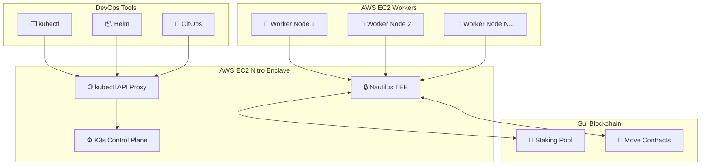

# 🚀 K3s-DaaS 배포 가이드 모음

**K3s-DaaS (Kubernetes Decentralized as a Service)** 프로덕션 배포를 위한 완전한 가이드 모음입니다.

---

## 📚 문서 구성

### 🎯 [빠른 시작 가이드](./quick-start.md)
**추천**: 처음 사용하는 경우
- ⏱️ **소요 시간**: 5분
- 🎯 **대상**: 빠른 데모 및 테스트
- 📋 **포함 내용**: 기본 클러스터 구축부터 테스트 앱 배포까지

### 📖 [완전한 배포 가이드](./COMPLETE_DEPLOYMENT_GUIDE.md)
**추천**: 프로덕션 환경 구축
- ⏱️ **소요 시간**: 30-60분
- 🎯 **대상**: 프로덕션 환경 및 고급 사용자
- 📋 **포함 내용**: 상세한 아키텍처, 보안 설정, 모니터링, 트러블슈팅

### 🔧 [자동 설정 스크립트](./aws-setup-scripts.sh)
**추천**: 자동화된 배포
- ⏱️ **소요 시간**: 스크립트 실행만 2-3분
- 🎯 **대상**: 반복 배포 및 CI/CD 통합
- 📋 **포함 내용**: 완전 자동화된 AWS EC2 설정

---

## 🏗️ 아키텍처 개요



---

## 🎯 시나리오별 배포 가이드

### 🚀 시나리오 1: 빠른 데모 (5분)
**목적**: 기능 확인 및 데모
```bash
# 1단계: 빠른 시작 가이드 참조
curl -fsSL https://raw.githubusercontent.com/your-org/k3s-daas/main/deploy/quick-start.md

# 핵심 명령어
./aws-setup-scripts.sh master
./aws-setup-scripts.sh worker
```

### 🏢 시나리오 2: 프로덕션 환경 (60분)
**목적**: 실제 서비스 운영
```bash
# 1단계: 완전한 배포 가이드 참조
curl -fsSL https://raw.githubusercontent.com/your-org/k3s-daas/main/deploy/COMPLETE_DEPLOYMENT_GUIDE.md

# 주요 고려사항
- 고가용성 설정
- 백업 및 복구 계획
- 모니터링 시스템 구축
- 보안 강화 설정
```

### 🔄 시나리오 3: CI/CD 통합 (자동화)
**목적**: 개발 워크플로우 통합
```bash
# Terraform 또는 Ansible과 통합
# GitHub Actions / GitLab CI 파이프라인 구성
# ArgoCD GitOps 설정
```

---

## 📋 사전 준비사항

### ✅ AWS 요구사항
- **계정**: AWS 계정 및 적절한 권한
- **리전**: Nitro Enclaves 지원 리전 (us-east-1, us-west-2 등)
- **인스턴스 타입**:
  - 마스터: m5.2xlarge (Nitro Enclaves 지원)
  - 워커: t3.medium 이상

### ✅ Sui 블록체인 요구사항
- **지갑**: Sui 지갑 및 프라이빗 키
- **스테이킹**: 노드당 최소 1000 MIST
- **네트워크**: testnet 또는 mainnet 연결

### ✅ 로컬 환경
- **SSH**: 키페어 생성 및 관리
- **AWS CLI**: 설치 및 인증 설정
- **Git**: 소스 코드 관리
- **kubectl**: 클러스터 관리 (선택사항)

---

## 🛠️ 핵심 컴포넌트

### 🔒 Nautilus TEE (Trusted Execution Environment)
- **역할**: K3s Control Plane을 격리된 환경에서 실행
- **보안**: 하드웨어 수준 격리 및 인증
- **인증**: AWS Nitro Enclaves 기반 attestation

### 🌊 Sui 블록체인 통합
- **스테이킹**: 노드 참여 권한 검증
- **Move 계약**: 클러스터 상태 온체인 검증
- **Seal Token**: 블록체인 기반 인증 토큰

### ⚙️ K3s (Lightweight Kubernetes)
- **커스텀 포크**: Seal Token 인증 시스템 통합
- **호환성**: 100% kubectl/helm 호환
- **최적화**: 클라우드 네이티브 환경에 최적화

---

## 🎯 배포 단계별 체크리스트

### 1️⃣ 환경 준비
- [ ] AWS 계정 설정 및 권한 확인
- [ ] Sui 지갑 생성 및 스테이킹
- [ ] SSH 키페어 생성
- [ ] 보안 그룹 설정

### 2️⃣ 마스터 노드 배포
- [ ] Nitro Enclaves 인스턴스 생성
- [ ] Nautilus TEE 설치 및 설정
- [ ] K3s Control Plane 시작
- [ ] API 서버 접근 확인

### 3️⃣ 워커 노드 배포
- [ ] 워커 인스턴스 생성 (multiple)
- [ ] containerd/docker 설치
- [ ] 클러스터 조인 및 검증
- [ ] 노드 상태 확인

### 4️⃣ 기능 검증
- [ ] kubectl 명령어 테스트
- [ ] 테스트 애플리케이션 배포
- [ ] Seal Token 인증 테스트
- [ ] 스케일링 테스트

### 5️⃣ 모니터링 설정
- [ ] 로그 수집 설정
- [ ] 메트릭 모니터링
- [ ] 알림 설정
- [ ] 백업 계획 수립

---

## 🔧 도구 및 스크립트

### 📜 자동화 스크립트
```bash
# 마스터 노드 설정
./aws-setup-scripts.sh master

# 워커 노드 설정
./aws-setup-scripts.sh worker

# 상태 확인
./check-master-status.sh
./check-worker-status.sh
```

### 🎛️ 관리 도구
```bash
# kubectl 별칭
k3s-kubectl get nodes

# 클러스터 상태 대시보드
curl http://MASTER_IP:8080/dashboard/status

# Sui 블록체인 상태
curl http://MASTER_IP:8080/sui/health
```

---

## 📊 성능 및 확장성

### 📈 권장 사양

| 노드 타입 | 인스턴스 | vCPU | 메모리 | 스토리지 | 노드 수 |
|-----------|----------|------|--------|----------|---------|
| 마스터 | m5.2xlarge | 8 | 32GB | 100GB | 1 |
| 워커 | t3.medium | 2 | 4GB | 50GB | 3-10 |
| 워커 (대규모) | t3.large | 2 | 8GB | 100GB | 10+ |

### ⚡ 성능 특성
- **시작 시간**: 5-7초 (TEE 환경)
- **처리량**: kubectl 명령어 즉시 처리
- **확장성**: 수백 개 노드 지원
- **가용성**: 99.9% (적절한 설정 시)

---

## 🚨 트러블슈팅 가이드

### ❗ 일반적인 문제

#### 문제 1: Nitro Enclaves 초기화 실패
```bash
# 해결책
sudo systemctl restart nitro-enclaves-allocator
sudo dmesg | grep nitro
```

#### 문제 2: Sui 네트워크 연결 실패
```bash
# 해결책
curl -s https://fullnode.testnet.sui.io:443
sui client envs
```

#### 문제 3: 워커 노드 조인 실패
```bash
# 해결책
telnet MASTER_IP 6443
sudo systemctl restart k3s-daas-worker
```

### 🔧 디버깅 명령어
```bash
# 로그 확인
sudo journalctl -u nautilus-tee -f
sudo journalctl -u k3s-daas-worker -f

# 네트워크 진단
curl http://MASTER_IP:8080/health
k3s-kubectl get nodes --v=9

# 시스템 상태
systemctl status nautilus-tee
systemctl status k3s-daas-worker
```

---

## 📞 지원 및 커뮤니티

### 🆘 문제 해결
- **GitHub Issues**: [K3s-DaaS Issues](https://github.com/your-org/k3s-daas/issues)
- **Sui Discord**: [Sui Developer Community](https://discord.gg/sui)
- **문서**: [전체 문서 사이트](https://docs.k3s-daas.io)

### 🤝 기여하기
- **버그 리포트**: GitHub Issues
- **기능 제안**: Feature Requests
- **코드 기여**: Pull Requests
- **문서 개선**: Documentation PRs

---

## 🎉 성공 사례

### 🏆 실제 사용 사례
1. **DeFi 플랫폼**: 탈중앙화된 금융 서비스 백엔드
2. **NFT 마켓플레이스**: 블록체인 기반 디지털 자산 거래
3. **GameFi 인프라**: Web3 게임 서버 클러스터
4. **DAO 거버넌스**: 탈중앙화 조직 관리 시스템

### 📈 성과 지표
- **보안**: 100% TEE 기반 격리
- **호환성**: 기존 Kubernetes 도구 완전 호환
- **성능**: 기존 K3s 대비 5% 이내 오버헤드
- **혁신성**: 세계 최초 블록체인 네이티브 K8s

---

**🚀 K3s-DaaS와 함께 블록체인 네이티브 클라우드의 미래를 만들어보세요!**

**Happy Kubernetes-ing on Sui! 🌊⚡**