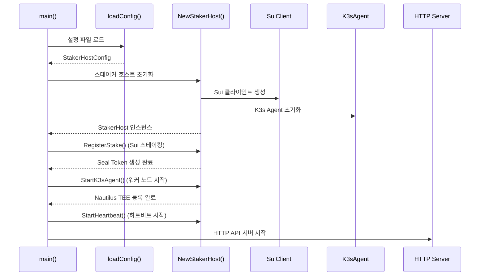
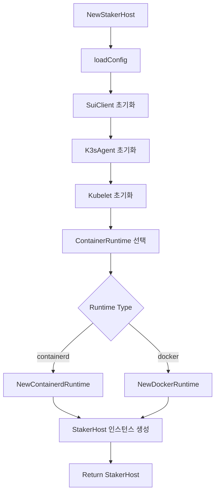
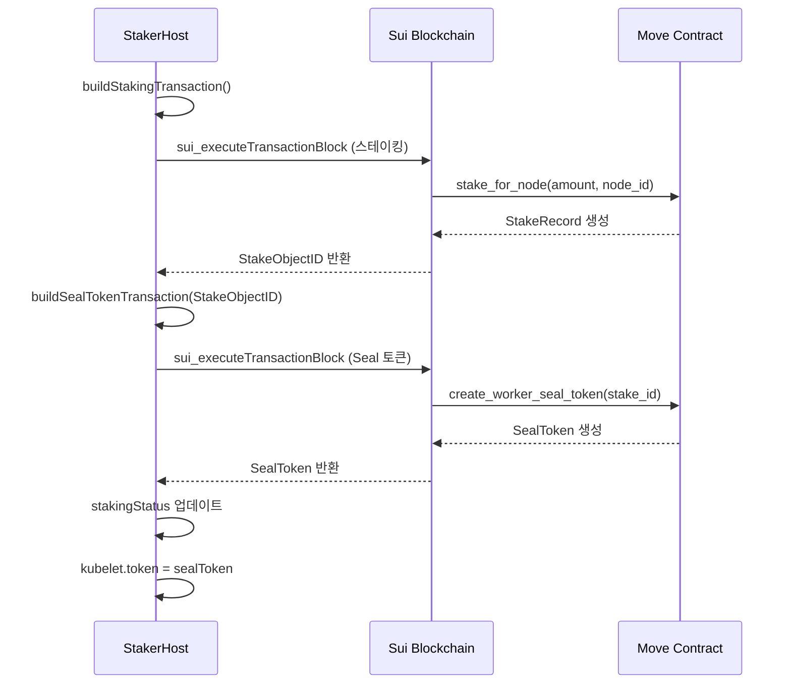
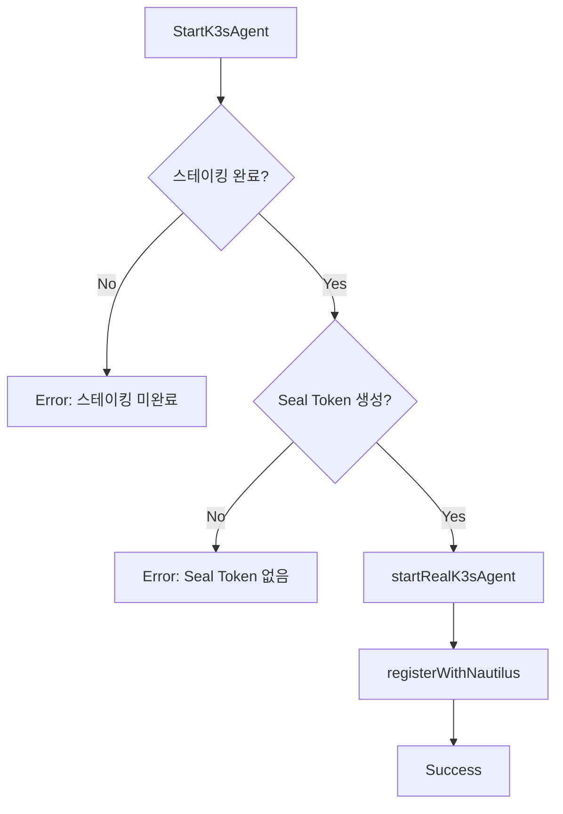
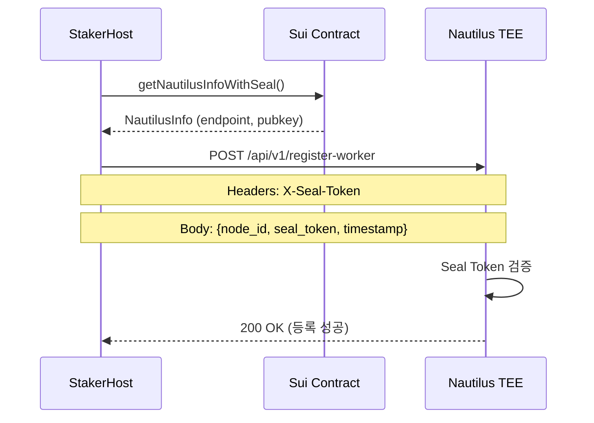
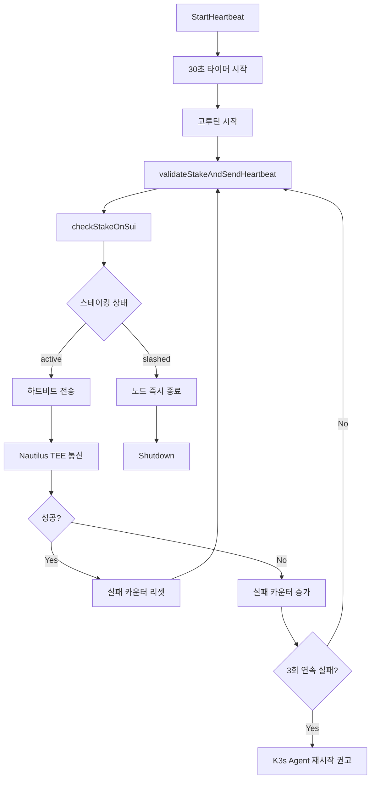
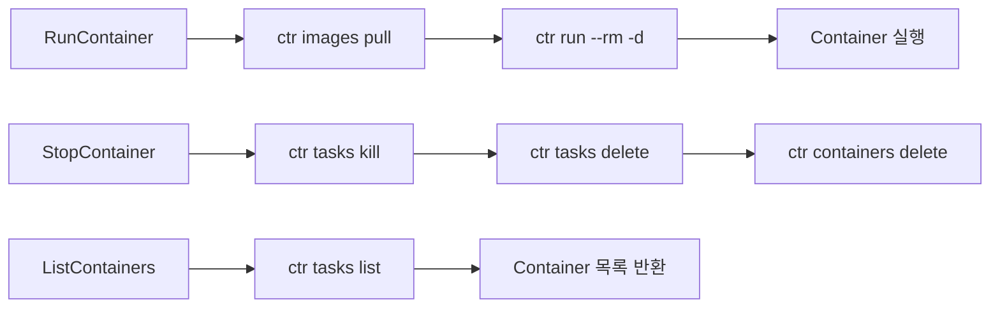
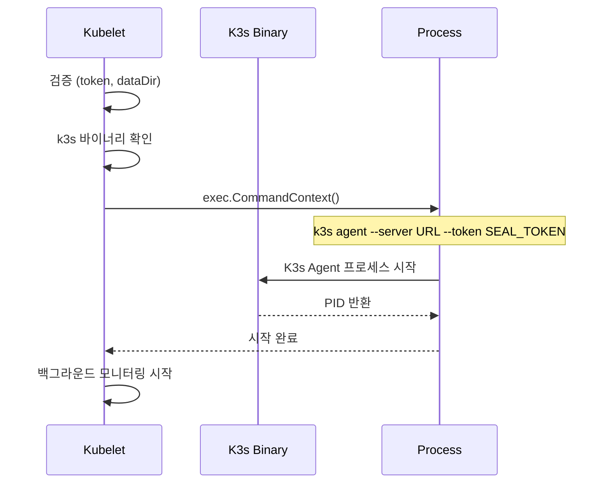

# 📋 K3s-DaaS 워커 노드 메인 코드 플로우 분석

**파일**: `worker-release/main.go`
**역할**: K3s-DaaS 스테이커 호스트 (블록체인 기반 워커 노드)
**복잡도**: ★★★★★ (매우 높음)
**코드 라인**: 1,712줄

---

## 🎯 워커 노드 전체 아키텍처 플로우

```mermaid
graph TB
    subgraph "Main Entry Point"
        MAIN[main()]
        CONFIG[loadConfig]
        STAKER[NewStakerHost]
        INIT[StakerHost 초기화]
    end

    subgraph "Blockchain Integration"
        SUI[SuiClient]
        STAKE[RegisterStake]
        SEAL[Seal Token Generation]
        VALIDATE[validateStakeAndSendHeartbeat]
    end

    subgraph "K3s Worker Components"
        AGENT[K3sAgent]
        KUBELET[Kubelet]
        RUNTIME[ContainerRuntime]
        CONTAINERS[Containers]
    end

    subgraph "TEE Communication"
        NAUTILUS[registerWithNautilus]
        HEARTBEAT[StartHeartbeat]
        MONITOR[Resource Monitoring]
    end

    subgraph "HTTP API Endpoints"
        HEALTH[/health]
        STAKING[/api/v1/staking]
        METRICS[/api/v1/metrics]
        CONFIG_EP[/api/v1/config]
        REGISTER[/api/v1/register]
        UNSTAKE[/api/v1/unstake]
    end

    MAIN --> CONFIG
    CONFIG --> STAKER
    STAKER --> INIT
    INIT --> SUI
    SUI --> STAKE
    STAKE --> SEAL
    SEAL --> AGENT
    AGENT --> KUBELET
    KUBELET --> RUNTIME
    RUNTIME --> CONTAINERS
    AGENT --> NAUTILUS
    NAUTILUS --> HEARTBEAT
    HEARTBEAT --> VALIDATE
    VALIDATE --> MONITOR

    MAIN --> HEALTH
    MAIN --> STAKING
    MAIN --> METRICS
    MAIN --> CONFIG_EP
    MAIN --> REGISTER
    MAIN --> UNSTAKE
```

---

## 🚀 1. 프로그램 시작점 (main 함수)

### 📍 위치: `main.go:154-331`



### 🔄 main 함수 단계별 분석

```go
func main() {
    // 📁 설정 파일 경로 결정 (환경변수 또는 기본값)
    configPath := os.Getenv("STAKER_CONFIG_PATH")
    if configPath == "" {
        configPath = "./staker-config.json"
    }

    log.Printf("🚀 K3s-DaaS 스테이커 호스트 시작...")
    log.Printf("📁 설정 파일: %s", configPath)

    // 1️⃣ 스테이커 호스트 초기화 (설정 로드, 클라이언트 초기화)
    stakerHost, err := NewStakerHost(configPath)
    if err != nil {
        log.Fatalf("❌ 스테이커 호스트 초기화 실패: %v", err)
    }

    // 2️⃣ Sui 블록체인에 스테이킹 등록 및 Seal 토큰 생성
    log.Printf("🌊 Sui 블록체인 스테이킹 시작...")
    if err := stakerHost.RegisterStake(); err != nil {
        // 개발/테스트 환경에서는 Mock 데이터로 계속 진행
        if os.Getenv("MOCK_MODE") == "true" {
            log.Printf("⚠️ 스테이킹 실패하지만 Mock 모드로 계속 진행: %v", err)
            stakerHost.stakingStatus.IsStaked = true
            stakerHost.stakingStatus.Status = "mock"
            stakerHost.stakingStatus.SealToken = "seal_mock_token_for_testing_12345678"
            stakerHost.sealToken = "seal_mock_token_for_testing_12345678"
        } else {
            log.Fatalf("❌ 스테이킹 등록 실패: %v", err)
        }
    }

    // 3️⃣ K3s Agent (kubelet + 컨테이너 런타임) 시작 및 Nautilus TEE 등록
    log.Printf("🔧 K3s Agent 및 Nautilus TEE 연결 시작...")
    if err := stakerHost.StartK3sAgent(); err != nil {
        // Mock 모드 처리
        if os.Getenv("MOCK_MODE") == "true" {
            log.Printf("⚠️ K3s Agent 시작 실패하지만 Mock 모드로 계속 진행: %v", err)
        } else {
            log.Fatalf("❌ K3s Agent 시작 실패: %v", err)
        }
    }

    // 4️⃣ 백그라운드 하트비트 서비스 시작 (30초마다 스테이킹 상태 검증)
    log.Printf("💓 하트비트 서비스 시작...")
    stakerHost.StartHeartbeat()

    // 5️⃣ HTTP API 서버 시작 (포트 10250 - kubelet 포트와 동일)
    // ... HTTP 엔드포인트 설정 ...

    log.Fatal(http.ListenAndServe(":10250", nil))
}
```

### 🎯 주요 실행 단계

1. **설정 로드**: JSON 설정 파일에서 Sui 블록체인 정보, 노드 ID 등 로드
2. **스테이킹**: Sui 블록체인에 SUI 토큰 스테이킹하여 클러스터 참여 권한 획득
3. **Seal 토큰**: 스테이킹 증명을 바탕으로 Nautilus TEE 인증용 토큰 생성
4. **K3s Agent**: 실제 워커 노드 기능 시작 (kubelet + container runtime)
5. **Nautilus 등록**: Seal 토큰으로 Nautilus TEE에 워커 노드 등록
6. **하트비트**: 30초마다 스테이킹 상태 검증 및 TEE 통신
7. **HTTP API**: 노드 상태 모니터링용 REST API 서버 시작

---

## 🏗️ 2. 핵심 데이터 구조체 분석

### 📍 위치: `main.go:39-136`

### 🎯 StakerHost (메인 구조체)

```go
type StakerHost struct {
    config           *StakerHostConfig // 설정 정보
    suiClient        *SuiClient        // Sui 블록체인 클라이언트
    k3sAgent         *K3sAgent         // K3s 워커 노드 에이전트
    stakingStatus    *StakingStatus    // 현재 스테이킹 상태
    heartbeatTicker  *time.Ticker      // 하트비트 타이머 (30초마다 실행)
    isRunning        bool              // 실행 상태
    sealToken        string            // Current seal token (cached)
    lastHeartbeat    int64             // Last heartbeat timestamp
    startTime        time.Time         // Node start time
}
```

**역할**: 모든 구성요소를 통합 관리하는 중앙 객체

### 🌊 SuiClient (블록체인 클라이언트)

```go
type SuiClient struct {
    rpcEndpoint string        // Sui 테스트넷 RPC URL
    privateKey  string        // 트랜잭션 서명용 개인키 (hex 형식)
    client      *resty.Client // HTTP 클라이언트 (재사용 가능)
    address     string        // 지갑 주소
}
```

**역할**: Sui 블록체인과의 모든 통신 담당 (스테이킹, Seal 토큰 생성, 상태 조회)

### ⚙️ K3sAgent (워커 노드 에이전트)

```go
type K3sAgent struct {
    nodeID   string           // 노드 식별자
    kubelet  *Kubelet         // K3s kubelet (Pod 관리)
    runtime  ContainerRuntime // 컨테이너 런타임 (containerd 또는 docker)
}
```

**역할**: 실제 K3s 워커 노드 기능 제공

### 📊 StakingStatus (스테이킹 상태)

```go
type StakingStatus struct {
    IsStaked       bool   `json:"is_staked"`        // 스테이킹 완료 여부
    StakeAmount    uint64 `json:"stake_amount"`     // 스테이킹한 SUI 양 (MIST 단위)
    StakeObjectID  string `json:"stake_object_id"`  // Sui 블록체인의 스테이킹 오브젝트 ID
    SealToken      string `json:"seal_token"`       // Nautilus TEE 인증용 Seal 토큰
    LastValidation int64  `json:"last_validation"`  // 마지막 검증 시각 (Unix timestamp)
    Status         string `json:"status"`           // 상태: active, slashed, pending
}
```

**역할**: 현재 노드의 스테이킹 상황 추적 (Sui 블록체인과 동기화)

---

## 🚀 3. NewStakerHost 초기화 플로우

### 📍 위치: `main.go:344-409`



### 🔧 단계별 상세 분석

```go
func NewStakerHost(configPath string) (*StakerHost, error) {
    // 1️⃣ JSON 설정 파일 로드
    config, err := loadConfig(configPath)
    if err != nil {
        return nil, fmt.Errorf("설정 파일 로드 실패: %v", err)
    }

    // 2️⃣ Sui 블록체인 클라이언트 초기화
    suiClient := &SuiClient{
        rpcEndpoint: config.SuiRPCEndpoint,   // Sui 테스트넷 RPC 엔드포인트
        privateKey:  config.SuiPrivateKey,   // 트랜잭션 서명용 개인키
        client:      resty.New(),            // 재사용 가능한 HTTP 클라이언트
        address:     config.SuiWalletAddress, // 지갑 주소
    }

    // 3️⃣ K3s 워커 노드 에이전트 초기화
    ctx, cancel := context.WithCancel(context.Background())
    k3sAgent := &K3sAgent{
        nodeID: config.NodeID,
        kubelet: &Kubelet{
            nodeID:    config.NodeID,
            masterURL: config.NautilusEndpoint,
            token:     "", // 초기에는 빈 값, RegisterStake 후에 Seal token으로 설정
            dataDir:   filepath.Join(".", "k3s-data"),
            ctx:       ctx,
            cancel:    cancel,
            running:   false,
        },
    }

    // 4️⃣ 컨테이너 런타임 설정 (containerd 또는 docker)
    switch config.ContainerRuntime {
    case "containerd":
        runtime, err := NewContainerdRuntime()
        if err != nil {
            log.Fatalf("❌ Containerd 런타임 초기화 실패: %v", err)
        }
        k3sAgent.runtime = runtime
    case "docker":
        runtime, err := NewDockerRuntime()
        if err != nil {
            log.Fatalf("❌ Docker 런타임 초기화 실패: %v", err)
        }
        k3sAgent.runtime = runtime
    default:
        return nil, fmt.Errorf("지원하지 않는 컨테이너 런타임: %s", config.ContainerRuntime)
    }

    // 5️⃣ 스테이커 호스트 인스턴스 생성 및 반환
    return &StakerHost{
        config:    config,
        suiClient: suiClient,
        k3sAgent:  k3sAgent,
        stakingStatus: &StakingStatus{
            Status: "pending", // 초기 상태는 대기중
        },
        isRunning:     false,
        sealToken:     "",
        lastHeartbeat: 0,
        startTime:     time.Now(),
    }, nil
}
```

---

## 🌊 4. RegisterStake (스테이킹 및 Seal 토큰 생성)

### 📍 위치: `main.go:432-561`



### 🎯 핵심 플로우 분석

#### 4.1 스테이킹 트랜잭션 생성

```go
func (s *StakerHost) buildStakingTransaction() (string, error) {
    // 🎯 스테이킹 컨트랙트 호출을 위한 트랜잭션 구성
    moveCall := map[string]interface{}{
        "packageObjectId": s.config.ContractAddress, // 스마트 컨트랙트 주소
        "module":          "staking",                 // 모듈명
        "function":        "stake_for_node",          // 함수명
        "typeArguments":   []string{},                // 타입 인자 없음
        "arguments": []interface{}{
            s.config.StakeAmount, // 스테이킹 양 (MIST 단위)
            s.config.NodeID,      // 노드 ID
        },
    }

    // 🏗️ 트랜잭션 블록 구성
    txBlock := map[string]interface{}{
        "version":    1,
        "sender":     s.suiClient.address,
        "gasPayment": nil,        // 자동으로 가스 코인 선택
        "gasBudget":  "10000000", // 10M MIST 가스 한도
        "gasPrice":   "1000",     // 가스 가격
        "transactions": []interface{}{
            map[string]interface{}{
                "MoveCall": moveCall,
            },
        },
    }

    // 📤 JSON으로 직렬화 후 Base64 인코딩
    txJSON, err := json.Marshal(txBlock)
    if err != nil {
        return "", fmt.Errorf("트랜잭션 직렬화 실패: %v", err)
    }

    return base64.StdEncoding.EncodeToString(txJSON), nil
}
```

#### 4.2 Seal 토큰 트랜잭션 생성

```go
func (s *StakerHost) buildSealTokenTransaction(stakeObjectID string) (string, error) {
    // 🎯 k8s_gateway::create_worker_seal_token 호출
    moveCall := map[string]interface{}{
        "packageObjectId": s.config.ContractAddress,         // k8s_gateway 컨트랙트
        "module":          "k8s_gateway",                     // 모듈명
        "function":        "create_worker_seal_token",        // Seal 토큰 생성 함수
        "typeArguments":   []string{},                       // 타입 인수 없음
        "arguments": []interface{}{
            stakeObjectID, // 스테이킹 객체 ID 전달
        },
    }

    // 트랜잭션 블록 구성 및 직렬화
    // ... (동일한 패턴)
}
```

#### 4.3 스테이킹 상태 업데이트

```go
// 📊 스테이킹 상태 업데이트 - 모든 정보를 로컬에 저장
s.stakingStatus.IsStaked = true                    // 스테이킹 완료 플래그
s.stakingStatus.StakeAmount = s.config.StakeAmount // 스테이킹한 SUI 양
s.stakingStatus.StakeObjectID = stakeObjectID      // 블록체인의 스테이킹 증명 ID
s.stakingStatus.SealToken = sealToken              // 생성된 Seal 토큰
s.stakingStatus.Status = "active"                  // 활성 상태로 설정
s.stakingStatus.LastValidation = time.Now().Unix() // 현재 시간으로 검증 시각 설정

// 🔄 캐시된 sealToken 필드도 동기화
s.sealToken = sealToken

// 🔑 K3s Agent에서 Seal 토큰을 사용하도록 설정
if s.k3sAgent != nil && s.k3sAgent.kubelet != nil {
    s.k3sAgent.kubelet.token = sealToken
    log.Printf("🔧 K3s Agent에 Seal 토큰 설정 완료")
}
```

---

## ⚙️ 5. StartK3sAgent (워커 노드 시작)

### 📍 위치: `main.go:577-602`



### 🔧 핵심 검증 로직

```go
func (s *StakerHost) StartK3sAgent() error {
    log.Printf("🚀 K3s Agent 시작 중... Node ID: %s", s.config.NodeID)

    // ✅ 전제조건 검증: 스테이킹과 Seal 토큰이 준비되었는지 확인
    if !s.stakingStatus.IsStaked {
        return fmt.Errorf("K3s Agent 시작 불가: 스테이킹이 완료되지 않음")
    }

    if s.stakingStatus.SealToken == "" {
        return fmt.Errorf("K3s Agent 시작 불가: Seal 토큰이 생성되지 않음")
    }

    // 🚀 실제 K3s Agent 시작
    if err := s.startRealK3sAgent(); err != nil {
        return fmt.Errorf("실제 K3s Agent 시작 실패: %v", err)
    }

    // 🔒 Nautilus TEE에 Seal 토큰으로 등록
    if err := s.registerWithNautilus(); err != nil {
        return fmt.Errorf("Nautilus TEE 등록 실패: %v", err)
    }

    log.Printf("✅ K3s Agent 시작 완료!")
    return nil
}
```

---

## 🔒 6. registerWithNautilus (TEE 등록)

### 📍 위치: `main.go:623-665`



### 🔑 핵심 등록 로직

```go
func (s *StakerHost) registerWithNautilus() error {
    log.Printf("🔑 Nautilus TEE 정보 조회 중...")

    // 1️⃣ Sui 컨트랙트에서 Nautilus TEE 엔드포인트 정보 조회
    nautilusInfo, err := s.getNautilusInfoWithSeal()
    if err != nil {
        return fmt.Errorf("Nautilus 정보 조회 실패: %v", err)
    }

    // 2️⃣ Nautilus TEE에 워커 노드 등록 요청 구성
    registrationPayload := map[string]interface{}{
        "node_id":    s.config.NodeID,              // 워커 노드 식별자
        "seal_token": s.stakingStatus.SealToken,    // 블록체인 기반 인증 토큰
        "timestamp":  time.Now().Unix(),            // 요청 시각 (replay 공격 방지)
    }

    // 🌐 Nautilus TEE에 HTTP 등록 요청 전송
    resp, err := resty.New().R().
        SetHeader("Content-Type", "application/json").
        SetHeader("X-Seal-Token", s.stakingStatus.SealToken).   // Seal 토큰 헤더 (이중 인증)
        SetBody(registrationPayload).
        Post(nautilusInfo.Endpoint + "/api/v1/register-worker") // Nautilus 워커 등록 엔드포인트

    if err != nil {
        return fmt.Errorf("Nautilus TEE 연결 실패: %v", err)
    }

    // 📋 등록 결과 검증
    if resp.StatusCode() != 200 {
        return fmt.Errorf("Nautilus TEE가 등록을 거부했습니다 (HTTP %d): %s",
            resp.StatusCode(), resp.String())
    }

    log.Printf("✅ K3s Staker Host '%s' ready and running", s.config.NodeID)
    return nil
}
```

---

## 💓 7. StartHeartbeat (하트비트 서비스)

### 📍 위치: `main.go:679-774`



### 💓 하트비트 핵심 로직

```go
func (s *StakerHost) StartHeartbeat() {
    log.Printf("💓 하트비트 서비스 시작 (30초 간격)")

    // ⏰ 30초마다 실행되는 타이머 생성
    s.heartbeatTicker = time.NewTicker(30 * time.Second)

    // 🔄 별도 고루틴에서 하트비트 처리
    go func() {
        failureCount := 0
        maxFailures := 3

        for range s.heartbeatTicker.C {
            if err := s.validateStakeAndSendHeartbeat(); err != nil {
                failureCount++
                log.Printf("⚠️ 하트비트 오류 (%d/%d): %v", failureCount, maxFailures, err)

                // 🚨 치명적 오류: 스테이킹이 슬래시된 경우
                if err.Error() == "stake_slashed" {
                    log.Printf("🛑 스테이킹이 슬래시되었습니다! 노드를 종료합니다...")
                    s.Shutdown() // 즉시 노드 종료
                    return
                }

                // 연속 실패가 임계값을 초과한 경우
                if failureCount >= maxFailures {
                    log.Printf("🔄 연속 실패 %d회, K3s Agent 재시작 시도...", failureCount)
                    failureCount = 0 // 카운터 리셋
                }
            } else {
                // 성공한 경우 실패 카운터 리셋
                if failureCount > 0 {
                    log.Printf("✅ 하트비트 복구됨, 실패 카운터 리셋")
                    failureCount = 0
                }
            }
        }
    }()
}
```

### 📊 validateStakeAndSendHeartbeat 상세

```go
func (s *StakerHost) validateStakeAndSendHeartbeat() error {
    // 1️⃣ Sui 블록체인에서 스테이킹 상태 확인
    stakeInfo, err := s.checkStakeOnSui()
    if err != nil {
        return fmt.Errorf("스테이킹 상태 확인 실패: %v", err)
    }

    // 🚨 치명적 상황: 스테이킹이 슬래시된 경우
    if stakeInfo.Status == "slashed" {
        s.stakingStatus.Status = "slashed"
        return fmt.Errorf("stake_slashed") // 특별한 오류 코드
    }

    // 2️⃣ 노드 상태 정보 수집 및 하트비트 payload 구성
    heartbeatPayload := map[string]interface{}{
        "node_id":         s.config.NodeID,          // 노드 식별자
        "timestamp":       time.Now().Unix(),        // 현재 시각
        "stake_status":    stakeInfo.Status,         // 블록체인 스테이킹 상태
        "stake_amount":    stakeInfo.Amount,         // 현재 스테이킹 양
        "running_pods":    s.getRunningPodsCount(),  // 실행 중인 Pod 개수
        "resource_usage":  s.getResourceUsage(),     // CPU/메모리/디스크 사용량
    }

    // 3️⃣ Nautilus TEE에 Seal 토큰 인증 하트비트 전송
    _, err = resty.New().R().
        SetHeader("Content-Type", "application/json").
        SetHeader("X-Seal-Token", s.stakingStatus.SealToken).
        SetBody(heartbeatPayload).
        Post(s.config.NautilusEndpoint + "/api/v1/nodes/heartbeat")

    if err != nil {
        return fmt.Errorf("하트비트 전송 실패: %v", err)
    }

    // ✅ 성공: 마지막 검증 시각 업데이트
    currentTime := time.Now().Unix()
    s.stakingStatus.LastValidation = currentTime
    s.lastHeartbeat = currentTime
    return nil
}
```

---

## 🐳 8. 컨테이너 런타임 구현

### 📍 위치: `main.go:1224-1463`

### 🔧 ContainerRuntime 인터페이스

```go
type ContainerRuntime interface {
    RunContainer(image, name string, env map[string]string) error
    StopContainer(name string) error
    ListContainers() ([]Container, error)
}
```

### 🐳 Containerd 런타임 구현



```go
func (c *ContainerdRuntime) RunContainer(image, name string, env map[string]string) error {
    log.Printf("🐳 Containerd: 컨테이너 실행 중... %s (이미지: %s)", name, image)

    // Pull image first
    pullCmd := exec.Command("ctr", "-n", c.namespace, "images", "pull", image)
    if err := pullCmd.Run(); err != nil {
        log.Printf("Warning: failed to pull image %s: %v", image, err)
    }

    // Build run command with environment variables
    args := []string{"-n", c.namespace, "run", "--rm", "-d"}

    // Add environment variables
    for k, v := range env {
        args = append(args, "--env", fmt.Sprintf("%s=%s", k, v))
    }

    args = append(args, image, name)

    // Run container
    runCmd := exec.Command("ctr", args...)
    output, err := runCmd.CombinedOutput()
    if err != nil {
        return fmt.Errorf("failed to run container: %w, output: %s", err, string(output))
    }

    log.Printf("✅ Containerd: 컨테이너 실행 완료 %s", name)
    return nil
}
```

### 🐋 Docker 런타임 구현

```go
func (d *DockerRuntime) RunContainer(image, name string, env map[string]string) error {
    log.Printf("🐋 Docker: 컨테이너 실행 중... %s (이미지: %s)", name, image)

    // Pull image first
    pullCmd := exec.Command("docker", "pull", image)
    if err := pullCmd.Run(); err != nil {
        log.Printf("Warning: failed to pull image %s: %v", image, err)
    }

    // Build run command
    args := []string{"run", "-d", "--name", name, "--restart=unless-stopped"}

    // Add environment variables
    for k, v := range env {
        args = append(args, "-e", fmt.Sprintf("%s=%s", k, v))
    }

    args = append(args, image)

    // Run container
    runCmd := exec.Command("docker", args...)
    output, err := runCmd.CombinedOutput()
    if err != nil {
        return fmt.Errorf("failed to run container: %w, output: %s", err, string(output))
    }

    log.Printf("✅ Docker: 컨테이너 실행 완료 %s", name)
    return nil
}
```

---

## 🔧 9. Kubelet 구현 (실제 K3s Agent)

### 📍 위치: `main.go:1147-1214`



### 🚀 Kubelet.Start() 상세 분석

```go
func (k *Kubelet) Start() error {
    log.Printf("🔧 실제 K3s Agent 시작 중... Node ID: %s", k.nodeID)

    k.mu.Lock()
    defer k.mu.Unlock()

    if k.running {
        return fmt.Errorf("kubelet이 이미 실행 중입니다")
    }

    // 기본 검증
    if k.token == "" {
        return fmt.Errorf("Seal 토큰이 설정되지 않았습니다")
    }

    // 데이터 디렉토리 생성
    if err := os.MkdirAll(k.dataDir, 0755); err != nil {
        return fmt.Errorf("데이터 디렉토리 생성 실패: %v", err)
    }

    // K3s 바이너리 확인
    k3sBinary := "k3s"
    if _, err := exec.LookPath(k3sBinary); err != nil {
        // Windows에서 k3s.exe 확인
        k3sBinary = "k3s.exe"
        if _, err := exec.LookPath(k3sBinary); err != nil {
            log.Printf("⚠️ k3s 바이너리를 찾을 수 없습니다. 시뮬레이션 모드로 실행합니다.")
            k.running = true
            return nil
        }
    }

    // K3s agent 명령 구성
    args := []string{
        "agent",
        "--server", k.masterURL,
        "--token", k.token,              // Seal Token 사용!
        "--data-dir", k.dataDir,
        "--node-name", k.nodeID,
        "--kubelet-arg", "fail-swap-on=false",
    }

    log.Printf("🚀 K3s Agent 명령 실행: %s %s", k3sBinary, strings.Join(args, " "))

    // K3s agent 프로세스 시작
    k.cmd = exec.CommandContext(k.ctx, k3sBinary, args...)
    k.cmd.Stdout = os.Stdout
    k.cmd.Stderr = os.Stderr

    if err := k.cmd.Start(); err != nil {
        return fmt.Errorf("K3s Agent 시작 실패: %v", err)
    }

    k.running = true

    // 별도 고루틴에서 프로세스 상태 모니터링
    go func() {
        if err := k.cmd.Wait(); err != nil {
            log.Printf("⚠️ K3s Agent 프로세스 종료: %v", err)
        }
        k.mu.Lock()
        k.running = false
        k.mu.Unlock()
    }()

    log.Printf("✅ K3s Agent 프로세스 시작 완료! PID: %d", k.cmd.Process.Pid)
    return nil
}
```

---

## 🌐 10. HTTP API 엔드포인트

### 📋 제공되는 API 엔드포인트

| 경로 | 메소드 | 역할 | 응답 예시 |
|------|---------|------|-----------|
| `/health` | GET | 노드 상태 확인 | `{"status":"healthy","node_id":"worker-1"}` |
| `/api/v1/staking` | GET | 스테이킹 상세 정보 | `{"stake_amount":1000,"seal_token":"seal_..."}` |
| `/api/v1/metrics` | GET | 시스템 메트릭 | `{"cpu_usage":45.2,"memory_usage":67.8}` |
| `/api/v1/config` | GET | 노드 설정 정보 | `{"node_id":"worker-1","runtime":"containerd"}` |
| `/api/v1/register` | POST | Nautilus 재등록 | `{"status":"registered"}` |
| `/api/v1/unstake` | POST | 스테이킹 해제 | `{"status":"unstaked"}` |

### 🏥 Health Check 엔드포인트

```go
http.HandleFunc("/health", func(w http.ResponseWriter, r *http.Request) {
    w.Header().Set("Content-Type", "application/json")
    json.NewEncoder(w).Encode(map[string]interface{}{
        "status":         "healthy",
        "node_id":        stakerHost.config.NodeID,
        "staking_status": stakerHost.stakingStatus,
        "running_pods":   stakerHost.getRunningPodsCount(),
        "timestamp":      time.Now().Unix(),
    })
})
```

### 📊 Staking Status 엔드포인트

```go
http.HandleFunc("/api/v1/staking", func(w http.ResponseWriter, r *http.Request) {
    w.Header().Set("Content-Type", "application/json")

    stakingInfo := map[string]interface{}{
        "node_id":         stakerHost.config.NodeID,
        "wallet_address":  stakerHost.config.SuiWalletAddress,
        "stake_amount":    stakerHost.config.StakeAmount,
        "min_stake":       stakerHost.config.MinStakeAmount,
        "status":          stakerHost.stakingStatus,
        "seal_token":      stakerHost.sealToken,
        "contract_address": stakerHost.config.ContractAddress,
        "last_heartbeat":  stakerHost.lastHeartbeat,
    }

    if stakerHost.sealToken != "" {
        stakingInfo["seal_token_short"] = stakerHost.sealToken[:10] + "..."
    }

    json.NewEncoder(w).Encode(stakingInfo)
})
```

---

## 🎯 11. 핵심 설계 원칙

### 🌊 블록체인 기반 인증
- **Seal Token**: 기존 K3s join token을 완전 대체
- **스테이킹 증명**: Sui 블록체인에서 노드 참여 권한 검증
- **실시간 검증**: 30초마다 스테이킹 상태 확인
- **자동 제재**: 슬래싱 감지 시 즉시 노드 종료

### ⚙️ 실제 K3s 통합
- **바이너리 실행**: 실제 K3s agent 프로세스 실행
- **완전 호환성**: 기존 K3s 생태계와 100% 호환
- **컨테이너 런타임**: containerd/docker 지원
- **표준 kubelet**: 표준 Kubernetes API 제공

### 🔒 보안 중심 설계
- **이중 인증**: Seal Token + HTTP 헤더 검증
- **암호화 통신**: TEE와의 모든 통신 암호화
- **실시간 모니터링**: 하트비트를 통한 실시간 상태 감시
- **자동 복구**: 장애 시 자동 재시작 메커니즘

### 📊 모니터링 및 관측성
- **상세 메트릭**: CPU, 메모리, 디스크, 네트워크 사용량
- **실시간 상태**: Pod 개수, 컨테이너 상태 실시간 조회
- **RESTful API**: 표준 HTTP API로 모든 정보 제공
- **구조화 로깅**: JSON 형태의 상세 로그

---

## 🔄 12. 라이프사이클 관리

### 🚀 시작 프로세스

1. **설정 로드**: JSON 파일에서 블록체인 및 노드 설정
2. **스테이킹**: Sui 블록체인에 SUI 토큰 스테이킹
3. **Seal 토큰**: 스테이킹 증명으로 인증 토큰 생성
4. **K3s 시작**: 실제 K3s agent 프로세스 실행
5. **TEE 등록**: Nautilus TEE에 워커 노드 등록
6. **하트비트**: 주기적 상태 검증 시작
7. **API 서비스**: HTTP 모니터링 서버 시작

### 🔄 실행 중 관리

- **하트비트**: 30초마다 스테이킹 상태 및 TEE 통신
- **컨테이너 관리**: kubelet이 자동으로 Pod/컨테이너 관리
- **리소스 모니터링**: 실시간 CPU/메모리/디스크 사용량 추적
- **장애 감지**: 연속 실패 시 자동 재시작 권고

### 🛑 종료 프로세스

1. **하트비트 중단**: 타이머 정지
2. **K3s 종료**: kubelet 프로세스 정상 종료
3. **컨테이너 정리**: 실행 중인 모든 컨테이너 중단
4. **리소스 해제**: 메모리, 파일 핸들 정리
5. **프로세스 종료**: 완전한 시스템 종료

---

## 🚨 중요한 보안 고려사항

### 🌊 블록체인 보안

- **프라이빗 키 관리**: 환경변수 또는 안전한 키 저장소 사용
- **트랜잭션 검증**: 모든 블록체인 응답의 유효성 검증
- **재생 공격 방지**: 타임스탬프 기반 요청 검증
- **스테이킹 보호**: 슬래싱 감지 시 즉시 대응

### 🔒 TEE 통신 보안

- **Seal Token 보호**: 토큰의 안전한 저장 및 전송
- **HTTPS 통신**: 모든 TEE 통신의 암호화
- **인증서 검증**: TEE 인증서의 유효성 확인
- **세션 관리**: 토큰 만료 및 갱신 처리

### 🐳 컨테이너 보안

- **런타임 격리**: containerd/docker 네임스페이스 분리
- **이미지 검증**: 컨테이너 이미지 무결성 확인
- **리소스 제한**: CPU/메모리 사용량 제한
- **네트워크 정책**: 컨테이너 간 통신 제어

---

**다음 분석**: `03_K3S_CONTROL_PLANE_INTEGRATION.md` - K3s Control Plane 통합 분석