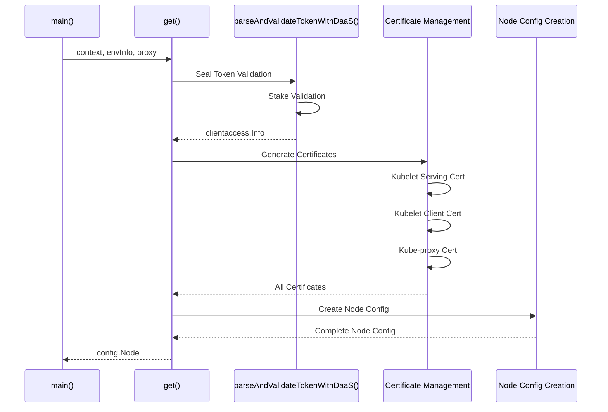
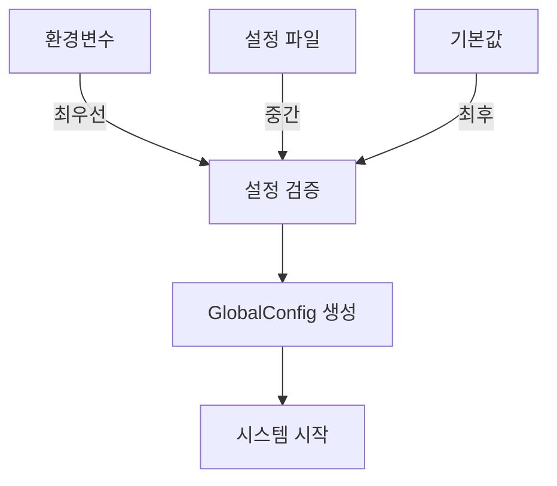

# ⚙️ K3s-DaaS 설정 시스템 상세 분석

**마스터 노드와 워커 노드의 통합 설정 관리 아키텍처**

---

## 📋 목차

1. [시스템 개요](#시스템-개요)
2. [마스터 노드 설정](#마스터-노드-설정)
3. [워커 노드 설정](#워커-노드-설정)
4. [K3s Agent 설정](#k3s-agent-설정)
5. [설정 우선순위](#설정-우선순위)
6. [설정 검증](#설정-검증)
7. [동적 설정 관리](#동적-설정-관리)
8. [보안 고려사항](#보안-고려사항)

---

## 시스템 개요

K3s-DaaS의 설정 시스템은 **계층적 설정 관리**와 **환경별 분리**를 통해 복잡한 블록체인-Kubernetes 통합 환경을 체계적으로 관리합니다.

### 🎯 핵심 특징

- **우선순위 기반**: 환경변수 > 설정파일 > 기본값
- **역할별 분리**: 마스터/워커 노드별 독립 설정
- **블록체인 통합**: Sui 네트워크 설정 내장
- **자동 검증**: 실시간 설정 유효성 검사
- **보안 우선**: 민감 정보 환경변수 처리

### 📁 설정 파일 구조
```
nautilus-release/
├── config.go           # 마스터 노드 설정 관리
└── main.go             # 설정 초기화 로직

worker-release/
├── config.go           # 워커 노드 설정 관리
├── pkg-reference/
│   └── agent/config/
│       └── config.go   # K3s Agent 통합 설정
└── main.go             # 워커 설정 초기화
```

---

## 마스터 노드 설정

### 🏗️ SystemConfig 구조

**위치**: `nautilus-release/config.go:13-28`

```go
type SystemConfig struct {
    // 서버 설정
    Server ServerConfig `json:"server"`

    // K3s 설정
    K3s K3sServerConfig `json:"k3s"`

    // TEE 설정
    TEE TEEConfig `json:"tee"`

    // Sui 블록체인 설정
    Sui SuiConfig `json:"sui"`

    // 로깅 설정
    Logging LoggingConfig `json:"logging"`
}
```

### 🌐 ServerConfig 상세

**위치**: `nautilus-release/config.go:30-35`

```go
type ServerConfig struct {
    ListenAddress string `json:"listen_address"`  // "0.0.0.0"
    ListenPort    int    `json:"listen_port"`     // 8080
    APIBasePath   string `json:"api_base_path"`   // "/api/v1"
}
```

#### 📋 환경변수 매핑
| 환경변수 | 설정 필드 | 기본값 | 설명 |
|----------|-----------|--------|------|
| `K3S_DAAS_LISTEN_ADDRESS` | `Server.ListenAddress` | `0.0.0.0` | HTTP 서버 바인딩 주소 |
| `K3S_DAAS_LISTEN_PORT` | `Server.ListenPort` | `8080` | HTTP 서버 포트 |

### ⚙️ K3sServerConfig 상세

**위치**: `nautilus-release/config.go:37-48`

```go
type K3sServerConfig struct {
    DataDir           string   `json:"data_dir"`            // "/var/lib/k3s-daas-tee"
    BindAddress       string   `json:"bind_address"`        // "0.0.0.0"
    HTTPSPort         int      `json:"https_port"`          // 6443
    ClusterCIDR       string   `json:"cluster_cidr"`        // "10.42.0.0/16"
    ServiceCIDR       string   `json:"service_cidr"`        // "10.43.0.0/16"
    ClusterDNS        string   `json:"cluster_dns"`         // "10.43.0.10"
    DisableComponents []string `json:"disable_components"`  // ["traefik", "metrics-server"]
    TLSMinVersion     string   `json:"tls_min_version"`     // "1.2"
    BootstrapToken    string   `json:"bootstrap_token"`     // TEE용 커스텀 토큰
}
```

#### 🔧 주요 설정 항목

**네트워크 설정**
- **ClusterCIDR**: Pod IP 대역 (`10.42.0.0/16`)
- **ServiceCIDR**: Service IP 대역 (`10.43.0.0/16`)
- **ClusterDNS**: 클러스터 DNS 서버 IP

**보안 설정**
- **TLSMinVersion**: 최소 TLS 버전 (`1.2`)
- **BootstrapToken**: TEE 전용 부트스트랩 토큰

**컴포넌트 관리**
- **DisableComponents**: 비활성화할 K3s 컴포넌트
  - `traefik`: 기본 인그레스 컨트롤러
  - `metrics-server`: 리소스 메트릭 수집기

### 🔒 TEEConfig 상세

**위치**: `nautilus-release/config.go:50-56`

```go
type TEEConfig struct {
    Mode                string `json:"mode"`                 // "real" or "simulation"
    AttestationEndpoint string `json:"attestation_endpoint"` // Nautilus 인증 서버
    EnclaveID          string `json:"enclave_id"`           // "sui-k3s-daas-master"
    MockAttestation    bool   `json:"mock_attestation"`     // 개발용 모킹
}
```

#### 🎯 TEE 모드 설정

| 모드 | 설명 | 용도 |
|------|------|------|
| `simulation` | 시뮬레이션 모드 | 개발/테스트 환경 |
| `real` | 실제 TEE 환경 | 프로덕션 환경 |

### 🌊 SuiConfig 상세

**위치**: `nautilus-release/config.go:58-66`

```go
type SuiConfig struct {
    NetworkURL        string `json:"network_url"`        // Sui RPC 엔드포인트
    GasObjectID       string `json:"gas_object_id"`      // 가스 객체 ID
    PrivateKey        string `json:"private_key"`        // Ed25519 개인키
    PackageID         string `json:"package_id"`         // Move 패키지 ID
    VerificationObject string `json:"verification_object"` // 검증 객체 ID
    StakingPool       string `json:"staking_pool"`       // 스테이킹 풀 ID
}
```

#### 🔐 보안 처리

```go
// 프로덕션 모드에서 필수 환경변수 검증
if c.TEE.Mode == "real" {
    if c.Sui.PrivateKey == "" {
        return fmt.Errorf("프로덕션 모드에서는 SUI_PRIVATE_KEY 환경변수가 필요함")
    }
    if c.Sui.PackageID == "" {
        return fmt.Errorf("프로덕션 모드에서는 SUI_PACKAGE_ID 환경변수가 필요함")
    }
}
```

---

## 워커 노드 설정

### 🏗️ WorkerConfig 구조

**위치**: `worker-release/config.go:13-25`

```go
type WorkerConfig struct {
    // 노드 설정
    Node NodeConfig `json:"node"`

    // K3s Agent 설정
    K3s K3sAgentWorkerConfig `json:"k3s"`

    // Sui 스테이킹 설정
    Staking StakingConfig `json:"staking"`

    // 로깅 설정
    Logging WorkerLoggingConfig `json:"logging"`
}
```

### 🔗 NodeConfig 상세

**위치**: `worker-release/config.go:27-33`

```go
type NodeConfig struct {
    NodeID             string `json:"node_id"`               // "k3s-daas-worker-001"
    NautilusEndpoint   string `json:"nautilus_endpoint"`     // "http://localhost:8080"
    ContainerRuntime   string `json:"container_runtime"`     // "containerd"
    DataDir            string `json:"data_dir"`              // "/var/lib/k3s-daas-agent"
}
```

### ⚙️ K3sAgentWorkerConfig 상세

**위치**: `worker-release/config.go:35-46`

```go
type K3sAgentWorkerConfig struct {
    ServerURL                string   `json:"server_url"`                  // 마스터 노드 URL
    Token                    string   `json:"token"`                       // Seal Token
    DataDir                  string   `json:"data_dir"`                    // 에이전트 데이터 디렉토리
    NodeName                 string   `json:"node_name"`                   // 노드 이름
    NodeIP                   string   `json:"node_ip"`                     // 노드 IP
    ContainerRuntimeEndpoint string   `json:"container_runtime_endpoint"`  // "unix:///run/containerd/containerd.sock"
    KubeletArgs              []string `json:"kubelet_args"`                // Kubelet 추가 인수
    NodeLabels               []string `json:"node_labels"`                 // 노드 레이블
    LogLevel                 string   `json:"log_level"`                   // "info"
}
```

#### 🐳 컨테이너 런타임 설정

```go
KubeletArgs: []string{
    "--container-runtime=remote",      // 원격 런타임 사용
    "--fail-swap-on=false",           // 스왑 무시
    "--cgroup-driver=systemd",        // systemd cgroup 드라이버
},
```

### 💰 StakingConfig 상세

**위치**: `worker-release/config.go:48-55`

```go
type StakingConfig struct {
    MinStakeAmount     uint64 `json:"min_stake_amount"`      // 1000000000 (1000 MIST)
    StakeCheckInterval int    `json:"stake_check_interval_seconds"` // 60초
    SuiNetworkURL      string `json:"sui_network_url"`       // Sui 네트워크 엔드포인트
    PrivateKey         string `json:"private_key"`           // 워커 개인키
    StakingPoolID      string `json:"staking_pool_id"`       // 참여할 스테이킹 풀
}
```

---

## K3s Agent 설정

### 🔧 Agent Configuration Flow

**위치**: `worker-release/pkg-reference/agent/config/config.go:444-848`

K3s Agent 설정은 매우 복잡한 과정을 거쳐 생성됩니다:



### 📋 핵심 설정 과정

#### 1️⃣ DaaS 토큰 검증

**위치**: `config.go:905-914`

```go
func parseAndValidateTokenWithDaaS(ctx context.Context, serverURL, token string, options ...clientaccess.ClientAccessOption) (*clientaccess.Info, error) {
    // Seal 토큰인지 확인
    if security.IsSealToken(token) {
        return parseAndValidateSealToken(ctx, serverURL, token, options...)
    }

    // 기존 K3s 토큰으로 폴백
    return clientaccess.ParseAndValidateToken(serverURL, token, options...)
}
```

#### 2️⃣ Seal 토큰 처리

**위치**: `config.go:916-960`

```go
func parseAndValidateSealToken(ctx context.Context, serverURL, token string, options ...clientaccess.ClientAccessOption) (*clientaccess.Info, error) {
    // 1. Seal 토큰 파싱
    sealToken, err := security.ParseSealTokenString(token)
    if err != nil {
        return nil, fmt.Errorf("failed to parse Seal token: %w", err)
    }

    // 2. DaaS 설정 초기화
    daasConfig := security.DefaultDaaSConfig()
    daasConfig.Enabled = true
    daasConfig.SealConfig.WalletAddress = sealToken.WalletAddress

    // 3. 스테이킹 검증
    validator, err := security.NewDaaSValidator(daasConfig)
    if err != nil {
        return nil, fmt.Errorf("failed to create DaaS validator: %w", err)
    }

    suiClient := validator.GetSuiClient()
    if suiClient != nil {
        minStake, _ := strconv.ParseUint(daasConfig.StakeConfig.MinStake, 10, 64)

        stakeInfo, err := suiClient.ValidateStake(ctx, sealToken.WalletAddress, minStake)
        if err != nil {
            return nil, fmt.Errorf("stake validation failed: %w", err)
        }

        logrus.Infof("DaaS authentication successful for wallet %s with stake %d",
            stakeInfo.WalletAddress, stakeInfo.StakeAmount)
    }

    return info, nil
}
```

#### 3️⃣ 노드 설정 생성

**위치**: `config.go:627-690`

```go
nodeConfig := &config.Node{
    Docker:                   envInfo.Docker,
    ContainerRuntimeEndpoint: envInfo.ContainerRuntimeEndpoint,
    FlannelBackend:           controlConfig.FlannelBackend,
    ServerHTTPSPort:          controlConfig.HTTPSPort,
    Token:                    info.String(),
}

// Agent 설정
nodeConfig.AgentConfig.NodeName = nodeName
nodeConfig.AgentConfig.ClientKubeletCert = clientKubeletCert
nodeConfig.AgentConfig.ServingKubeletCert = servingKubeletCert
nodeConfig.AgentConfig.ClusterDNS = controlConfig.ClusterDNS
nodeConfig.AgentConfig.ClusterDomain = controlConfig.ClusterDomain
```

---

## 설정 우선순위

### 📊 우선순위 순서



### 🔄 설정 로드 과정

**위치**: `nautilus-release/config.go:89-103`

```go
func LoadConfig() (*SystemConfig, error) {
    // 1. 기본 설정으로 시작
    config := getDefaultConfig()

    // 2. 설정 파일에서 로드 (있다면)
    if err := loadFromFile(config); err != nil {
        // 파일이 없으면 기본값 사용 (에러 아님)
        fmt.Printf("⚠️ 설정 파일을 찾을 수 없어 기본값 사용: %v\n", err)
    }

    // 3. 환경변수로 오버라이드
    loadFromEnvironment(config)

    return config, nil
}
```

### 📁 설정 파일 검색 순서

**위치**: `nautilus-release/config.go:149-172`

```go
configPaths := []string{
    os.Getenv("K3S_DAAS_CONFIG"),                    // 1. 환경변수 지정 경로
    "./config.json",                                 // 2. 현재 디렉토리
    "/etc/k3s-daas/config.json",                    // 3. 시스템 설정 디렉토리
    filepath.Join(os.Getenv("HOME"), ".k3s-daas", "config.json"), // 4. 사용자 홈 디렉토리
}

for _, path := range configPaths {
    if path == "" {
        continue
    }

    if data, err := os.ReadFile(path); err == nil {
        if err := json.Unmarshal(data, config); err != nil {
            return fmt.Errorf("설정 파일 파싱 실패 (%s): %v", path, err)
        }
        fmt.Printf("✅ 설정 파일 로드 완료: %s\n", path)
        return nil
    }
}
```

---

## 설정 검증

### ✅ 마스터 노드 검증

**위치**: `nautilus-release/config.go:277-303`

```go
func (c *SystemConfig) Validate() error {
    // 포트 범위 검증
    if c.Server.ListenPort <= 0 || c.Server.ListenPort > 65535 {
        return fmt.Errorf("잘못된 서버 포트: %d", c.Server.ListenPort)
    }

    if c.K3s.HTTPSPort <= 0 || c.K3s.HTTPSPort > 65535 {
        return fmt.Errorf("잘못된 K3s HTTPS 포트: %d", c.K3s.HTTPSPort)
    }

    // 필수 디렉토리 확인
    if c.K3s.DataDir == "" {
        return fmt.Errorf("K3s 데이터 디렉토리가 설정되지 않음")
    }

    // 프로덕션 환경 검증
    if c.TEE.Mode == "real" {
        if c.Sui.PrivateKey == "" {
            return fmt.Errorf("프로덕션 모드에서는 SUI_PRIVATE_KEY 환경변수가 필요함")
        }
        if c.Sui.PackageID == "" {
            return fmt.Errorf("프로덕션 모드에서는 SUI_PACKAGE_ID 환경변수가 필요함")
        }
    }

    return nil
}
```

### ✅ 워커 노드 검증

**위치**: `worker-release/config.go:227-251`

```go
func (c *WorkerConfig) Validate() error {
    if c.Node.NodeID == "" {
        return fmt.Errorf("노드 ID가 설정되지 않음")
    }

    if c.Node.NautilusEndpoint == "" {
        return fmt.Errorf("Nautilus 엔드포인트가 설정되지 않음")
    }

    if c.Node.DataDir == "" {
        return fmt.Errorf("데이터 디렉토리가 설정되지 않음")
    }

    if c.Staking.MinStakeAmount <= 0 {
        return fmt.Errorf("최소 스테이킹 양이 0보다 작거나 같음")
    }

    // 프로덕션 환경에서는 프라이빗 키 필요
    if os.Getenv("ENVIRONMENT") == "production" && c.Staking.PrivateKey == "" {
        return fmt.Errorf("프로덕션 환경에서는 SUI_WORKER_PRIVATE_KEY 환경변수가 필요함")
    }

    return nil
}
```

---

## 동적 설정 관리

### 🔄 설정 요약 출력

**마스터 노드**

**위치**: `nautilus-release/config.go:305-314`

```go
func (c *SystemConfig) PrintSummary() {
    fmt.Printf("📋 K3s-DaaS 설정 요약:\n")
    fmt.Printf("  🌐 서버: %s:%d\n", c.Server.ListenAddress, c.Server.ListenPort)
    fmt.Printf("  🎯 K3s API: %s:%d\n", c.K3s.BindAddress, c.K3s.HTTPSPort)
    fmt.Printf("  📁 데이터 디렉토리: %s\n", c.K3s.DataDir)
    fmt.Printf("  🔒 TEE 모드: %s\n", c.TEE.Mode)
    fmt.Printf("  🌊 Sui 네트워크: %s\n", c.Sui.NetworkURL)
    fmt.Printf("  📊 로그 레벨: %s\n", c.Logging.Level)
}
```

**워커 노드**

**위치**: `worker-release/config.go:253-263`

```go
func (c *WorkerConfig) PrintSummary() {
    fmt.Printf("📋 K3s-DaaS 워커 노드 설정 요약:\n")
    fmt.Printf("  🏷️  노드 ID: %s\n", c.Node.NodeID)
    fmt.Printf("  🔗 Nautilus: %s\n", c.Node.NautilusEndpoint)
    fmt.Printf("  📁 데이터 디렉토리: %s\n", c.Node.DataDir)
    fmt.Printf("  🐳 컨테이너 런타임: %s\n", c.Node.ContainerRuntime)
    fmt.Printf("  💰 최소 스테이킹: %d MIST\n", c.Staking.MinStakeAmount)
    fmt.Printf("  🌊 Sui 네트워크: %s\n", c.Staking.SuiNetworkURL)
    fmt.Printf("  📊 로그 레벨: %s\n", c.Logging.Level)
}
```

### 💾 기본 설정 파일 생성

**위치**: `nautilus-release/config.go:254-275`

```go
func SaveDefaultConfig(path string) error {
    config := getDefaultConfig()

    // 디렉토리 생성
    if err := os.MkdirAll(filepath.Dir(path), 0755); err != nil {
        return fmt.Errorf("설정 디렉토리 생성 실패: %v", err)
    }

    // JSON으로 저장
    data, err := json.MarshalIndent(config, "", "  ")
    if err != nil {
        return fmt.Errorf("설정 직렬화 실패: %v", err)
    }

    if err := os.WriteFile(path, data, 0600); err != nil {
        return fmt.Errorf("설정 파일 저장 실패: %v", err)
    }

    fmt.Printf("✅ 기본 설정 파일 생성: %s\n", path)
    return nil
}
```

---

## 보안 고려사항

### 🔐 민감 정보 처리

#### 1️⃣ 환경변수 우선 처리
```go
// 프라이빗 키는 반드시 환경변수로
if val := os.Getenv("SUI_PRIVATE_KEY"); val != "" {
    config.Sui.PrivateKey = val
}
```

#### 2️⃣ 파일 권한 설정
```go
// 설정 파일 0600 권한 (소유자만 읽기/쓰기)
if err := os.WriteFile(path, data, 0600); err != nil {
    return fmt.Errorf("설정 파일 저장 실패: %v", err)
}
```

#### 3️⃣ 로그에서 민감 정보 제외
```go
// 설정 요약에서 프라이빗 키 등 민감 정보 제외
func (c *SystemConfig) PrintSummary() {
    // PrivateKey는 출력하지 않음
    fmt.Printf("  🌊 Sui 네트워크: %s\n", c.Sui.NetworkURL)
}
```

### 🛡️ 설정 파일 보안

| 설정 항목 | 보안 레벨 | 저장 방식 |
|-----------|-----------|-----------|
| **PrivateKey** | 🔴 최고 | 환경변수만 |
| **BootstrapToken** | 🟡 중간 | 파일 + 환경변수 |
| **NetworkURL** | 🟢 낮음 | 파일 허용 |
| **DataDir** | 🟢 낮음 | 파일 허용 |

### ⚠️ 검증 규칙

#### 📋 필수 검증 항목

1. **포트 충돌 방지**
   ```go
   if c.Server.ListenPort == c.K3s.HTTPSPort {
       return fmt.Errorf("서버 포트와 K3s 포트가 중복됨")
   }
   ```

2. **네트워크 CIDR 검증**
   ```go
   if _, _, err := net.ParseCIDR(c.K3s.ClusterCIDR); err != nil {
       return fmt.Errorf("잘못된 클러스터 CIDR: %v", err)
   }
   ```

3. **스테이킹 최소값 확인**
   ```go
   if c.Staking.MinStakeAmount < 1000000000 { // 1000 MIST
       return fmt.Errorf("최소 스테이킹이 부족함")
   }
   ```

---

## 🎯 핵심 특징 요약

### ✅ 설계 원칙

1. **계층적 구조**: 역할별 설정 분리
2. **우선순위 기반**: 환경변수 > 파일 > 기본값
3. **자동 검증**: 시작 시점 설정 유효성 검사
4. **보안 우선**: 민감 정보 환경변수 처리
5. **유연성**: 개발/프로덕션 환경 구분

### 🚀 관리 편의성

- **자동 생성**: 기본 설정 파일 자동 생성
- **요약 출력**: 현재 설정 상태 한눈에 확인
- **에러 메시지**: 한국어 친화적 오류 메시지
- **다중 경로**: 여러 위치에서 설정 파일 검색

### 🔧 운영 효율성

- **즉시 적용**: 환경변수 변경 시 재시작으로 적용
- **롤백 지원**: 설정 파일 백업을 통한 빠른 복구
- **검증 자동화**: 잘못된 설정으로 인한 실행 실패 방지
- **모니터링 연동**: 설정 변경 이력 추적 가능

---

**⚙️ K3s-DaaS의 설정 시스템은 복잡한 블록체인-Kubernetes 통합 환경을 안전하고 효율적으로 관리하는 핵심 인프라입니다!**