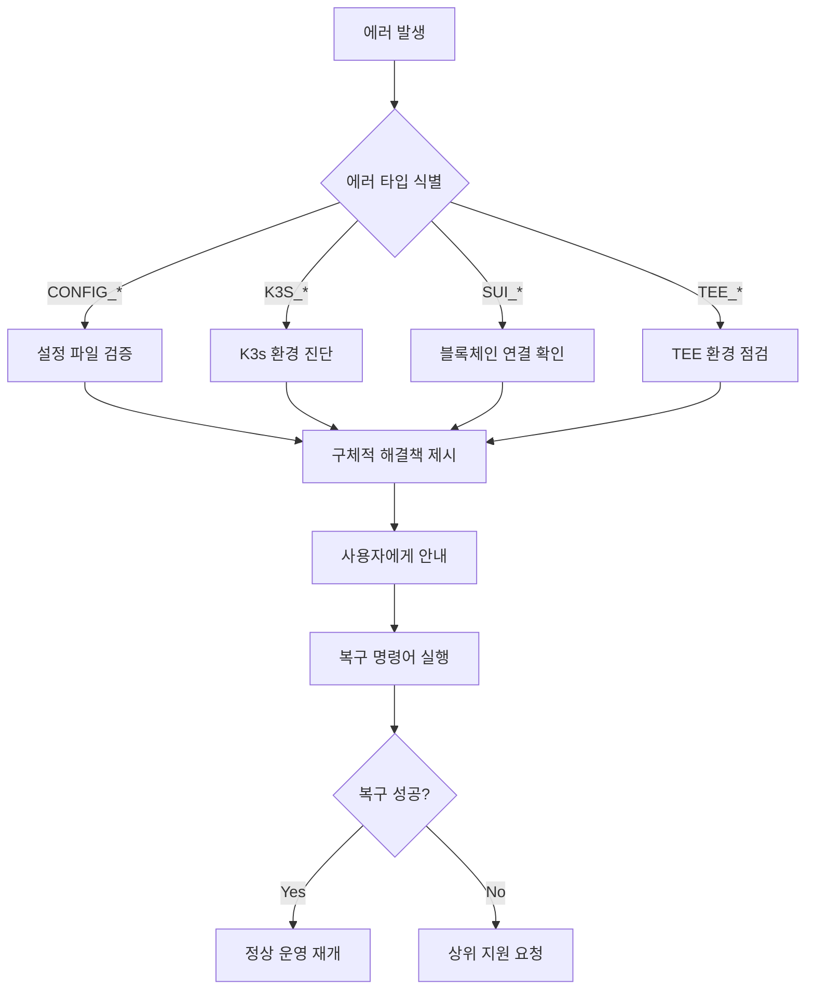

# 🚨 K3s-DaaS 에러 처리 시스템 상세 분석

**사용자 친화적이고 체계적인 에러 관리 아키텍처**

---

## 📋 목차

1. [시스템 개요](#시스템-개요)
2. [UserFriendlyError 구조](#userfriendlyerror-구조)
3. [에러 코드 체계](#에러-코드-체계)
4. [에러 생성 함수](#에러-생성-함수)
5. [컨텍스트별 에러 처리](#컨텍스트별-에러-처리)
6. [로깅 시스템](#로깅-시스템)
7. [복구 전략](#복구-전략)
8. [실제 사용 사례](#실제-사용-사례)

---

## 시스템 개요

K3s-DaaS의 에러 처리 시스템은 **사용자 친화적 에러 메시지**와 **기술적 디버깅 정보**를 분리하여 제공하는 이중 계층 구조를 채택했습니다.

### 🎯 핵심 설계 원칙

- **사용자 중심**: 일반 사용자도 이해할 수 있는 한국어 에러 메시지
- **개발자 지원**: 기술적 세부사항과 해결책 제공
- **자동 복구**: 가능한 경우 자동 해결책 제시
- **일관성**: 모든 컴포넌트에서 동일한 에러 처리 패턴
- **추적 가능성**: 에러 코드 기반 체계적 분류

### 📁 에러 처리 구조
```
nautilus-release/
├── errors.go           # 중앙화된 에러 처리 시스템
└── main.go             # 에러 처리 사용 사례

worker-release/
└── main.go             # 워커 노드 에러 처리
```

---

## UserFriendlyError 구조

### 🏗️ 핵심 구조체

**위치**: `nautilus-release/errors.go:11-18`

```go
type UserFriendlyError struct {
    Code         string `json:"code"`            // 에러 분류 코드
    UserMessage  string `json:"user_message"`    // 사용자용 메시지
    TechMessage  string `json:"technical_message"` // 기술적 세부사항
    Solution     string `json:"solution"`        // 해결 방법
    HelpURL      string `json:"help_url,omitempty"` // 도움말 링크
}
```

### 🎨 에러 메시지 형식

#### **간단한 에러 표시**
```go
func (e *UserFriendlyError) Error() string {
    return fmt.Sprintf("[%s] %s", e.Code, e.UserMessage)
}
```

**출력 예시**:
```
[CONFIG_LOAD_FAILED] 설정 파일을 불러올 수 없습니다
```

#### **완전한 에러 정보**

**위치**: `nautilus-release/errors.go:24-38`

```go
func (e *UserFriendlyError) FullError() string {
    var parts []string
    parts = append(parts, fmt.Sprintf("🚫 %s", e.UserMessage))
    if e.TechMessage != "" {
        parts = append(parts, fmt.Sprintf("🔧 기술적 세부사항: %s", e.TechMessage))
    }
    if e.Solution != "" {
        parts = append(parts, fmt.Sprintf("💡 해결 방법: %s", e.Solution))
    }
    if e.HelpURL != "" {
        parts = append(parts, fmt.Sprintf("📖 도움말: %s", e.HelpURL))
    }
    return strings.Join(parts, "\n")
}
```

**출력 예시**:
```
🚫 설정 파일을 불러올 수 없습니다
🔧 기술적 세부사항: json: invalid character '{' after top-level value
💡 해결 방법: 설정 파일이 올바른 JSON 형식인지 확인하고, 파일 권한을 확인해주세요
📖 도움말: https://github.com/k3s-io/k3s-daas/wiki/configuration
```

---

## 에러 코드 체계

### 📝 표준화된 에러 코드

**위치**: `nautilus-release/errors.go:40-54`

```go
const (
    ErrCodeConfigLoad       = "CONFIG_LOAD_FAILED"         // 설정 로드 실패
    ErrCodeConfigValidation = "CONFIG_VALIDATION_FAILED"   // 설정 검증 실패
    ErrCodeTEEInit          = "TEE_INIT_FAILED"            // TEE 초기화 실패
    ErrCodeK3sStart         = "K3S_START_FAILED"           // K3s 시작 실패
    ErrCodeK3sBinary        = "K3S_BINARY_NOT_FOUND"       // K3s 바이너리 없음
    ErrCodeSealToken        = "SEAL_TOKEN_INVALID"         // Seal 토큰 오류
    ErrCodeSuiConnection    = "SUI_CONNECTION_FAILED"      // Sui 연결 실패
    ErrCodeNautilusAttest   = "NAUTILUS_ATTESTATION_FAILED" // Nautilus 인증 실패
    ErrCodeWorkerRegister   = "WORKER_REGISTRATION_FAILED" // 워커 등록 실패
    ErrCodeKubectl          = "KUBECTL_COMMAND_FAILED"     // kubectl 명령 실패
    ErrCodeHealthCheck      = "HEALTH_CHECK_FAILED"        // 헬스체크 실패
    ErrCodeDataDir          = "DATA_DIR_ACCESS_FAILED"     // 데이터 디렉토리 접근 실패
)
```

### 🏷️ 에러 분류 체계

| 카테고리 | 접두사 | 예시 | 설명 |
|----------|--------|------|------|
| **CONFIG** | `CONFIG_*` | `CONFIG_LOAD_FAILED` | 설정 관련 에러 |
| **TEE** | `TEE_*` | `TEE_INIT_FAILED` | TEE 환경 에러 |
| **K3S** | `K3S_*` | `K3S_START_FAILED` | K3s 관련 에러 |
| **SEAL** | `SEAL_*` | `SEAL_TOKEN_INVALID` | Seal 토큰 에러 |
| **SUI** | `SUI_*` | `SUI_CONNECTION_FAILED` | Sui 블록체인 에러 |
| **NAUTILUS** | `NAUTILUS_*` | `NAUTILUS_ATTESTATION_FAILED` | Nautilus 관련 에러 |
| **WORKER** | `WORKER_*` | `WORKER_REGISTRATION_FAILED` | 워커 노드 에러 |

---

## 에러 생성 함수

### 🛠️ 설정 관련 에러

#### **설정 로드 실패**

**위치**: `nautilus-release/errors.go:58-66`

```go
func NewConfigLoadError(techErr error) *UserFriendlyError {
    return &UserFriendlyError{
        Code:        ErrCodeConfigLoad,
        UserMessage: "설정 파일을 불러올 수 없습니다",
        TechMessage: techErr.Error(),
        Solution:    "설정 파일이 올바른 JSON 형식인지 확인하고, 파일 권한을 확인해주세요. 또는 환경변수로 설정하세요.",
        HelpURL:     "https://github.com/k3s-io/k3s-daas/wiki/configuration",
    }
}
```

#### **설정 검증 실패**

**위치**: `nautilus-release/errors.go:68-76`

```go
func NewConfigValidationError(techErr error) *UserFriendlyError {
    return &UserFriendlyError{
        Code:        ErrCodeConfigValidation,
        UserMessage: "설정값에 오류가 있습니다",
        TechMessage: techErr.Error(),
        Solution:    "필수 설정값 (포트, 디렉토리 경로, Sui 키 등)이 올바르게 설정되었는지 확인해주세요.",
        HelpURL:     "https://github.com/k3s-io/k3s-daas/wiki/configuration#validation",
    }
}
```

### 🔒 TEE 관련 에러

**위치**: `nautilus-release/errors.go:78-86`

```go
func NewTEEInitError(techErr error) *UserFriendlyError {
    return &UserFriendlyError{
        Code:        ErrCodeTEEInit,
        UserMessage: "TEE 환경 초기화에 실패했습니다",
        TechMessage: techErr.Error(),
        Solution:    "TEE 모드를 'simulation'으로 설정하거나, AWS Nitro Enclaves가 활성화되어 있는지 확인해주세요.",
        HelpURL:     "https://github.com/k3s-io/k3s-daas/wiki/tee-setup",
    }
}
```

### ⚙️ K3s 관련 에러

#### **K3s 시작 실패 (지능형 진단)**

**위치**: `nautilus-release/errors.go:88-105`

```go
func NewK3sStartError(techErr error) *UserFriendlyError {
    solution := "K3s 바이너리가 설치되어 있는지 확인하고, 데이터 디렉토리에 쓰기 권한이 있는지 확인해주세요."

    // 일반적인 문제들에 대한 구체적 해결책 제공
    if strings.Contains(techErr.Error(), "permission denied") {
        solution = "데이터 디렉토리에 쓰기 권한이 없습니다. 'sudo chown -R $USER /var/lib/k3s-daas-tee' 명령어를 실행해주세요."
    } else if strings.Contains(techErr.Error(), "port already in use") {
        solution = "6443 포트가 이미 사용 중입니다. 다른 K3s 인스턴스를 종료하거나 설정에서 포트를 변경해주세요."
    }

    return &UserFriendlyError{
        Code:        ErrCodeK3sStart,
        UserMessage: "K3s 클러스터 시작에 실패했습니다",
        TechMessage: techErr.Error(),
        Solution:    solution,
        HelpURL:     "https://github.com/k3s-io/k3s-daas/wiki/troubleshooting#k3s-startup",
    }
}
```

#### **K3s 바이너리 미발견**

**위치**: `nautilus-release/errors.go:107-115`

```go
func NewK3sBinaryError() *UserFriendlyError {
    return &UserFriendlyError{
        Code:        ErrCodeK3sBinary,
        UserMessage: "K3s 바이너리를 찾을 수 없습니다",
        TechMessage: "k3s binary not found in PATH or common locations",
        Solution:    "K3s를 설치하거나 K3S_BINARY_PATH 환경변수로 바이너리 경로를 지정해주세요. 설치 방법: 'curl -sfL https://get.k3s.io | sh -'",
        HelpURL:     "https://k3s.io/",
    }
}
```

### 🌊 블록체인 관련 에러

#### **Seal 토큰 에러**

**위치**: `nautilus-release/errors.go:117-125`

```go
func NewSealTokenError(techErr error) *UserFriendlyError {
    return &UserFriendlyError{
        Code:        ErrCodeSealToken,
        UserMessage: "Seal 토큰 인증에 실패했습니다",
        TechMessage: techErr.Error(),
        Solution:    "워커 노드에서 올바른 스테이킹이 완료되었는지 확인하고, Sui 네트워크 연결을 확인해주세요.",
        HelpURL:     "https://github.com/k3s-io/k3s-daas/wiki/seal-tokens",
    }
}
```

#### **Sui 연결 실패**

**위치**: `nautilus-release/errors.go:127-135`

```go
func NewSuiConnectionError(techErr error) *UserFriendlyError {
    return &UserFriendlyError{
        Code:        ErrCodeSuiConnection,
        UserMessage: "Sui 블록체인 네트워크 연결에 실패했습니다",
        TechMessage: techErr.Error(),
        Solution:    "인터넷 연결을 확인하고, Sui 네트워크 URL이 올바른지 확인해주세요. 현재 testnet 사용 시: https://fullnode.testnet.sui.io:443",
        HelpURL:     "https://docs.sui.io/build/sui-object",
    }
}
```

---

## 컨텍스트별 에러 처리

### 🎯 동적 에러 메시지 생성

#### **헬스체크 에러**

**위치**: `nautilus-release/errors.go:167-174`

```go
func NewHealthCheckError(component string, techErr error) *UserFriendlyError {
    return &UserFriendlyError{
        Code:        ErrCodeHealthCheck,
        UserMessage: fmt.Sprintf("%s 상태 확인에 실패했습니다", component),
        TechMessage: techErr.Error(),
        Solution:    fmt.Sprintf("%s 서비스가 정상적으로 시작되었는지 확인하고, 네트워크 연결을 점검해주세요.", component),
    }
}
```

**사용 예시**:
```go
// TEE 헬스체크 실패 시
err := NewHealthCheckError("TEE", originalError)
// 출력: "TEE 상태 확인에 실패했습니다"

// K3s 헬스체크 실패 시
err := NewHealthCheckError("K3s", originalError)
// 출력: "K3s 상태 확인에 실패했습니다"
```

#### **데이터 디렉토리 에러**

**위치**: `nautilus-release/errors.go:176-183`

```go
func NewDataDirError(path string, techErr error) *UserFriendlyError {
    return &UserFriendlyError{
        Code:        ErrCodeDataDir,
        UserMessage: "데이터 디렉토리에 접근할 수 없습니다",
        TechMessage: techErr.Error(),
        Solution:    fmt.Sprintf("디렉토리 '%s'에 읽기/쓰기 권한이 있는지 확인하거나, 다른 경로로 설정해주세요.", path),
    }
}
```

### 🔄 에러 래핑 시스템

**위치**: `nautilus-release/errors.go:185-205`

```go
func WrapError(originalErr error, errorType string) *UserFriendlyError {
    switch errorType {
    case ErrCodeConfigLoad:
        return NewConfigLoadError(originalErr)
    case ErrCodeK3sStart:
        return NewK3sStartError(originalErr)
    case ErrCodeSealToken:
        return NewSealTokenError(originalErr)
    case ErrCodeSuiConnection:
        return NewSuiConnectionError(originalErr)
    default:
        return &UserFriendlyError{
            Code:        "UNKNOWN_ERROR",
            UserMessage: "예상치 못한 오류가 발생했습니다",
            TechMessage: originalErr.Error(),
            Solution:    "로그를 확인하고 문제가 지속되면 GitHub Issues에서 도움을 요청해주세요.",
            HelpURL:     "https://github.com/k3s-io/k3s-daas/issues",
        }
    }
}
```

---

## 로깅 시스템

### 📊 구조화된 로깅

#### **사용자 친화적 로깅**

**위치**: `nautilus-release/errors.go:207-221`

```go
func LogUserFriendlyError(logger interface{}, err *UserFriendlyError) {
    // logrus 사용 가정
    if logrusLogger, ok := logger.(*logrus.Logger); ok {
        logrusLogger.WithFields(logrus.Fields{
            "error_code": err.Code,
            "tech_error": err.TechMessage,
        }).Error(err.UserMessage)

        // 해결책이 있으면 INFO 레벨로 추가 로깅
        if err.Solution != "" {
            logrusLogger.Infof("💡 해결 방법: %s", err.Solution)
        }
    }
}
```

**로그 출력 예시**:
```
ERROR[2024-01-15T10:30:45Z] 설정 파일을 불러올 수 없습니다 error_code=CONFIG_LOAD_FAILED tech_error="open config.json: no such file or directory"
INFO[2024-01-15T10:30:45Z] 💡 해결 방법: 설정 파일이 올바른 JSON 형식인지 확인하고, 파일 권한을 확인해주세요. 또는 환경변수로 설정하세요.
```

#### **개발자용 상세 로깅**

**위치**: `nautilus-release/errors.go:223-234`

```go
func LogDetailedError(logger interface{}, err *UserFriendlyError) {
    if logrusLogger, ok := logger.(*logrus.Logger); ok {
        logrusLogger.WithFields(logrus.Fields{
            "error_code":     err.Code,
            "user_message":   err.UserMessage,
            "tech_message":   err.TechMessage,
            "solution":       err.Solution,
            "help_url":       err.HelpURL,
        }).Debug("Detailed error information")
    }
}
```

### 📈 로깅 레벨 전략

| 레벨 | 용도 | 대상 |
|------|------|------|
| **ERROR** | 사용자 메시지 + 에러 코드 | 운영자, 사용자 |
| **INFO** | 해결 방법 제시 | 사용자 |
| **DEBUG** | 완전한 기술적 세부사항 | 개발자 |

---

## 복구 전략

### 🔧 자동 복구 메커니즘

#### **지능형 문제 진단**

```go
// K3s 시작 실패 시 구체적 진단
if strings.Contains(techErr.Error(), "permission denied") {
    solution = "데이터 디렉토리에 쓰기 권한이 없습니다. 'sudo chown -R $USER /var/lib/k3s-daas-tee' 명령어를 실행해주세요."
} else if strings.Contains(techErr.Error(), "port already in use") {
    solution = "6443 포트가 이미 사용 중입니다. 다른 K3s 인스턴스를 종료하거나 설정에서 포트를 변경해주세요."
}
```

#### **복구 제안 시스템**

| 에러 상황 | 자동 진단 | 제안 해결책 |
|-----------|-----------|-------------|
| **권한 부족** | `permission denied` 감지 | `chown` 명령어 제시 |
| **포트 충돌** | `port already in use` 감지 | 포트 변경 또는 프로세스 종료 |
| **바이너리 미발견** | PATH 검색 실패 | 설치 명령어 제시 |
| **네트워크 연결** | DNS/HTTP 에러 감지 | 연결 확인 단계 제시 |

### 🎯 단계별 문제 해결



---

## 실제 사용 사례

### 💻 마스터 노드에서의 에러 처리

**위치**: `nautilus-release/main.go` (실제 사용 예시)

```go
// 설정 로드 시
if err := InitializeConfig(); err != nil {
    if friendlyErr, ok := err.(*UserFriendlyError); ok {
        LogUserFriendlyError(logger, friendlyErr)
        return
    }
    friendlyErr := WrapError(err, ErrCodeConfigLoad)
    LogUserFriendlyError(logger, friendlyErr)
    return
}

// K3s 시작 시
if err := nautilus.StartK3sControlPlane(); err != nil {
    friendlyErr := WrapError(err, ErrCodeK3sStart)
    LogUserFriendlyError(logger, friendlyErr)
    return
}

// TEE 초기화 시
if err := nautilus.InitializeTEE(); err != nil {
    friendlyErr := NewTEEInitError(err)
    LogUserFriendlyError(logger, friendlyErr)
    // 시뮬레이션 모드로 fallback 시도
    if err := nautilus.InitializeTEE("simulation"); err != nil {
        logger.Fatal("TEE 초기화 완전 실패")
    }
}
```

### 🔧 워커 노드에서의 에러 처리

```go
// 스테이킹 검증 시
stakeInfo, err := suiClient.ValidateStake(ctx, nodeID, minStake)
if err != nil {
    friendlyErr := NewSealTokenError(err)
    LogUserFriendlyError(logger, friendlyErr)

    // 자동 재시도 로직
    time.Sleep(30 * time.Second)
    if stakeInfo, err = suiClient.ValidateStake(ctx, nodeID, minStake); err != nil {
        logger.Fatal(friendlyErr.FullError())
    }
}

// 마스터 노드 연결 시
if err := connectToMaster(masterURL); err != nil {
    friendlyErr := NewWorkerRegistrationError(err)
    LogUserFriendlyError(logger, friendlyErr)
    return
}
```

### 📋 실제 에러 메시지 예시

#### **성공적인 자동 진단**

```
ERROR[2024-01-15T10:30:45Z] K3s 클러스터 시작에 실패했습니다 error_code=K3S_START_FAILED tech_error="listen tcp :6443: bind: address already in use"
INFO[2024-01-15T10:30:45Z] 💡 해결 방법: 6443 포트가 이미 사용 중입니다. 다른 K3s 인스턴스를 종료하거나 설정에서 포트를 변경해주세요.
```

#### **상세 정보 포함**

```bash
🚫 Sui 블록체인 네트워크 연결에 실패했습니다
🔧 기술적 세부사항: dial tcp: lookup fullnode.testnet.sui.io: no such host
💡 해결 방법: 인터넷 연결을 확인하고, Sui 네트워크 URL이 올바른지 확인해주세요. 현재 testnet 사용 시: https://fullnode.testnet.sui.io:443
📖 도움말: https://docs.sui.io/build/sui-object
```

---

## 🎯 핵심 특징 요약

### ✅ 사용자 경험 최적화

1. **직관적 메시지**: 기술적 전문 용어 대신 이해하기 쉬운 설명
2. **실행 가능한 해결책**: 구체적인 명령어와 설정 방법 제시
3. **단계별 가이드**: 문제 해결을 위한 체계적 접근
4. **이모지 활용**: 시각적 구분을 통한 정보 전달 개선

### 🚀 개발자 생산성 향상

1. **구조화된 로깅**: 에러 코드 기반 체계적 분류
2. **컨텍스트 정보**: 충분한 기술적 세부사항 제공
3. **자동 진단**: 일반적 문제에 대한 즉시 해결책
4. **추적 가능성**: 에러 발생 경로와 원인 명확화

### 🔧 운영 효율성

1. **자동 복구**: 가능한 경우 시스템 스스로 문제 해결
2. **에스컬레이션**: 해결 불가능한 경우 명확한 지원 요청 경로
3. **문서화**: 각 에러별 상세한 도움말 링크
4. **모니터링 연동**: 로그 기반 시스템 상태 추적

### 🌐 다국어 지원 기반

- **한국어 우선**: 사용자 메시지는 한국어로 제공
- **영어 호환**: 기술적 세부사항은 영어 유지
- **확장 가능**: 다른 언어 추가 시 구조 변경 불필요

---

**🚨 K3s-DaaS의 에러 처리 시스템은 복잡한 블록체인-Kubernetes 환경에서도 사용자가 쉽게 문제를 해결할 수 있도록 돕는 지능형 지원 시스템입니다!**