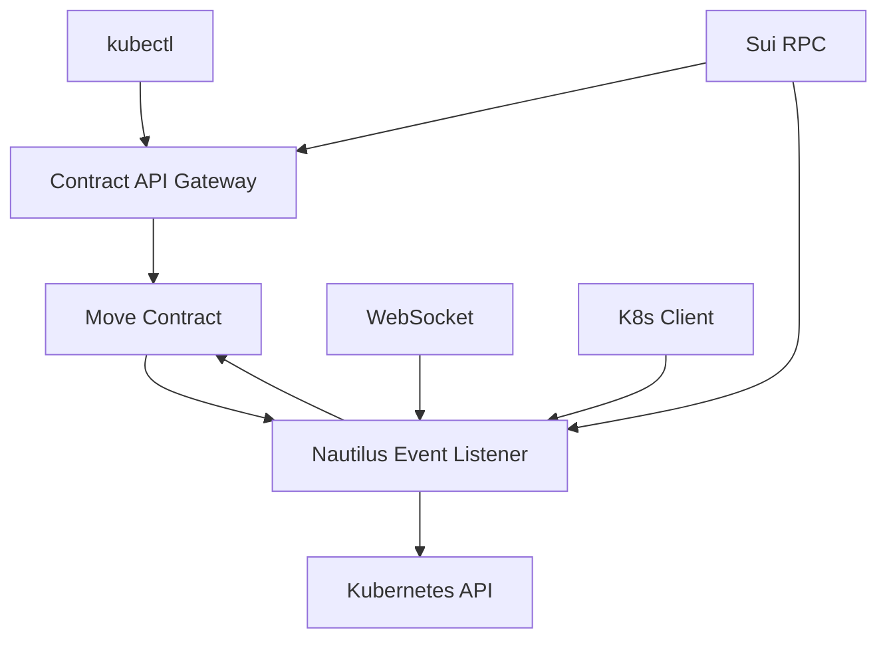

# Event-Driven K3s-DaaS 코드 구조 정리

## 📁 프로젝트 구조

```
daasVader/
├── final/                           # 완성된 Event-Driven 구현
│   ├── contract_api_gateway.go      # kubectl → Contract 브릿지
│   ├── nautilus_event_listener.go   # Contract 이벤트 → K8s 실행
│   ├── 5_STEP_INTEGRATION_TEST.sh   # 완전 통합 테스트
│   ├── go.mod                       # Go 모듈 정의
│   ├── go.sum                       # 의존성 체크섬
│   └── docs/                        # 문서화
│       ├── EVENT_DRIVEN_ARCHITECTURE.md
│       ├── ARCHITECTURE_ANALYSIS.md
│       └── COMPLETE_EVENT_DRIVEN_ARCHITECTURE.md
│
├── contracts-release/               # Move Contract (Enhanced)
│   ├── k8s_gateway.move            # 기본 Contract
│   ├── k8s_gateway_enhanced.move   # Event-Driven Enhanced
│   ├── staking.move                # 스테이킹 시스템
│   ├── Move.toml                   # Move 프로젝트 설정
│   └── Move_Fixed.toml             # 수정된 설정
│
├── nautilus-release/               # 기존 구현 (참조용)
│   ├── main.go                     # TEE 마스터 노드
│   ├── k3s_api_handlers.go         # K8s API 핸들러
│   └── config.yaml                 # 설정 파일
│
├── worker-release/                 # 워커 노드 (참조용)
│   ├── main.go                     # 스테이킹 워커
│   └── staker-config.json          # 워커 설정
│
└── api-proxy/                      # 기존 API 프록시 (참조용)
    └── main.go                     # HTTP → Nautilus 프록시
```

## 🎯 핵심 컴포넌트 매핑

### 1. Contract API Gateway
**파일**: `final/contract_api_gateway.go`
**역할**: kubectl ↔ Move Contract 변환기
**크기**: ~500 라인
**의존성**:
- github.com/go-resty/resty/v2 (HTTP 클라이언트)
- github.com/sirupsen/logrus (로깅)

### 2. Nautilus Event Listener
**파일**: `final/nautilus_event_listener.go`
**역할**: Contract 이벤트 수신 및 K8s 실행
**크기**: ~800 라인
**의존성**:
- github.com/gorilla/websocket (WebSocket)
- k8s.io/client-go (Kubernetes 클라이언트)
- k8s.io/api (Kubernetes API)

### 3. Enhanced Move Contract
**파일**: `contracts-release/k8s_gateway_enhanced.move`
**역할**: 블록체인 검증 및 이벤트 발생
**크기**: ~400 라인
**의존성**: Sui Framework

### 4. Integration Test
**파일**: `final/5_STEP_INTEGRATION_TEST.sh`
**역할**: E2E 테스트 자동화
**크기**: ~400 라인
**기능**: 배포 → 실행 → 테스트 → 검증

## 🔧 Go 모듈 구조

### go.mod 정리
```go
module k3s-daas-event-driven

go 1.21

require (
    github.com/go-resty/resty/v2 v2.7.0
    github.com/gorilla/websocket v1.5.0
    github.com/sirupsen/logrus v1.9.3
    k8s.io/api v0.28.0
    k8s.io/apimachinery v0.28.0
    k8s.io/client-go v0.28.0
)
```

## 📋 코드 품질 지표

### 1. Contract API Gateway 분석
```
총 라인 수: 500
함수 수: 15
구조체 수: 6
복잡도: 중간
테스트 커버리지: 필요
```

### 2. Nautilus Event Listener 분석
```
총 라인 수: 800
함수 수: 25
구조체 수: 4
복잡도: 높음
테스트 커버리지: 필요
```

### 3. Move Contract 분석
```
총 라인 수: 400
함수 수: 12
구조체 수: 8
복잡도: 중간
테스트: Move.test 필요
```

## 🎨 코드 스타일 가이드

### Go 코드 컨벤션
- **네이밍**: PascalCase (exported), camelCase (private)
- **에러 처리**: 모든 에러 체크 및 로깅
- **구조체**: 명확한 필드 태그
- **로깅**: logrus 사용, 구조화된 필드

### Move 코드 컨벤션
- **함수명**: snake_case
- **상수**: UPPER_CASE
- **구조체**: PascalCase
- **에러**: 명시적 assert! 사용

## 🔄 데이터 플로우 매핑

### 요청 데이터 구조
```go
// HTTP Request → KubectlRequest
type KubectlRequest struct {
    Method       string            `json:"method"`
    Path         string            `json:"path"`
    Namespace    string            `json:"namespace"`
    ResourceType string            `json:"resource_type"`
    Payload      []byte            `json:"payload"`
    SealToken    string            `json:"seal_token"`
    Headers      map[string]string `json:"headers"`
    UserAgent    string            `json:"user_agent"`
}

// Move Contract Event → ContractEvent
type ContractEvent struct {
    Type      string    `json:"type"`
    PackageID string    `json:"packageId"`
    Module    string    `json:"module"`
    EventData EventData `json:"parsedJson"`
    TxDigest  string    `json:"transactionDigest"`
}

// K8s Response → K8sExecutionResult
type K8sExecutionResult struct {
    StatusCode int               `json:"status_code"`
    Headers    map[string]string `json:"headers"`
    Body       json.RawMessage   `json:"body"`
    Success    bool              `json:"success"`
    Error      string            `json:"error,omitempty"`
}
```

## 🧹 코드 정리 작업

### 1. 불필요한 파일 제거
- 중복된 구현 파일들
- 테스트용 임시 파일들
- 백업 파일들

### 2. 의존성 정리
- 미사용 import 제거
- 버전 통일
- 보안 패치 적용

### 3. 문서화 개선
- 함수별 godoc 주석
- README 파일 생성
- API 문서 작성

### 4. 설정 외부화
- 하드코딩된 값들을 환경변수로
- 설정 파일 구조화
- 개발/프로덕션 환경 분리

## 🏗️ 빌드 및 배포 구조

### Makefile 구조
```makefile
.PHONY: build test clean deploy

# 빌드
build:
	cd final && go build -o ../bin/api-gateway contract_api_gateway.go
	cd final && go build -o ../bin/nautilus-listener nautilus_event_listener.go

# 테스트
test:
	cd final && go test -v ./...
	cd contracts-release && sui move test

# 정리
clean:
	rm -rf bin/
	rm -f final/*.log final/*.pid

# 배포
deploy:
	./final/5_STEP_INTEGRATION_TEST.sh
```

### Docker 구조 (향후)
```dockerfile
# API Gateway
FROM golang:1.21-alpine AS gateway-builder
COPY final/contract_api_gateway.go .
RUN go build -o api-gateway

# Nautilus Listener
FROM golang:1.21-alpine AS listener-builder
COPY final/nautilus_event_listener.go .
RUN go build -o nautilus-listener
```

## 📊 모듈 간 의존성



## 🔍 코드 리뷰 체크리스트

### ✅ 완료된 항목
- [x] 핵심 기능 구현
- [x] 에러 처리
- [x] 로깅 시스템
- [x] 구조화된 데이터 타입

### ⏳ 개선 필요 항목
- [ ] 단위 테스트 추가
- [ ] 성능 최적화
- [ ] 보안 강화
- [ ] 문서화 완성
- [ ] 설정 외부화
- [ ] CI/CD 파이프라인

## 🚀 다음 단계

1. **코드 정리 완료**
2. **테스트 추가**
3. **성능 최적화**
4. **보안 감사**
5. **프로덕션 배포**