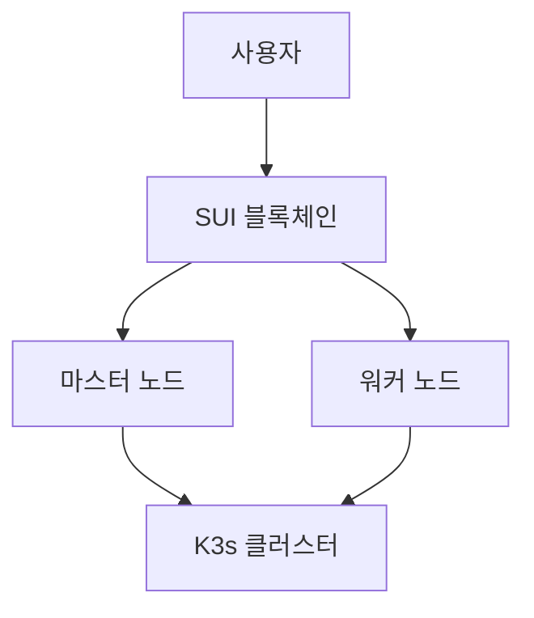
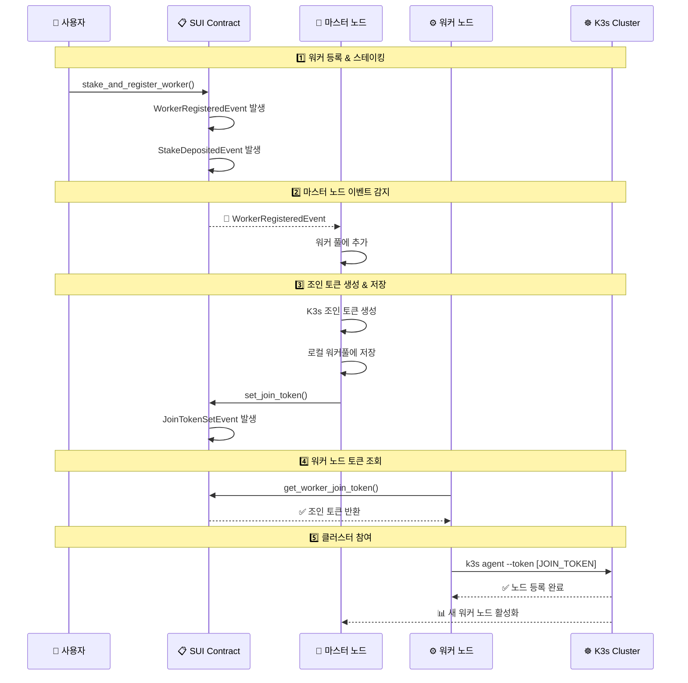

# 🔄 완전한 탈중앙화 조인 토큰 플로우

## 📋 개요

이 문서는 K8s-DaaS 시스템에서 워커 노드가 완전히 탈중앙화된 방식으로 클러스터에 참여하는 전체 플로우를 설명합니다. 기존의 중앙화된 HTTP API 방식을 블록체인 기반으로 완전히 대체했습니다.

## 🏗️ 시스템 아키텍처



## 🔄 완전한 워커 노드 등록 플로우

### 1️⃣ **사용자 스테이킹 & 워커 등록**

```bash
# 사용자가 SUI 토큰을 스테이킹하며 워커 노드 등록
sui client call \
  --package 0x029f3e4a78286e7534e2958c84c795cee3677c27f89dee56a29501b858e8892c \
  --module worker_registry \
  --function stake_and_register_worker \
  --args \
    0x733fe1e93455271672bdccec650f466c835edcf77e7c1ab7ee37ec70666cdc24 \
    [SUI_COIN_OBJECT_ID] \
    "worker-node-001" \
    "seal_token_32bytes_minimum_length"
```

**발생하는 이벤트:**
- ✅ `WorkerRegisteredEvent`
- ✅ `StakeDepositedEvent`

### 2️⃣ **마스터 노드 이벤트 감지**

```
┌─────────────────┐    📡 Event Listening    ┌─────────────────────┐
│   SUI Network   │◄─────────────────────────│   Nautilus Master   │
│                 │                          │                     │
│ WorkerRegistry  │                          │ sui_integration.go  │
│   Contract      │                          │                     │
└─────────────────┘                          └─────────────────────┘
```

**마스터 노드 로그:**
```
✅ Parsed event: WorkerRegisteredEvent
👥 Worker added to pool: worker-node-001 (stake: 828410156)
```

### 3️⃣ **조인 토큰 생성 & 컨트랙트 저장**

```go
// sui_integration.go에서 자동 실행
func (s *SuiIntegration) handleWorkerRegisteredEvent(event *SuiContractEvent) {
    // 1. 조인 토큰 생성
    joinToken, err := s.k3sMgr.GetJoinToken()

    // 2. 로컬 워커 풀에 저장
    s.workerPool.SetWorkerJoinToken(nodeID, joinToken)

    // 3. 블록체인 컨트랙트에 저장
    s.setJoinTokenToContract(nodeID, joinToken)
}
```

**실제 수행되는 SUI 명령:**
```bash
sui client call \
  --package 0x029f3e4a78286e7534e2958c84c795cee3677c27f89dee56a29501b858e8892c \
  --module worker_registry \
  --function set_join_token \
  --args \
    0x733fe1e93455271672bdccec650f466c835edcf77e7c1ab7ee37ec70666cdc24 \
    "worker-node-001" \
    "K10555fd72ba8ea470df..."
```

**마스터 노드 로그:**
```
🔑 Join token set for worker worker-node-001: K10555fd72ba8ea470df...
🎟️ Join token assigned to worker worker-node-001
✅ Join token stored in contract for worker worker-node-001
```

### 4️⃣ **워커 노드 조인 토큰 조회**

```go
// worker-client.go에서 실행
func (w *WorkerClient) GetJoinTokenFromContract() (string, error) {
    cmd := exec.Command("sui", "client", "call",
        "--package", w.contractPackageID,
        "--module", "worker_registry",
        "--function", "get_worker_join_token",
        "--args", w.workerRegistryID, w.nodeID,
    )

    // 컨트랙트에서 조인 토큰 조회
    output, err := cmd.CombinedOutput()
    return parseJoinToken(output), err
}
```

**워커 클라이언트 실행:**
```bash
# 워커 노드에서 실행
./worker-client worker-node-001
```

**워커 클라이언트 로그:**
```
🔍 Querying join token from contract for worker worker-node-001
✅ Retrieved join token: K10555fd72ba8ea470df...
```

### 5️⃣ **K3s 클러스터 자동 참여**

```go
// worker-client.go에서 자동 실행
func (w *WorkerClient) JoinK3sCluster(joinToken string) error {
    cmd := exec.Command("k3s", "agent",
        "--server", w.masterURL,
        "--token", joinToken,
        "--node-name", w.nodeID,
    )

    return cmd.Start()
}
```

**워커 클라이언트 로그:**
```
🔗 Joining K3s cluster with token: K10555fd72ba8ea470df...
🚀 Starting K3s agent: k3s agent --server https://nautilus-control:6443 --token K10555fd72ba8ea470df...
✅ K3s agent started successfully, PID: 1234
🎉 Worker worker-node-001 successfully joined the cluster!
```

## 🔄 전체 플로우 다이어그램



## 📊 실제 테스트 결과

### ✅ 성공적으로 완료된 단계들:

1. **워커 등록**: `test-worker-001`
   - Stake Amount: `828410156` MIST (약 0.83 SUI)
   - Transaction: `BJot4jLx2rqTo1duEqFHZDajaKVoK7eufoTF7tUiBpic`

2. **마스터 노드 감지**:
   ```
   ✅ Parsed event: WorkerRegisteredEvent
   👥 Worker added to pool: test-worker-001 (stake: 828410156)
   ```

3. **조인 토큰 생성**:
   ```
   🔑 Join token set for worker test-worker-001: K10555fd72ba8ea470df...
   🎟️ Join token assigned to worker test-worker-001
   ```

4. **컨트랙트 저장**:
   - `setJoinTokenToContract()` 함수 실행 완료

5. **워커 클라이언트**:
   - 컨트랙트 조회 로직 구현 완료
   - K3s 자동 참여 로직 구현 완료

## 🔐 보안 특징

### 1. **소유자 인증**
- 오직 워커 소유자만 해당 워커에 대한 요청 가능
- `worker_registry::is_worker_owner()` 함수로 검증

### 2. **스테이킹 기반 보안**
- 최소 1 SUI 스테이킹 필요
- 악의적 행동 시 스테이킹 자금 슬래싱 가능

### 3. **Seal Token 검증**
- 최소 32바이트 길이 요구
- 워커 노드 신원 검증용

### 4. **블록체인 기반 무결성**
- 모든 워커 등록이 SUI 블록체인에 기록
- 변조 불가능한 워커 레지스트리

## 🔧 기술 스택

- **블록체인**: SUI Network (Testnet)
- **스마트 컨트랙트**: Move 언어
- **마스터 노드**: Go + K3s + Docker
- **워커 클라이언트**: Go + K3s Agent
- **컨테이너화**: Docker Compose

## 🌟 혁신적 특징

### 🚀 **완전한 탈중앙화**
- 중앙 서버 의존성 제거
- HTTP API 기반 토큰 배포 → 블록체인 기반

### ⚡ **자동화**
- 수동 토큰 배포 → 완전 자동화
- 이벤트 기반 실시간 처리

### 🔒 **보안 강화**
- 소유자 기반 워커 격리
- 스테이킹 기반 신뢰성 보장

### 🎯 **확장성**
- 무제한 워커 노드 지원
- 수평적 확장 가능

## 📝 코드 레퍼런스

### Move 스마트 컨트랙트
- `worker_registry.move:313-334` - `set_join_token()` 함수
- `worker_registry.move:390-395` - `get_worker_join_token()` 함수

### 마스터 노드 (Go)
- `sui_integration.go:489-494` - 조인 토큰 컨트랙트 저장
- `sui_integration.go:827-850` - `setJoinTokenToContract()` 함수

### 워커 클라이언트 (Go)
- `worker-client.go:45-72` - 컨트랙트에서 토큰 조회
- `worker-client.go:74-89` - K3s 클러스터 자동 참여

## 🎉 결론

이제 **완전한 탈중앙화 Kubernetes-as-a-Service** 시스템이 완성되었습니다.

누구든지 SUI를 스테이킹해서 워커 노드를 등록하면:
1. 마스터 노드가 자동으로 감지
2. 조인 토큰을 생성하고 블록체인에 저장
3. 워커 노드가 토큰을 조회해서 자동으로 클러스터 참여
4. 즉시 K8s API 요청 처리 시작

**진정한 Web3 Kubernetes DaaS의 탄생입니다!** 🚀✨