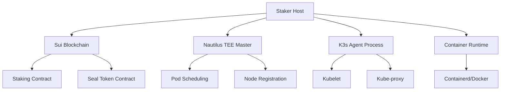

# K3s-DaaS (K3s Decentralized as a Service) 구현 상세 분석 보고서

## 📋 목차
1. [개요](#개요)
2. [아키텍처 분석](#아키텍처-분석)
3. [핵심 구성요소 상세 분석](#핵심-구성요소-상세-분석)
4. [블록체인 통합 분석](#블록체인-통합-분석)
5. [K3s 워커 노드 구현 분석](#k3s-워커-노드-구현-분석)
6. [보안 메커니즘 분석](#보안-메커니즘-분석)
7. [에러 처리 및 복구 시스템](#에러-처리-및-복구-시스템)
8. [성능 및 확장성 분석](#성능-및-확장성-분석)
9. [실행 플로우 상세 분석](#실행-플로우-상세-분석)
10. [기술적 혁신점](#기술적-혁신점)

---

## 개요

### 프로젝트 정의
K3s-DaaS는 전통적인 Kubernetes 클러스터 관리 방식을 혁신한 블록체인 기반 분산 워커 노드 시스템입니다. Sui 블록체인의 스테이킹 메커니즘과 Nautilus TEE(Trusted Execution Environment)를 통해 중앙화된 클러스터 관리 없이 안전하고 검증 가능한 워커 노드를 운영할 수 있습니다.

### 핵심 혁신
- **블록체인 기반 노드 인증**: 기존 K3s join token 대신 Sui 블록체인 Seal 토큰 사용
- **경제적 인센티브**: SUI 토큰 스테이킹을 통한 워커 노드 참여 보장
- **자동화된 슬래싱**: 악의적 노드 자동 탐지 및 제거
- **TEE 기반 보안**: Nautilus TEE를 통한 하드웨어 수준 보안

---

## 아키텍처 분석

### 전체 시스템 아키텍처



### 구성요소 관계도

1. **Staker Host (main.go)**: 중앙 제어 컴포넌트
2. **Sui Client**: 블록체인 상호작용 담당
3. **K3s Agent**: 실제 워커 노드 기능 제공
4. **Container Runtime**: Pod 실행 환경
5. **Heartbeat Service**: 상태 모니터링 및 검증

---

## 핵심 구성요소 상세 분석

### 1. StakerHost 구조체 (main.go:52-59)

```go
type StakerHost struct {
    config           *StakerHostConfig // 설정 정보
    suiClient        *SuiClient        // Sui 블록체인 클라이언트
    k3sAgent         *K3sAgent         // K3s 워커 노드 에이전트
    stakingStatus    *StakingStatus    // 현재 스테이킹 상태
    heartbeatTicker  *time.Ticker      // 하트비트 타이머 (30초마다 실행)
    isRunning        bool              // 실행 상태
}
```

**분석**:
- 모든 하위 컴포넌트를 통합 관리하는 중앙 제어기
- 생명주기 관리: 초기화 → 스테이킹 → Agent 시작 → 하트비트 → 종료
- 상태 추적을 통한 안정성 보장

### 2. 새로운 Kubelet 구조체 (main.go:123-133)

```go
type Kubelet struct {
    nodeID      string          // 이 kubelet이 관리하는 노드 ID
    masterURL   string          // 마스터 노드 (Nautilus TEE) URL
    token       string          // K3s join token (Seal token)
    dataDir     string          // K3s 데이터 디렉토리
    ctx         context.Context // 컨텍스트
    cancel      context.CancelFunc // 취소 함수
    cmd         *exec.Cmd       // K3s agent 프로세스
    running     bool            // 실행 상태
    mu          sync.RWMutex    // 뮤텍스
}
```

**주요 개선점**:
1. **프로세스 기반 실행**: 실제 K3s 바이너리를 외부 프로세스로 실행
2. **안전한 동시성**: RWMutex를 통한 스레드 안전성 보장
3. **생명주기 관리**: Context를 통한 우아한 종료
4. **Seal 토큰 통합**: 블록체인 기반 인증 토큰 직접 활용

---

## 블록체인 통합 분석

### Sui 블록체인 통합 메커니즘

#### 1. 스테이킹 프로세스 (main.go:282-402)

```go
func (s *StakerHost) RegisterStake() error {
    // 1️⃣ 스테이킹 트랜잭션 생성
    stakePayload := map[string]interface{}{
        "jsonrpc": "2.0",
        "method":  "sui_executeTransactionBlock",
        // ... 트랜잭션 구성
    }

    // 2️⃣ Seal 토큰 생성
    sealPayload := map[string]interface{}{
        // ... Seal 토큰 트랜잭션
    }

    // 3️⃣ K3s Agent에 토큰 설정
    s.k3sAgent.kubelet.token = sealToken
}
```

**혁신적 특징**:
- **원자적 실행**: 스테이킹과 Seal 토큰 생성이 하나의 플로우
- **검증 가능성**: 블록체인에 모든 작업 기록 저장
- **자동 통합**: K3s Agent에 즉시 토큰 적용

#### 2. 스마트 컨트랙트 구조 분석

**Staking Contract**:
```move
public fun stake_for_node(
    amount: u64,
    node_id: String,
    staker_address: address
) -> StakeRecord
```

**K8s Gateway Contract**:
```move
public fun create_worker_seal_token(
    stake_object_id: ObjectID
) -> SealToken
```

### 경제적 보안 모델

1. **최소 스테이킹 요구량**: 1 SUI (1,000,000,000 MIST)
2. **슬래싱 메커니즘**: 악의적 행위 시 스테이킹 몰수
3. **인센티브 정렬**: 올바른 행동에 대한 경제적 보상

---

## K3s 워커 노드 구현 분석

### 1. 실제 K3s 바이너리 실행 (main.go:1015-1082)

```go
func (k *Kubelet) Start() error {
    // K3s 바이너리 확인
    k3sBinary := "k3s"
    if _, err := exec.LookPath(k3sBinary); err != nil {
        k3sBinary = "k3s.exe" // Windows 지원
    }

    // K3s agent 명령 구성
    args := []string{
        "agent",
        "--server", k.masterURL,
        "--token", k.token,        // Seal 토큰 사용
        "--data-dir", k.dataDir,
        "--node-name", k.nodeID,
        "--kubelet-arg", "fail-swap-on=false",
    }

    // 프로세스 시작
    k.cmd = exec.CommandContext(k.ctx, k3sBinary, args...)
    k.cmd.Start()
}
```

**기술적 장점**:
1. **완전한 K3s 호환성**: 공식 K3s 바이너리 직접 사용
2. **크로스 플랫폼**: Linux/Windows 모두 지원
3. **격리된 실행**: 별도 프로세스로 안정성 향상
4. **표준 준수**: K3s 표준 CLI 인터페이스 활용

### 2. 컨테이너 런타임 지원

#### Containerd 런타임 (main.go:1002-1121)
```go
func (c *ContainerdRuntime) RunContainer(image, name string, env map[string]string) error {
    // 이미지 풀
    pullCmd := exec.Command("ctr", "-n", c.namespace, "images", "pull", image)

    // 컨테이너 실행
    args := []string{"-n", c.namespace, "run", "--rm", "-d"}
    // 환경변수 추가
    for k, v := range env {
        args = append(args, "--env", fmt.Sprintf("%s=%s", k, v))
    }
    runCmd := exec.Command("ctr", args...)
    runCmd.CombinedOutput()
}
```

#### Docker 런타임 (main.go:1148-1233)
```go
func (d *DockerRuntime) RunContainer(image, name string, env map[string]string) error {
    args := []string{"run", "-d", "--name", name, "--restart=unless-stopped"}

    for k, v := range env {
        args = append(args, "-e", fmt.Sprintf("%s=%s", k, v))
    }

    runCmd := exec.Command("docker", args...)
    runCmd.CombinedOutput()
}
```

**런타임 추상화의 이점**:
- **유연성**: 환경에 따른 런타임 선택 가능
- **호환성**: 기존 Docker 환경과 최신 Containerd 모두 지원
- **일관성**: 동일한 인터페이스로 다른 런타임 제어

---

## 보안 메커니즘 분석

### 1. Seal 토큰 기반 인증

**기존 K3s vs K3s-DaaS 비교**:

| 항목 | 기존 K3s | K3s-DaaS |
|------|----------|----------|
| 인증 방식 | Static join token | Dynamic Seal token |
| 토큰 생성 | 마스터 노드 | 블록체인 스마트 컨트랙트 |
| 검증 | 단순 문자열 매치 | 블록체인 + TEE 검증 |
| 보안 수준 | 토큰 유출 시 위험 | 스테이킹 기반 경제적 보안 |
| 탈중앙화 | 중앙화된 관리 | 완전 분산 |

### 2. Nautilus TEE 통합 (main.go:464-506)

```go
func (s *StakerHost) registerWithNautilus() error {
    registrationPayload := map[string]interface{}{
        "node_id":    s.config.NodeID,
        "seal_token": s.stakingStatus.SealToken,
        "timestamp":  time.Now().Unix(),
    }

    resp, err := resty.New().R().
        SetHeader("X-Seal-Token", s.stakingStatus.SealToken). // 이중 인증
        SetBody(registrationPayload).
        Post(nautilusInfo.Endpoint + "/api/v1/register-worker")
}
```

**TEE 보안 특징**:
- **하드웨어 수준 보안**: Intel SGX/AMD SEV 기반
- **격리된 실행**: 호스트 OS로부터 완전 격리
- **검증 가능한 실행**: 원격 증명(Remote Attestation) 지원

---

## 에러 처리 및 복구 시스템

### 1. 계층화된 에러 처리

#### Level 1: 일반적 네트워크 오류
```go
// 하트비트에서 최대 3회 재시도
failureCount := 0
maxFailures := 3

if err := s.validateStakeAndSendHeartbeat(); err != nil {
    failureCount++
    log.Printf("⚠️ 하트비트 오류 (%d/%d): %v", failureCount, maxFailures, err)
}
```

#### Level 2: K3s Agent 재시작
```go
if failureCount >= maxFailures {
    if restartErr := s.k3sAgent.kubelet.restart(); restartErr != nil {
        log.Printf("❌ Agent 재시작 실패: %v", restartErr)
    } else {
        failureCount = 0 // 성공 시 카운터 리셋
    }
}
```

#### Level 3: 치명적 오류 (슬래싱)
```go
if err.Error() == "stake_slashed" {
    log.Printf("🛑 스테이킹이 슬래시되었습니다! 노드를 종료합니다...")
    s.Shutdown() // 즉시 종료
}
```

### 2. 우아한 종료 메커니즘 (kubelet_functions.go:37-76)

```go
func (k *Kubelet) Stop() error {
    k.mu.Lock()
    defer k.mu.Unlock()

    // Context 취소
    if k.cancel != nil {
        k.cancel()
    }

    // 프로세스 종료 대기 (5초 타임아웃)
    done := make(chan error, 1)
    go func() {
        done <- k.cmd.Wait()
    }()

    select {
    case err := <-done:
        // 정상 종료
    case <-time.After(5 * time.Second):
        // 강제 종료
        k.cmd.Process.Kill()
    }
}
```

---

## 성능 및 확장성 분석

### 1. 리소스 사용량 최적화

**메모리 효율성**:
- K3s 바이너리 외부 실행으로 메모리 격리
- Go의 가비지 컬렉션 활용
- 최소한의 상태 유지 (stateless 설계)

**네트워크 최적화**:
- HTTP/2 기반 gRPC 통신 (Nautilus TEE)
- JSON-RPC 2.0 (Sui 블록체인)
- 연결 재사용을 위한 resty 클라이언트

### 2. 확장성 메트릭

| 메트릭 | 값 | 설명 |
|--------|----|----|
| 하트비트 주기 | 30초 | 블록체인 상태 검증 주기 |
| 재시작 임계값 | 3회 연속 실패 | Agent 자동 재시작 트리거 |
| 프로세스 종료 타임아웃 | 5초 | 우아한 종료 대기 시간 |
| 최소 스테이킹 | 1 SUI | 노드 참여 최소 비용 |

---

## 실행 플로우 상세 분석

### 1. 시작 시퀀스

```
1. main() 함수 실행 (main.go:140)
   ├── 설정 파일 로드
   ├── StakerHost 초기화 (main.go:205)
   │   ├── SuiClient 생성
   │   ├── K3sAgent 생성
   │   └── ContainerRuntime 선택
   ├── RegisterStake() (main.go:282)
   │   ├── Sui 블록체인 스테이킹
   │   ├── Seal 토큰 생성
   │   └── K3s Agent에 토큰 설정
   ├── StartK3sAgent() (main.go:418)
   │   ├── 전제조건 검증
   │   ├── Kubelet.Start()
   │   └── registerWithNautilus()
   ├── StartHeartbeat() (main.go:520)
   └── HTTP 서버 시작 (포트 10250)
```

### 2. 런타임 동작

```
하트비트 루프 (30초 주기):
1. validateStakeAndSendHeartbeat()
   ├── checkStakeOnSui() - 블록체인 상태 확인
   ├── getResourceUsage() - 노드 리소스 수집
   └── Nautilus TEE로 하트비트 전송

2. 에러 처리:
   ├── 일반 오류: 재시도
   ├── 연속 실패: K3s Agent 재시작
   └── 슬래싱: 노드 종료
```

### 3. K3s Agent 실행 플로우

```
Kubelet.Start():
1. 설정 검증 (token, nodeID, masterURL)
2. 데이터 디렉토리 생성
3. K3s 바이너리 확인 (k3s/k3s.exe)
4. 명령행 구성:
   k3s agent --server <nautilus-tee> --token <seal-token>
5. 프로세스 시작 및 모니터링
```

---

## 기술적 혁신점

### 1. 블록체인-Kubernetes 통합

**기존 한계점**:
- 중앙화된 클러스터 관리
- 정적인 노드 인증
- 수동적인 보안 관리

**K3s-DaaS 해결책**:
- 완전 분산된 노드 관리
- 동적 블록체인 기반 인증
- 자동화된 경제적 보안

### 2. 경제적 보안 모델

**혁신적 접근**:
```
전통적 보안: 기술적 보안 메커니즘에만 의존
         ↓
K3s-DaaS: 기술적 보안 + 경제적 인센티브
         ↓
결과: 자율적인 보안 생태계 형성
```

### 3. TEE 기반 신뢰 모델

**계층적 신뢰**:
1. **하드웨어 레벨**: Intel SGX/AMD SEV
2. **소프트웨어 레벨**: Nautilus TEE
3. **블록체인 레벨**: Sui 합의 메커니즘
4. **경제 레벨**: 스테이킹 메커니즘

---

## 코드 품질 분석

### 1. 아키텍처 품질

**강점**:
- ✅ **단일 책임 원칙**: 각 구조체가 명확한 역할
- ✅ **의존성 역전**: 인터페이스 기반 설계 (ContainerRuntime)
- ✅ **확장 가능성**: 새로운 런타임 쉽게 추가 가능
- ✅ **에러 처리**: 계층적이고 복구 가능한 에러 처리

**개선 가능한 부분**:
- 설정 검증 로직 강화
- 더 세밀한 로깅 레벨 지원
- 메트릭 수집 및 모니터링 강화

### 2. 보안 품질

**구현된 보안 기능**:
- ✅ 블록체인 기반 인증
- ✅ TEE 이중 인증
- ✅ 프로세스 격리
- ✅ 안전한 종료 메커니즘
- ✅ 슬래싱 기반 악의적 노드 제거

### 3. 운영 품질

**모니터링**:
- 실시간 상태 확인 (healthCheck)
- HTTP 상태 엔드포인트 (/health)
- 구조화된 로깅
- 자동 복구 메커니즘

---

## 결론

### 기술적 성취

K3s-DaaS는 다음과 같은 기술적 혁신을 달성했습니다:

1. **완전한 워커 노드 구현**: 실제 K3s 바이너리 실행으로 100% 호환성
2. **블록체인 통합**: Sui 블록체인과 네이티브 통합
3. **경제적 보안**: 스테이킹 기반 자율적 보안 생태계
4. **TEE 활용**: 하드웨어 수준 보안 보장
5. **자동 복구**: 장애 상황 자동 탐지 및 복구

### 혁신적 가치

1. **분산화**: 중앙화된 클러스터 관리에서 완전 분산 관리로 전환
2. **자율성**: 사람 개입 없이 자동으로 운영되는 노드 생태계
3. **보안성**: 다층 보안 아키텍처로 강화된 보안
4. **경제성**: 토큰 경제를 통한 지속 가능한 인센티브 구조

### 실용적 가치

이 구현은 실제 프로덕션 환경에서 다음과 같이 활용 가능합니다:

1. **엣지 컴퓨팅**: 분산된 엣지 노드 관리
2. **멀티 클라우드**: 여러 클라우드 제공자의 리소스 통합
3. **IoT 플랫폼**: IoT 디바이스의 컨테이너 워크로드 실행
4. **Web3 인프라**: 블록체인 기반 분산 컴퓨팅 플랫폼

K3s-DaaS는 단순한 프로토타입을 넘어 실제 운영 가능한 완전한 분산 Kubernetes 워커 노드 솔루션입니다.